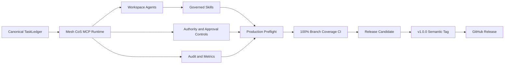
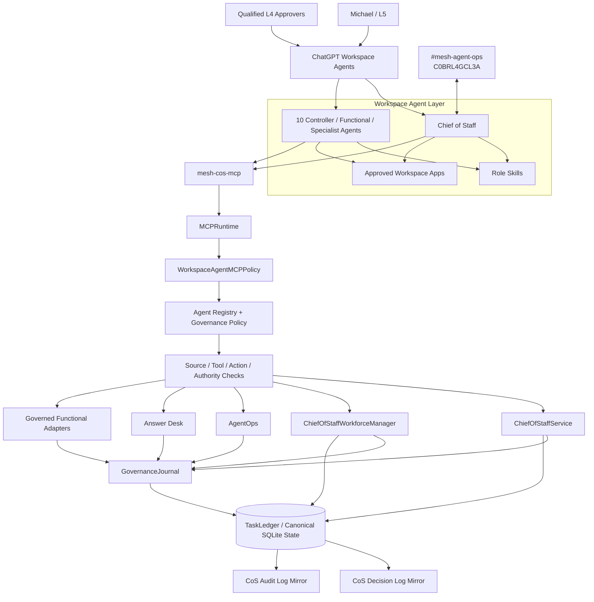
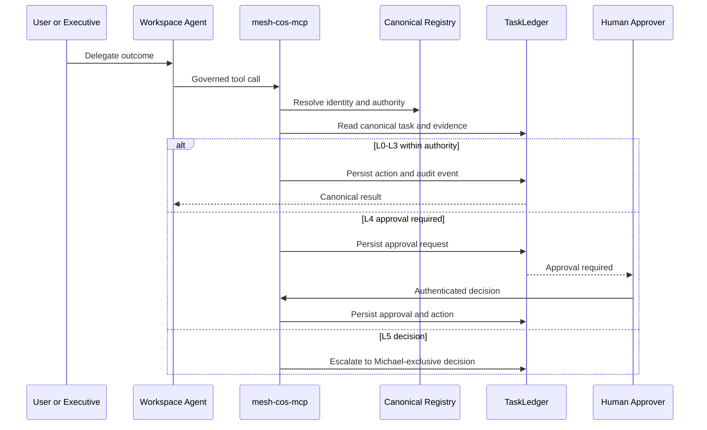
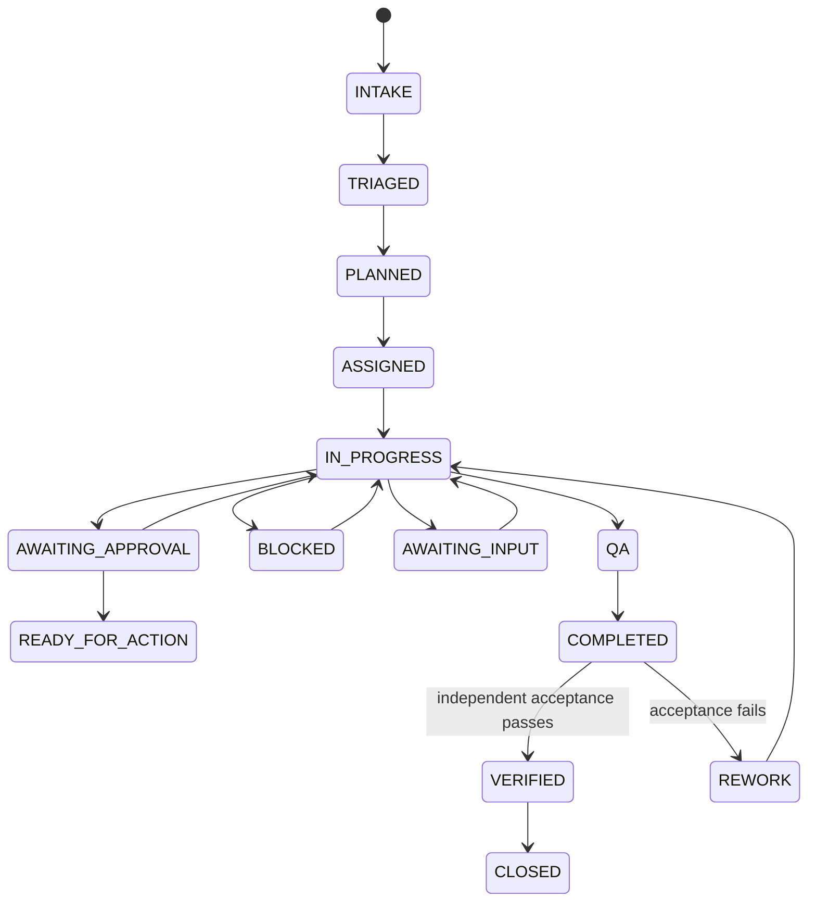
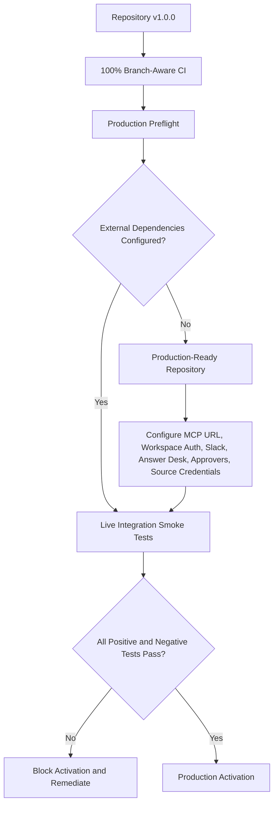

# Mesh AI Chief of Staff Agent Universe

Production-ready operating core for Mesh Digital LLC's AI Chief of Staff. The repository implements a governed executive operating control plane for a bounded agent workforce. It is not a general chatbot. ChatGPT, Slack, and Google Sheets are not the system of record.

## Operating objective

**Maximize the return on Michael's judgment, relationships, attention, and authority by independently resolving everything that does not require the CEO, and materially improving everything that does.**

## Release status

**Current semantic release: `v1.0.0 Production Readiness`.**

Version `1.0.0` is the first stable production-readiness milestone. It combines the completed Phase 1 operating core with the hardened Workspace Agent deployment layer, serialized MCP runtime, human-principal enforcement, production preflight, 100% branch-aware release coverage, and release-grade documentation.

Production readiness is not production activation. The repository is ready to be activated when the target environment passes preflight and live integration tests. It does not fabricate a deployed MCP endpoint, Workspace credentials, Slack credentials, Answer Desk channel, source credentials, approval-owner mappings, or runtime infrastructure.

Key release artifacts:

- 11 validated OpenAI role Skills under `chatgpt/skills/`;
- 11 exact Workspace Agent manifests under `chatgpt/workspace-agents/`;
- `chatgpt/mcp/mesh-cos-mcp.v1.json`, aligned to runtime release `1.0.0`;
- serialized `mesh_cos.mcp_runtime.MCPRuntime` execution boundary;
- deny-by-default `WorkspaceAgentMCPPolicy` and per-agent tool allowlists;
- human-only approval and reliability-override paths;
- production preflight and private-preview requirements;
- 100% branch-aware `mesh_cos` release coverage;
- `docs/release-1.0.0-production-readiness.md` and `RELEASE.md`.

## Production-readiness architecture



## System architecture



### Canonical boundaries

- `agents/registry.json`, normalized by the runtime registry and shared governance policy, is authoritative for agent identity, authority, source/tool policy, delegation permissions, health, and prohibited actions.
- `TaskLedger` is canonical for task state, work graph, approvals, conflicts, explainable decisions, audit events, verification, performance, and consequential operating records.
- `chatgpt/workspace-agents/*.json` is the exact product-deployment projection of the registry. It may narrow behavior but may not widen canonical authority.
- `chatgpt/skills/*` contains reusable role workflows. Skills do not become a second authority source.
- `chatgpt/mcp/mesh-cos-mcp.v1.json` and `MCPRuntime` define the controlled Workspace Agent execution bridge to existing runtime code.
- ChatGPT conversations, Slack, and governance Google Sheets are interaction or review surfaces, not canonical state.

## Phase 1 agent hierarchy

- **Chief of Staff**: outcome intake, decomposition, prioritization, delegation, dependency coordination, arbitration, reallocation, escalation, verification, and portfolio recommendations.
- **AgentOps Controller**: rolling performance evaluation, workload/SLA monitoring, health recommendations, stalled-work detection, defect signals, and coordination-loop detection.
- **Answer & Decision Desk**: permission-aware team question handling, policy application, routing, recommendations, approvals, escalation, and correction tracking.
- **CRO**: commercial strategy, opportunity qualification, pipeline health, pursuits, buyer dynamics, proposal commercial architecture, next-best action, expansion, and commercial-risk framing.
- **CFO**: Engagement Finance / FP&A only, including engagement economics, pricing scenarios, cost-to-serve, contribution economics, margins, supported working-capital implications, forecast-versus-actual, margin leakage, assumption management, scenario comparison, and financial-risk recommendations.
- **COO**: delivery feasibility, configuration, capacity, POD/resource composition, dependency readiness, partner capacity, delivery-risk sensing, operational constraints, and staffing recommendations.
  - **Consultant Network Steward**: candidate identification/matching, fit, freshness, validation timestamps, rate, availability confidence, readiness gaps, refresh workflow, and contracting readiness.
- **CMO**: marketing strategy, audience/ICP strategy, category positioning, demand/campaign architecture, distribution, brand governance, campaign optimization, editorial priorities, and marketing-commercial feedback.
  - **VP Content**: editorial planning/calendar, source/evidence assembly, content production, channel adaptation, derivative content, repurposing, Mesh IP reuse, inventory, editorial QA, and performance feedback.
- **Devil's Advocate**: independent challenge, never final decision owner.
- **Message Operations**: controlled execution boundary for explicitly approved communications.

## Governed execution path



## Decision rights

- **L0 Information**: authorized retrieval and factual synthesis.
- **L1 Established policy / precedent**: execution of approved rules with logging.
- **L2 Reversible operating judgment**: bounded internal decisions within explicit guardrails.
- **L3 Material internal judgment**: agents recommend; CoS resolves only when explicitly delegated, otherwise the named human owner decides.
- **L4 Human approval required**: consequential commercial, external, public, legal, regulatory, security, privacy, personnel, destructive, sensitive-system, and irreversible actions fail closed.
- **L5 Michael exclusive**: firm strategy, major pivots/capital decisions, material client/partner exceptions, senior personnel decisions, CoS authority, decision-rights policy, and material agent-authority expansion.

No monetary thresholds are inferred.

## Completion and verification



`task.complete` lets the accountable owner persist outcome evidence. `COMPLETED` is not `VERIFIED`. `task.verify` remains a separate acceptance action and requires explicit verifier identity and evidence.

## Release verification

```bash
python3 -m venv .venv
source .venv/bin/activate
pip install -e '.[dev]'
python -m pip check
python scripts/validate-contracts.py
python scripts/check-runtime-doc-drift.py
python scripts/check-chatgpt-packages.py
ruff check src
ruff check tests scripts --select E9,F63,F7,F82
mypy src --check-untyped-defs
pytest --cov=mesh_cos --cov-report=term-missing --cov-report=xml --cov-fail-under=100
bandit -q -r src -lll
python -m compileall -q src
```

Before live activation, run:

```bash
python scripts/production-preflight.py
```

Add `--require-slack`, `--require-answer-desk`, and `--require-ledger` when those surfaces are required in the target environment.

## Production readiness versus activation



## Documentation

Start at [`docs/README.md`](docs/README.md). Release-specific references:

- [`docs/release-1.0.0-production-readiness.md`](docs/release-1.0.0-production-readiness.md)
- [`docs/production-readiness.md`](docs/production-readiness.md)
- [`docs/production-hardening-2026-08-17.md`](docs/production-hardening-2026-08-17.md)
- [`docs/architecture.md`](docs/architecture.md)
- [`docs/decision-rights.md`](docs/decision-rights.md)
- [`docs/explainable-decisions-audit.md`](docs/explainable-decisions-audit.md)
- [`docs/security-governance.md`](docs/security-governance.md)
- [`docs/testing-evaluation.md`](docs/testing-evaluation.md)
- [`docs/runbook.md`](docs/runbook.md)
- [`chatgpt/workspace-agent-builder-prompt.md`](chatgpt/workspace-agent-builder-prompt.md)

Historical Phase 1 closure, remediation, and gap documents remain historical snapshots and are not rewritten to imply they were authored against `v1.0.0`.

## Remaining production activation dependencies

- approved remote `mesh-cos-mcp` deployment and `MESH_COS_MCP_SERVER_URL`;
- Workspace app authentication with least privilege;
- Slack bot token/signing secret where Slack runtime integration is used;
- separate Answer Desk Slack channel ID;
- approved Mesh source and Skill credentials/permissions;
- production approval-owner mapping;
- deployment/runtime infrastructure and secrets management;
- authenticated Google Sheets write capability if automatic governance mirroring is enabled;
- target-workspace private preview tests and RBAC-controlled publication;
- explicitly approved future monetary thresholds, if any.

SQLite remains the Phase 1 persistence choice. Revisit persistence before multi-instance or high-availability deployment.
