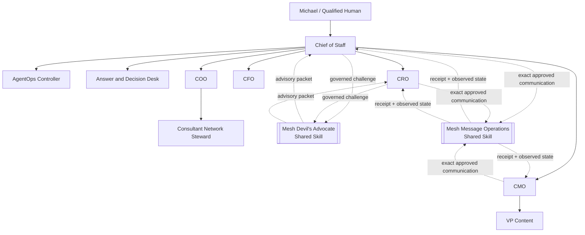

# Mesh AI Chief of Staff Agent Universe

Production-ready operating core for Mesh Digital LLC's governed AI Chief of Staff workforce. Release `v3.0.0` deploys a **9-agent** ChatGPT Workspace organization plus two governed external shared Skills: **Mesh Devil's Advocate** for advisory challenge and **Mesh Message Operations** for approval-bound communication execution. ChatGPT, Slack, connector responses, shared-Skill packets/receipts, and governance Sheets are interaction or evidence surfaces. `TaskLedger` remains canonical state.

## Release status

**Current semantic release target: `v3.0.0 Shared Mesh Message Operations`.**

This is a breaking deployment-model change because the canonical registered workforce moves from 10 principals to 9. The former repository-local `message-ops` principal, role card, Workspace Agent manifest, MCP identity, and duplicate `chatgpt/skills/mesh-message-operations/` package are removed. The already-built external `mesh-message-operations` Skill is shared only by Chief of Staff, CRO, and CMO through governed Skill invocation.

The `v2.0.0` shared Mesh Devil's Advocate architecture remains intact: it is external, advisory-only, and available only to Chief of Staff and CRO.

## Runtime topology

```text
ChatGPT Workspace Agent
        |
        | LOCAL_STDIO
        v
node mcp/dist/index.js
        |
        | bounded JSON bridge
        v
mesh_cos.mcp_stdio_bridge
        |
        v
mesh_cos.mcp_runtime.MCPRuntime
        |
        v
TaskLedger / canonical SQLite state
```

A managed remote MCP transport may be added separately, but it is optional and may not replace the same authority, approval, audit, or canonical-state controls.

## Workforce topology



Neither shared Skill is an agent principal. Neither owns TaskLedger tasks, becomes a decision owner, creates an MCP identity, or widens caller authority.

### Mesh Devil's Advocate

The shared Mesh Devil's Advocate may steelman, generate countercases, test assumptions, run premortems/red-team analysis, audit evidence sufficiency, and challenge decision conditions. It is **advisory only**, cannot overwrite canonical facts, cannot execute external actions, and returns authority to the owning role or qualified human.

### Mesh Message Operations

The shared Mesh Message Operations Skill is **approval-bound execution only**. It does not create campaign strategy, pursuit strategy, message copy, legal conclusions, consent decisions, or canonical account/lifecycle state. Preview is not approval.

Execution requires the existing Skill's full contract: batch preview, per-message preflight, explicit current approval bound to message ID/payload hash plus sender, recipient, channel, operation and execution window, suppression/consent/jurisdiction/frequency/thread checks, cancellation and kill-switch checks immediately before execution, a unique idempotency key, a documented supported connector action, per-attempt receipts, and post-send observed provider-state verification. Material changes invalidate approval and return the message to preflight.

VP Content remains drafting/editorial-production only and does not receive the shared Message Operations entitlement.

For Revenue Intelligence work, canonical account IDs, evidence classes, scores, stage, lifecycle, queue state, activation readiness, and prioritization remain authoritative. Neither shared Skill may overwrite those facts.

## Release artifacts

- 9 validated repository-local role Skills under `chatgpt/skills/`;
- 9 Workspace Agent manifests under `chatgpt/workspace-agents/`;
- external shared `mesh-devils-advocate` entitlement for Chief of Staff and CRO;
- external shared `mesh-message-operations` entitlement for Chief of Staff, CRO, and CMO;
- `chatgpt/mcp/mesh-cos-mcp.v1.json`, release `3.0.0`, transport `LOCAL_STDIO`;
- bundled TypeScript MCP package under `mcp/`;
- Python bridge `mesh_cos.mcp_stdio_bridge`;
- canonical `mesh_cos.mcp_runtime.MCPRuntime` business/governance execution core;
- deny-by-default `WorkspaceAgentMCPPolicy` and per-agent tool allowlists;
- human-only approval and reliability-override paths;
- 100% branch-aware `mesh_cos` coverage gate plus Node build/test/smoke/security gates;
- production preflight and private-preview requirements;
- release record `docs/release-3.0.0-shared-message-operations.md` and `RELEASE.md`.

## Runtime configuration

```text
MESH_COS_AGENT_ID=<registered-agent-id>
MESH_COS_LEDGER_PATH=.mesh-cos/task-ledger.sqlite3
MESH_COS_PYTHON_BIN=python
```

`MESH_COS_AGENT_ID` binds the local MCP process to one registered role. Prompt text, retrieved content, connector output, and shared-Skill output cannot change that identity. All 9 agents in one CoS operating universe use the same approved `MESH_COS_LEDGER_PATH`. Neither shared Skill receives an agent ID.

There is no required `MESH_COS_MCP_SERVER_URL` for ChatGPT-local operation.

## Canonical boundaries

- `agents/registry.json` is authoritative for agent identity, authority, source/tool policy, delegation, health, prohibited actions, and shared capability entitlements.
- `TaskLedger` is canonical for task state, work graph, approvals, conflicts, explainable decisions, audit events, verification, performance, and consequential operating records.
- `chatgpt/workspace-agents/*.json` is the deployment projection. It may narrow behavior but may not widen canonical authority.
- `chatgpt/skills/*` contains repository-local role workflows. External shared Skills are not duplicated here.
- `chatgpt/mcp/mesh-cos-mcp.v1.json` defines the MCP contract and per-agent allowlists.
- `mcp/` provides the local stdio transport only. Business and governance execution remain in `MCPRuntime`.
- CoS Decision Log and CoS Audit Log remain human-readable mirrors, not canonical state.

## Authority model

- **L0** authorized information retrieval and factual synthesis.
- **L1** execution of established policy or precedent with logging.
- **L2** reversible operating judgment inside explicit guardrails.
- **L3** material internal judgment within delegated role authority.
- **L4** qualified human approval required.
- **L5** Michael-exclusive decisions.

Mesh Devil's Advocate cannot elevate authority. Mesh Message Operations cannot manufacture, infer, broaden, or reuse approval and cannot turn connector access into authorization. Human-only MCP operations, including `approval.record_decision` and `reliability.human_override`, remain excluded from every agent MCP catalog.

## External communication execution boundary

Chief of Staff, CRO, and CMO may invoke Mesh Message Operations only for exact approved communications. Their Workspace app write access remains `WRITE_WITH_APPROVAL` and product write actions remain **Always ask** by default. This release does not enable autonomous outbound or autonomous public publishing.

LinkedIn remains non-publishing. AuthoredUp remains draft/analytics only. Apollo remains research/enrichment only. The Skill may use only documented supported connector actions and must fail closed when the execution or provider state cannot be verified.

## Completion and verification

`task.complete` lets an accountable owner persist a finished outcome and evidence. `COMPLETED` is not `VERIFIED`. `task.verify` remains a separate acceptance action requiring explicit verifier identity and evidence.

A successful Message Operations connector attempt is also not equivalent to business-outcome verification. The Skill first re-reads provider state and records the observed communication state; the owning workflow then uses that evidence under normal TaskLedger acceptance rules.

## Release verification

```bash
python3 -m venv .venv
source .venv/bin/activate
pip install -e '.[dev]'
python -m pip check
cd mcp && npm ci && npm run check && cd ..
python scripts/validate-contracts.py
python scripts/check-runtime-doc-drift.py
python scripts/check-chatgpt-packages.py
ruff check src
ruff check tests scripts --select E9,F63,F7,F82
mypy src --check-untyped-defs
pytest --cov=mesh_cos --cov-report=term-missing --cov-report=xml --cov-fail-under=100
bandit -q -r src -lll
python -m compileall -q src
```

Before activation, run `python scripts/production-preflight.py`. Add `--require-slack`, `--require-answer-desk`, and/or `--require-ledger` when those surfaces are required.

## Production activation boundary

Repository readiness does not fabricate Workspace app authentication, Gmail/Slack credentials, a dedicated Answer Desk Slack channel, approved source credentials, external shared-Skill availability, production approval-owner mappings, consent/jurisdiction decisions, Google Sheets write credentials, secrets management, or target-workspace publication settings. Those dependencies still require configuration and private-preview testing.

A separate remote MCP deployment is **not** a production activation dependency for ChatGPT-local operation. SQLite remains the Phase 1 persistence choice and should be revisited before multi-instance or high-availability deployment.

## Documentation

Start at `docs/README.md`. Current operating references include `docs/release-3.0.0-shared-message-operations.md`, `docs/production-readiness.md`, `docs/architecture.md`, `docs/security-governance.md`, `docs/testing-evaluation.md`, `docs/runbook.md`, `chatgpt/README.md`, `chatgpt/mcp/README.md`, and `chatgpt/workspace-agent-builder-prompt.md`.

Historical release documents remain historical snapshots. Current deployment authority is release `v3.0.0`, the canonical registry, and the governed shared capability contracts.
