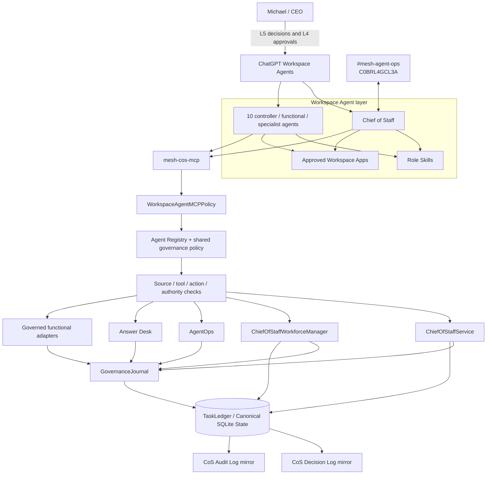
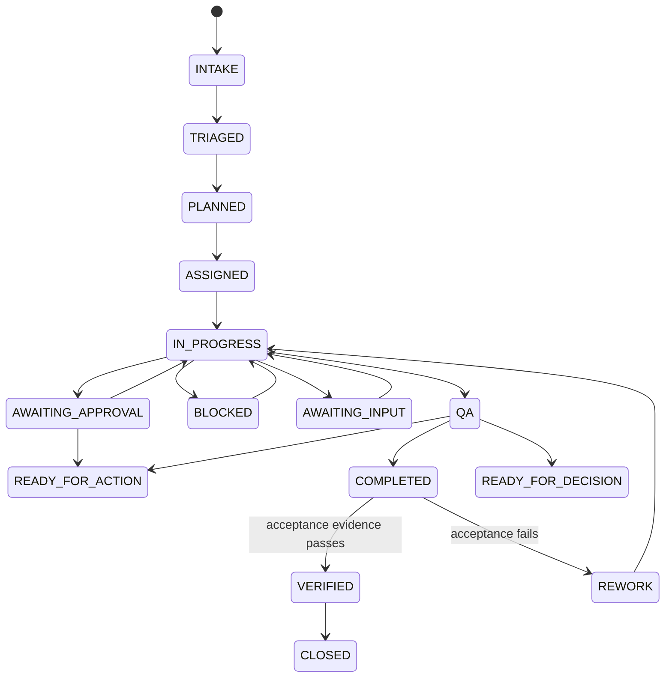

# Mesh AI Chief of Staff Agent Universe

Phase 1 operating core for Mesh Digital LLC's AI Chief of Staff. The repository implements a governed executive operating control plane for a bounded agent workforce. It is not a general chatbot. ChatGPT, Slack, and Google Sheets are not the system of record.

## Operating objective

**Maximize the return on Michael's judgment, relationships, attention, and authority by independently resolving everything that does not require the CEO, and materially improving everything that does.**

## Release status

Version `0.2.0` preserves the completed Phase 1 runtime, explainable `decision.v2` records, fully auditable `agent-event.v2` records, stable organizational role identities, and adds ChatGPT Workspace Agent-ready deployment packages for all 11 canonical roles.

The release includes:

- 11 OpenAI Skill source packages under `chatgpt/skills/`,
- 11 exact Workspace Agent manifests under `chatgpt/workspace-agents/`,
- `chatgpt/mcp/mesh-cos-mcp.v1.json`, mapping Workspace Agents to the existing governed runtime,
- server-side `WorkspaceAgentMCPPolicy` with deny-by-default per-agent tool authorization,
- an MCP-safe evidence-backed verification path for remote Workspace Agents,
- exact Workspace Agent builder handoff instructions,
- TDD acceptance and drift gates for registry, Skill, manifest, MCP, permission, release, and documentation consistency.

The repository does **not** fabricate a live remote MCP endpoint or workspace credentials. Product-side Workspace Agent creation/publication remains a deployment step after the repository passes CI and the target workspace passes private preview tests.

## System architecture



### Canonical boundaries

- `agents/registry.json`, normalized by the runtime registry and shared governance policy, is authoritative for agent identity, authority, source/tool policy, delegation permissions, health, and prohibited actions.
- `TaskLedger` is canonical for task state, work graph, approvals, conflicts, explainable decisions, audit events, verification, performance, and consequential operating records.
- `chatgpt/workspace-agents/*.json` is the exact product-deployment projection of the registry. It may narrow behavior but may not widen canonical authority.
- `chatgpt/skills/*` contains reusable role workflows. Skills do not become a second authority source.
- `chatgpt/mcp/mesh-cos-mcp.v1.json` and `WorkspaceAgentMCPPolicy` define the controlled Workspace Agent execution bridge to existing runtime code.
- Versioned JSON schemas define machine-readable contracts, including `decision.v2` and `agent-event.v2`.
- ChatGPT conversations, Slack, and the governance Google Sheets are observable/human-readable surfaces, not canonical state.

## Phase 1 agent hierarchy

- **Chief of Staff**: outcome intake, work decomposition, prioritization, delegation, dependency coordination, arbitration, reallocation, escalation, verification, and portfolio recommendations.
- **AgentOps Controller**: rolling performance evaluation, workload/SLA monitoring, health recommendations, stalled-work detection, defect signals, and coordination-loop detection.
- **Answer & Decision Desk**: permission-aware team question handling, policy application, routing, recommendations, approvals, escalation, and correction tracking.
- **CRO**: commercial strategy, opportunity qualification, pipeline health, pursuits, buyer dynamics, proposal commercial architecture, next-best commercial action, expansion, and commercial-risk framing.
- **CFO**: Engagement Finance / FP&A only, including engagement economics, pricing scenarios, cost-to-serve, contribution economics, margins, supported working-capital implications, forecast-versus-actual, margin leakage, assumption management, scenario comparison, and financial-risk recommendations.
- **COO**: delivery feasibility, configuration, capacity, POD/resource composition, dependency readiness, partner capacity, delivery-risk sensing, operational constraints, and staffing recommendations.
  - **Consultant Network Steward**: candidate identification/matching, fit, freshness, validation timestamps, rate, availability confidence, readiness gaps, refresh workflow, and contracting readiness.
- **CMO**: marketing strategy, audience/ICP strategy, category positioning, demand/campaign architecture, distribution, brand governance, campaign optimization, editorial priorities, and marketing-commercial feedback.
  - **VP Content**: editorial planning/calendar, source/evidence assembly, content production, channel adaptation, derivative content, repurposing, Mesh IP reuse, inventory, editorial QA, and performance feedback.
- **Devil's Advocate**: independent challenge, never final decision owner.
- **Message Operations**: controlled execution boundary for explicitly approved communications.

## Role identity and implementation versioning

Organizational role identity is stable. Agent display names do not encode software maturity or release labels. Agent implementation versions live in each registry record's `version` field using `MAJOR.MINOR.PATCH`; repository release `0.2.0` identifies the operating-core/deployment-contract release. Scope limitations are expressed through accountable domain, source authority, permitted/prohibited actions, approvals, and delegation rules.

The Workspace Agent projection preserves these raw registry values. CI rejects version-bearing role names, authority drift, approval drift, prohibited-action drift, delegation-depth drift, and release-version drift.

## ChatGPT Workspace Agent deployment model

Each canonical role has one checked-in Skill and one exact Workspace Agent manifest. A Workspace Agent is not a prompt-only persona:

```text
agents/registry.json
  -> chatgpt/skills/<role-skill>/SKILL.md
  -> chatgpt/workspace-agents/<agent_id>.json
  -> chatgpt/mcp/mesh-cos-mcp.v1.json
  -> existing Python runtime services
  -> TaskLedger
```

The manifests specify exact builder name/description, preferred and fallback model, reasoning effort, attached Skill, knowledge files, custom MCP, allowed MCP tools, Workspace apps, write-approval mode, Connector Action Constraints, channels, starter prompts, and private-until-tested publication state.

Workspace write actions default to **Always ask**. This is defense in depth and does not replace Mesh L4/L5 governance. Builder-side MCP tool settings also do not replace server-side authorization.

See [`chatgpt/README.md`](chatgpt/README.md) and [`chatgpt/workspace-agent-builder-prompt.md`](chatgpt/workspace-agent-builder-prompt.md).

## `mesh-cos-mcp`

The MCP contract exposes only bounded operations required by Phase 1, including registry reads, task lifecycle/work-graph operations, delegation, approval, conflict, governance, AgentOps, Answer Desk, governed Skill invocation, metrics, replay, and human override.

`WorkspaceAgentMCPPolicy` denies unknown agents, unknown tools, and any tool missing from the specific agent allowlist. The runtime then applies its existing source/tool/action permissions and L0-L5 authority. Consequential writes are audited.

A remote Workspace Agent cannot pass the local runtime's Python acceptance callback. `ChiefOfStaffService.record_verification_result()` provides the MCP-safe path: a passing result requires a named verifier plus explicit evidence references or it fails closed without moving the task to `VERIFIED`.

## Workspace app constraints

App access is least privilege and role-specific:

- CoS and AgentOps may use Slack only for internal `#mesh-agent-ops` coordination.
- Answer Desk Slack remains disabled until a dedicated channel ID is configured.
- CRO Apollo access is research/enrichment only; Gmail and LinkedIn are non-outbound.
- CMO and VP Content have no autonomous public posting; AuthoredUp is analytics/draft preparation only.
- CFO, COO, and Consultant Network Steward use approved evidence sources read-only.
- Message Operations is the controlled outbound executor. It must read a matching canonical approval, cannot decide that approval, cannot materially change an approved message without reapproval, and still encounters Workspace **Always ask** before a consequential send.

## Explainable AI governance

Every registered agent inherits `config/governance-policy.v1.json`. Material decisions/recommendations are recorded through `mesh.cos.decision.v2`, including decision owner, authority, approval evidence, concise basis, authoritative evidence/source references, alternatives, selection criteria, confidence, risk, reversibility, model/Skill provenance, outcome validation, lineage, and integrity hash.

Consequential agent, MCP, service, app, and governed Skill activity is recorded through `mesh.cos.agent-event.v2`, including actor/action/result provenance, task/correlation/decision links, authority/policy, capability/tool/target/source, evidence/approval, error metadata, model/Skill provenance, risk/classification, retention, and a tamper-evident SHA-256 hash chain.

Private chain-of-thought, hidden reasoning traces, secrets, credentials, tokens, raw sensitive prompts, and unnecessary personal data are prohibited from governance records.

`TaskLedger` is written first. Human-readable operational mirrors are:

- CoS Decision Log: `1IJcwPuulqsNAa1lCW2MsmNgH6Vm5INPqTlcH4NR0xpw`
- CoS Audit Log: `1T8vKx4gaUJdeG8kSc18MsBbXpY4EbDF3exZ0RGpvND0`

## Decision rights

- **L0 Information**: authorized retrieval and factual synthesis.
- **L1 Established policy / precedent**: execution of approved rules with logging.
- **L2 Reversible operating judgment**: bounded internal decisions within explicit guardrails.
- **L3 Material internal judgment**: agents recommend; CoS resolves only when explicitly delegated, otherwise the named human owner decides.
- **L4 Human approval required**: consequential commercial, external, public, legal, regulatory, security, privacy, personnel, destructive, sensitive-system, and irreversible actions fail closed.
- **L5 Michael exclusive**: firm strategy, major pivots/capital decisions, material client/partner exceptions, senior personnel decisions, CoS authority, decision-rights policy, and material agent-authority expansion.

No monetary thresholds are inferred.

## Outcome lifecycle



`COMPLETED` is not `VERIFIED`. Workspace Agent verification requires explicit verifier identity and evidence through the MCP-safe verification method.

## Development and verification

```bash
python3 -m venv .venv
source .venv/bin/activate
pip install -e '.[dev]'
python -m pip check
python scripts/validate-contracts.py
python scripts/check-runtime-doc-drift.py
python scripts/check-chatgpt-packages.py
ruff check src tests scripts --select E9,F63,F7,F82
pytest --cov=mesh_cos --cov-report=term-missing --cov-fail-under=55
bandit -q -r src -lll
python -m compileall -q src
```

GitHub Actions executes the same release gates. Development uses explicit red-green-refactor loops, including intentionally failing acceptance tests before implementation and classification of test defects separately from product defects.

## Documentation

Start at [`docs/README.md`](docs/README.md). Key references:

- [`docs/phase-1-operating-contract.md`](docs/phase-1-operating-contract.md)
- [`docs/architecture.md`](docs/architecture.md)
- [`docs/decision-rights.md`](docs/decision-rights.md)
- [`docs/explainable-decisions-audit.md`](docs/explainable-decisions-audit.md)
- [`docs/security-governance.md`](docs/security-governance.md)
- [`docs/testing-evaluation.md`](docs/testing-evaluation.md)
- [`docs/runbook.md`](docs/runbook.md)
- [`chatgpt/workspace-agent-gap-assessment-2026-08-17.md`](chatgpt/workspace-agent-gap-assessment-2026-08-17.md)

## Production dependencies

The remaining dependencies are environment configuration and product-side activation, not fabricated live integrations:

- approved remote `mesh-cos-mcp` deployment and `MESH_COS_MCP_SERVER_URL`,
- Workspace app authentication with least privilege,
- Slack bot token/signing secret where Slack runtime integration is used,
- separate Answer Desk Slack channel ID,
- approved Mesh source and Skill credentials/permissions,
- production approval owners,
- deployment/runtime infrastructure and secrets management,
- authenticated Google Sheets write capability if automatic governance mirroring is enabled,
- target-workspace private preview tests and RBAC-controlled publication,
- explicitly approved future monetary thresholds, if any.

SQLite remains the Phase 1 persistence choice. Revisit persistence before multi-instance or high-availability deployment.
