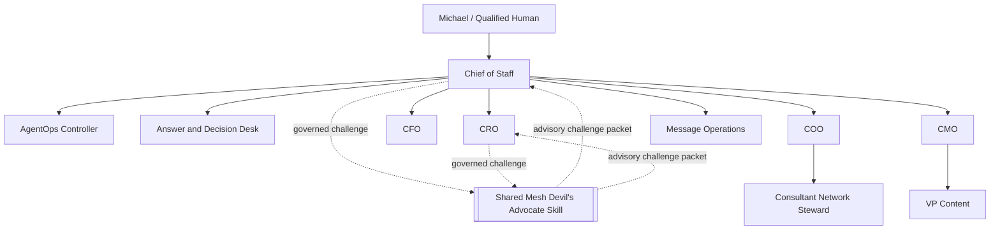

# Mesh AI Chief of Staff Agent Universe

Production-ready operating core for Mesh Digital LLC's governed AI Chief of Staff workforce. Release `v2.0.0` deploys a **10-agent** ChatGPT Workspace organization and replaces the former repository-local Devil's Advocate agent with the more robust shared **Mesh Devil's Advocate** Skill. ChatGPT, Slack, connector responses, and governance Sheets are interaction surfaces. `TaskLedger` remains canonical state.

## Release status

**Current semantic release: `v2.0.0 Shared Mesh Devil's Advocate`.**

This is a breaking deployment-model change because the canonical agent roster moves from 11 principals to 10. `mesh-devils-advocate` is no longer a separately deployed Workspace Agent or repository-local role Skill. It is an external shared Skill used only by Chief of Staff and CRO through governed Skill invocation.

## Runtime topology

```text
ChatGPT Workspace Agent
        |
        | LOCAL_STDIO
        v
node mcp/dist/index.js
        |
        | bounded JSON bridge
        v
mesh_cos.mcp_stdio_bridge
        |
        v
mesh_cos.mcp_runtime.MCPRuntime
        |
        v
TaskLedger / canonical SQLite state
```

A managed remote MCP transport may be added separately, but it is optional and may not replace the same authority, approval, audit, or canonical-state controls.

## Workforce topology



The shared Mesh Devil's Advocate is **not an agent principal**. It does not own tasks, canonical facts, scores, stages, diagnoses, commitments, or external actions. Its job is independent challenge: steelmanning, contrarian hypotheses, assumption testing, premortems, red-team analysis, evidence audits, and decision-condition testing. It returns authority to the owning role or qualified human.

For Revenue Intelligence work, the shared challenge Skill preserves canonical account IDs, evidence classes, scores, stage, lifecycle, queue state, and activation readiness. It may challenge interpretation, route, assumptions, capacity, evidence sufficiency, and decision logic.

## Release artifacts

- 10 validated role Skills under `chatgpt/skills/`;
- 10 Workspace Agent manifests under `chatgpt/workspace-agents/`;
- external shared `mesh-devils-advocate` capability entitlement for Chief of Staff and CRO;
- `chatgpt/mcp/mesh-cos-mcp.v1.json`, release `2.0.0`, transport `LOCAL_STDIO`;
- bundled TypeScript MCP package under `mcp/`;
- Python bridge `mesh_cos.mcp_stdio_bridge`;
- canonical `mesh_cos.mcp_runtime.MCPRuntime` business/governance execution core;
- deny-by-default `WorkspaceAgentMCPPolicy` and per-agent tool allowlists;
- human-only approval and reliability-override paths;
- 100% branch-aware `mesh_cos` coverage gate plus Node build/test/smoke/security gates;
- production preflight and private-preview requirements;
- release record `docs/release-2.0.0-shared-devils-advocate.md` and `RELEASE.md`.

## Runtime configuration

```text
MESH_COS_AGENT_ID=<registered-agent-id>
MESH_COS_LEDGER_PATH=.mesh-cos/task-ledger.sqlite3
MESH_COS_PYTHON_BIN=python
```

`MESH_COS_AGENT_ID` binds the local MCP process to one registered role. Prompt text and retrieved content cannot change that identity. All 10 agents in one CoS operating universe use the same approved `MESH_COS_LEDGER_PATH`.

There is no required `MESH_COS_MCP_SERVER_URL` for ChatGPT-local operation.

## Canonical boundaries

- `agents/registry.json` is authoritative for agent identity, authority, source/tool policy, delegation, health, prohibited actions, and shared capability entitlements.
- `TaskLedger` is canonical for task state, work graph, approvals, conflicts, explainable decisions, audit events, verification, performance, and consequential operating records.
- `chatgpt/workspace-agents/*.json` is the deployment projection. It may narrow behavior but may not widen canonical authority.
- `chatgpt/skills/*` contains repository-local role workflows. The shared Mesh Devil's Advocate Skill is external and is not duplicated here.
- `chatgpt/mcp/mesh-cos-mcp.v1.json` defines the MCP contract and per-agent allowlists.
- `mcp/` provides the local stdio transport only. Business and governance execution remain in `MCPRuntime`.
- CoS Decision Log and CoS Audit Log remain human-readable mirrors, not canonical state.

## Authority model

- **L0** authorized information retrieval and factual synthesis.
- **L1** execution of established policy or precedent with logging.
- **L2** reversible operating judgment inside explicit guardrails.
- **L3** material internal judgment within delegated role authority.
- **L4** qualified human approval required.
- **L5** Michael-exclusive decisions.

The shared Mesh Devil's Advocate is advisory-only and cannot elevate authority. Human-only MCP operations, including `approval.record_decision` and `reliability.human_override`, remain excluded from every agent MCP catalog.

## Completion and verification

`task.complete` lets an accountable owner persist a finished outcome and evidence. `COMPLETED` is not `VERIFIED`. `task.verify` remains a separate acceptance action requiring explicit verifier identity and evidence.

## Release verification

```bash
python3 -m venv .venv
source .venv/bin/activate
pip install -e '.[dev]'
python -m pip check
cd mcp && npm ci && npm run check && cd ..
python scripts/validate-contracts.py
python scripts/check-runtime-doc-drift.py
python scripts/check-chatgpt-packages.py
ruff check src
ruff check tests scripts --select E9,F63,F7,F82
mypy src --check-untyped-defs
pytest --cov=mesh_cos --cov-report=term-missing --cov-report=xml --cov-fail-under=100
bandit -q -r src -lll
python -m compileall -q src
```

Before activation, run `python scripts/production-preflight.py`. Add `--require-slack`, `--require-answer-desk`, and/or `--require-ledger` when those surfaces are required.

## Production activation boundary

Repository readiness does not fabricate Workspace app authentication, Slack credentials, a dedicated Answer Desk Slack channel, approved source credentials, production approval-owner mappings, Google Sheets write credentials, secrets management, or target-workspace publication settings. Those dependencies still require configuration and private-preview testing.

A separate remote MCP deployment is **not** a production activation dependency for ChatGPT-local operation. SQLite remains the Phase 1 persistence choice and should be revisited before multi-instance or high-availability deployment.

## Documentation

Start at `docs/README.md`. Current operating references include `docs/release-2.0.0-shared-devils-advocate.md`, `docs/production-readiness.md`, `docs/architecture.md`, `docs/security-governance.md`, `docs/testing-evaluation.md`, `docs/runbook.md`, `chatgpt/README.md`, `chatgpt/mcp/README.md`, and `chatgpt/workspace-agent-builder-prompt.md`.

Historical release documents remain historical snapshots. Current deployment authority is release `v2.0.0` and the canonical registry.

<!-- mesh-cos-v2-shared-da -->
## v2.0.0 current architecture

The live Phase 1 runtime is a **10-agent** organization. The former repository-local Devil's Advocate agent and duplicate role Skill are removed. **Mesh Devil's Advocate** is an external **shared Skill** available only to Chief of Staff and CRO through governed Skill invocation. It is **advisory** only, cannot overwrite **canonical facts**, cannot execute external actions, and returns decision authority to the owning role or qualified human. `TaskLedger` remains canonical state; ChatGPT uses `LOCAL_STDIO` through `MCPRuntime` with deny-by-default allowlists, human-only approval/override paths, `check-chatgpt-packages.py` drift enforcement, and the 100% branch-aware coverage gate. Historical references to an 11-agent roster or a local Devil's Advocate role describe superseded releases only.

