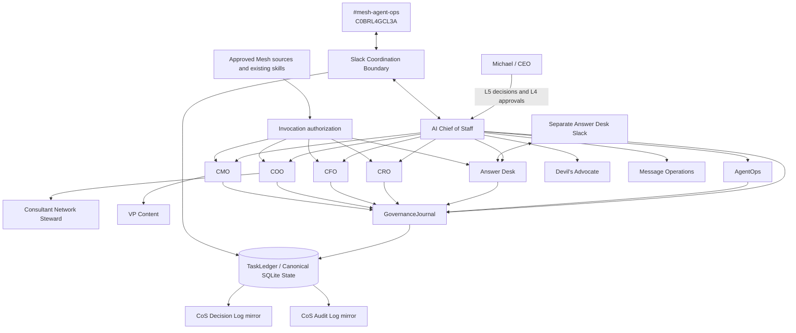
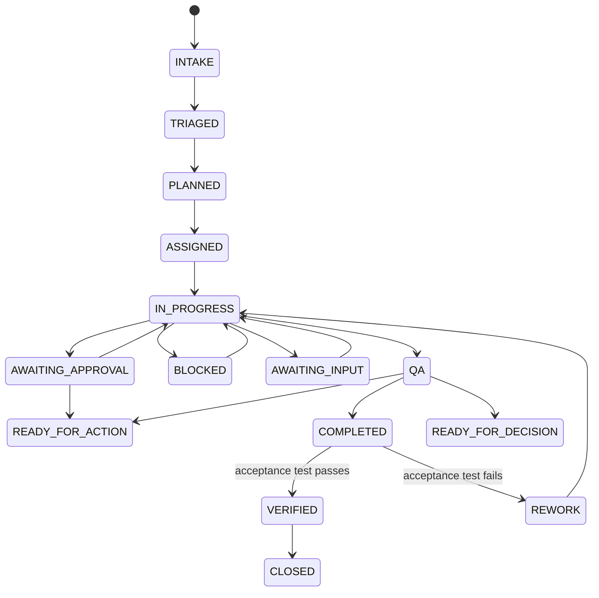

# Mesh AI Chief of Staff Agent Universe

Phase 1 operating core for Mesh Digital LLC's AI Chief of Staff. The repository implements a governed executive operating control plane for a bounded agent workforce. It is not a general chatbot, and Slack is not the system of record.

## Operating objective

**Maximize the return on Michael's judgment, relationships, attention, and authority by independently resolving everything that does not require the CEO, and materially improving everything that does.**

## Phase 1 status

Version `0.1.4` preserves the completed Phase 1 operating core, explainable `decision.v2` records, fully auditable `agent-event.v2` records, and a reconciled canonical role model with stable organizational names and separate implementation-version metadata.

`ChiefOfStaffService` and `ChiefOfStaffWorkforceManager` manage the durable work graph from intake through decomposition, delegation, dependencies, check-ins, reassignment, stalled-work remediation, escalation, governed functional invocation, acceptance verification, closure, and supersession. AgentOps supports durable rolling performance evidence, workload and SLA signals, complete Phase 1 recommendation vocabulary, and governed health-state changes.

Production activation still requires environment-specific configuration that must not be committed: Slack credentials, the separate Answer Desk channel ID, authoritative source and skill credentials/permissions, production approval owners, deployment infrastructure, and authenticated Google Sheets write capability if automatic governance mirroring is enabled.

## System architecture



### Canonical boundaries

- `agents/registry.json`, normalized by the runtime registry and shared governance policy, is authoritative for agent identity, authority, source/tool policy, delegation permissions, health, and prohibited actions.
- `TaskLedger` is canonical for task state, explainable decisions, audit events, and consequential operating records.
- Versioned JSON schemas define machine-readable contracts, including backward-compatible v1 contracts plus `decision.v2` and `agent-event.v2`.
- Slack and Google Sheets are observable/human-readable surfaces, not canonical state.
- Functional adapters compose approved Mesh capabilities without duplicating skill logic.

## Role identity and implementation versioning

Organizational role identity is stable. Canonical Phase 1 display names do not encode software maturity or release labels. Agent implementation versions live in each registry record's `version` field using `MAJOR.MINOR.PATCH`, while repository releases carry the operating-core release version. Scope limitations are expressed through accountable domain, source authority, permitted/prohibited actions, approvals, and delegation rules, not through names such as a role plus a version suffix.

## Explainable AI governance

Every registered agent inherits `config/governance-policy.v1.json` at runtime. This adds the shared `governance-journal` tool and the v2 governance output contracts without expanding any agent's functional authority.

**Explainable decisions.** Any material decision or recommendation is recorded through `mesh.cos.decision.v2`. The record captures the decision owner, authority level, approval evidence where applicable, concise basis, authoritative evidence/source references, alternatives, selection criteria, confidence, risk, affected entities, reversibility/reversal conditions, model/skill provenance, outcome validation, lineage, and integrity hash.

**Fully auditable actions.** Consequential agent, service, and governed skill/tool activity is recorded through `mesh.cos.agent-event.v2`. The event includes actor/action/result provenance, task/correlation/decision links, authority/policy, source/tool/target, concise input/output summaries, evidence/approval, error metadata, model/skill provenance, risk/classification, retention, and a tamper-evident SHA-256 hash chain.

**Privacy boundary.** Explainability does not mean exposing hidden reasoning. Private chain-of-thought, hidden reasoning traces, secrets, credentials, tokens, raw sensitive prompts, and unnecessary personal data are prohibited from governance records.

**Canonical-first mirroring.** `TaskLedger` is written first. The human-readable registers are operational mirrors:

- CoS Decision Log, spreadsheet ID `1IJcwPuulqsNAa1lCW2MsmNgH6Vm5INPqTlcH4NR0xpw`
- CoS Audit Log, spreadsheet ID `1T8vKx4gaUJdeG8kSc18MsBbXpY4EbDF3exZ0RGpvND0`

A mirror failure cannot erase canonical state and is itself recorded for remediation. See [`docs/explainable-decisions-audit.md`](docs/explainable-decisions-audit.md).

## Agent hierarchy

- **CoS**: outcome intake, work decomposition, prioritization, delegation, dependency coordination, arbitration, reallocation, escalation, verification, and portfolio recommendations.
- **AgentOps**: rolling performance evaluation, workload and SLA monitoring, health recommendations, stalled-work detection, defect signals, and coordination-loop detection.
- **Answer Desk**: permission-aware team question handling, routing, recommendations, approvals, escalation, and correction tracking.
- **CRO**: commercial strategy, opportunity qualification, pipeline health, pursuits, buyer dynamics, proposal commercial architecture, next-best commercial action, expansion, and commercial-risk framing within delegated scope.
- **CFO**: Engagement Finance / FP&A, including engagement economics, pricing scenarios, cost-to-serve, contribution economics, margins, supported working-capital implications, forecast-versus-actual, margin leakage, assumption management, scenario comparison, and financial-risk recommendations. It is not unrestricted enterprise-finance authority.
- **COO**: delivery feasibility, delivery configuration, capacity, POD/resource composition, dependency readiness, partner capacity, delivery-risk sensing, operational constraints, and staffing recommendations.
  - **Consultant Network Steward**: candidate identification/matching, consultant fit, freshness, validation timestamps, rate, availability confidence, readiness gaps, refresh workflow, and contracting readiness.
- **CMO**: marketing strategy, audience/ICP strategy, category positioning, demand/campaign architecture, distribution, brand governance, campaign optimization, editorial priorities, and marketing-commercial feedback.
  - **VP Content**: editorial planning/calendar, source and evidence assembly, content production, channel adaptation, derivative content, repurposing, Mesh IP reuse, inventory, editorial QA, and performance feedback.
- **Devil's Advocate**: independent challenge, never final decision owner.
- **Message Operations**: controlled execution boundary for approved communications.

## Decision rights

- **L0 Information**: authorized retrieval and factual synthesis.
- **L1 Established policy / precedent**: execution of approved rules with logging.
- **L2 Reversible operating judgment**: bounded internal decisions within explicit guardrails.
- **L3 Material internal judgment**: agents recommend; CoS resolves only when explicitly delegated, otherwise Michael decides.
- **L4 Human approval required**: consequential commercial, external, public, legal, regulatory, security, privacy, personnel, destructive, sensitive-system, and irreversible actions fail closed.
- **L5 Michael exclusive**: firm strategy, major pivots and capital decisions, material client or partner exceptions, senior personnel decisions, CoS authority, decision-rights policy, and material agent-authority expansion.

No monetary thresholds are inferred. Threshold-sensitive actions remain approval-required until explicitly configured.

## Outcome lifecycle



A produced artifact is not completion. `VERIFIED` requires explicit acceptance-test execution with evidence. Failed verification routes to remediation.

## Slack coordination

Current agent-operations channel:

- Name: `#mesh-agent-ops`
- Channel ID: `C0BRL4GCL3A`
- Environment variable: `MESH_COS_SLACK_AGENT_OPS_CHANNEL_ID`

Implemented controls include HMAC request verification, five-minute freshness/replay rejection, durable event deduplication, one-task/one-thread mapping, structured message rendering and parsing, inbound event persistence, and approval notifications. Live operation still requires a bot token and signing secret.

The team-facing Answer Desk uses a separate configurable Slack channel via `MESH_COS_SLACK_ANSWER_DESK_CHANNEL_ID` and supports `ANSWERED`, `ROUTED`, `RECOMMENDATION_PROVIDED`, `APPROVAL_REQUIRED`, `ESCALATED`, `BLOCKED_BY_ACCESS`, and `BLOCKED_BY_EVIDENCE`.

## Reliability and auditability

Phase 1 includes idempotent intake, bounded retries, timeout handling, execution leases, failure records, explicit replay, human override, task supersession, stalled-work remediation, decision lineage, durable audit events, mirror-failure records, and `MESH_COS_KILL_SWITCH` enforcement for automated actions.

## Metrics

The runtime instruments the full Phase 1 measurement set without inventing baselines or targets: work resolved without Michael, questions deflected, CEO touches, first-pass acceptance, rework, escalation quality, cycle time, stalled work, verified outcomes, agent failures, approval cycle time, cross-agent conflicts, conversation loops, contributors, and cost per verified outcome where telemetry exists.

## Development and verification

```bash
python3 -m venv .venv
source .venv/bin/activate
pip install -e '.[dev]'
python -m pip check
python scripts/validate-contracts.py
python scripts/check-runtime-doc-drift.py
ruff check src tests scripts --select E9,F63,F7,F82
pytest --cov=mesh_cos --cov-report=term-missing --cov-fail-under=55
bandit -q -r src -lll
python -m compileall -q src
```

GitHub Actions executes the same release gates on pull requests and `main`. Development uses explicit red-green-refactor loops, with acceptance tests committed before the implementation that satisfies them.

## Documentation

Start at [`docs/README.md`](docs/README.md). The governance standard is [`docs/explainable-decisions-audit.md`](docs/explainable-decisions-audit.md). The canonical human-readable operating specification remains [`docs/phase-1-operating-contract.md`](docs/phase-1-operating-contract.md).

## Production dependencies

The remaining dependencies are configuration and external connectivity, not fabricated live integrations:

- Slack bot token and signing secret
- team-facing Answer Desk Slack channel ID
- approved Mesh source and skill credentials/permissions
- production approval owners
- deployment/runtime infrastructure for the chosen production environment
- authenticated runtime permission to write the two governance Google Sheets if automatic mirroring is enabled
- explicitly approved future monetary thresholds, if any

SQLite remains the Phase 1 persistence choice. Revisit persistence before multi-instance or high-availability deployment.
