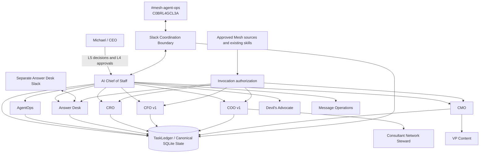
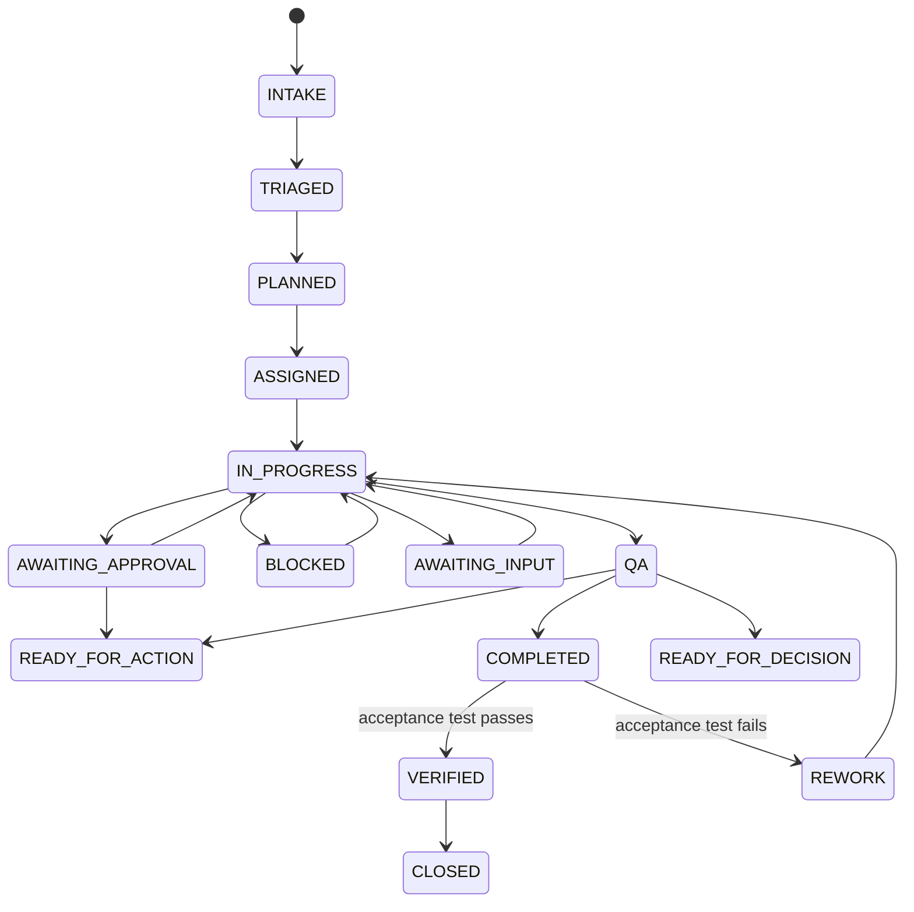

# Mesh AI Chief of Staff Agent Universe

Phase 1 operating core for Mesh Digital LLC's AI Chief of Staff. The repository implements a governed executive operating control plane for a bounded agent workforce. It is not a general chatbot, and Slack is not the system of record.

## Operating objective

**Maximize the return on Michael's judgment, relationships, attention, and authority by independently resolving everything that does not require the CEO, and materially improving everything that does.**

## Phase 1 status

Version `0.1.2` closes the remaining code-level requirement gaps identified by the post-remediation audit. `ChiefOfStaffService` and `ChiefOfStaffWorkforceManager` now manage the durable work graph from intake through decomposition, delegation, dependencies, check-ins, reassignment, stalled-work remediation, escalation, governed functional invocation, acceptance verification, closure, and supersession.

AgentOps now supports durable rolling performance evidence, workload and SLA signals, the complete Phase 1 recommendation vocabulary, and governed health-state changes. Slack includes inbound request verification and freshness controls, structured parsing, durable deduplication, one-task/one-thread mapping, and approval notifications. Answer Desk has a separate configurable team-facing interface and complete Phase 1 dispositions.

Production activation still requires environment-specific configuration that must not be committed: Slack credentials, the separate Answer Desk channel ID, authoritative source and skill credentials/permissions, production approval owners, and deployment infrastructure.

## System architecture



### Canonical boundaries

- `agents/registry.json`, normalized by the runtime registry, is authoritative for agent identity, authority, source/tool policy, delegation permissions, health, and prohibited actions.
- `TaskLedger` is canonical for task state and consequential operating records.
- Nine versioned JSON schemas define machine-readable contracts and are validated against runtime shapes.
- Slack is an observable collaboration layer. Task/thread mappings and event idempotency are persisted outside Slack.
- Functional adapters compose approved Mesh capabilities without duplicating skill logic.

## Agent hierarchy

- **CoS**: outcome intake, work decomposition, prioritization, delegation, dependency coordination, arbitration, reallocation, escalation, verification, and portfolio recommendations.
- **AgentOps**: rolling performance evaluation, workload and SLA monitoring, health recommendations, stalled-work detection, defect signals, and coordination-loop detection.
- **Answer Desk**: permission-aware team question handling, routing, recommendations, approvals, escalation, and correction tracking.
- **CRO**: commercial executive and pursuit ownership within delegated scope.
- **CFO v1**: Engagement Finance / FP&A only.
- **COO v1**: delivery feasibility, capacity, and resource readiness.
  - **Consultant Network Steward**: consultant fit, freshness, rate, availability confidence, and contracting readiness.
- **CMO**: marketing strategy and delegated execution.
  - **VP Content**: editorial production workflow.
- **Devil's Advocate**: independent challenge, never final decision owner.
- **Message Operations**: controlled execution boundary for approved communications.

## Decision rights

- **L0 Information**: authorized retrieval and factual synthesis.
- **L1 Established policy / precedent**: execution of approved rules with logging.
- **L2 Reversible operating judgment**: bounded internal decisions within explicit guardrails.
- **L3 Material internal judgment**: agents recommend; CoS resolves only when explicitly delegated, otherwise Michael decides.
- **L4 Human approval required**: consequential commercial, external, public, legal, regulatory, security, privacy, personnel, destructive, sensitive-system, and irreversible actions fail closed.
- **L5 Michael exclusive**: firm strategy, major pivots and capital decisions, material client or partner exceptions, senior personnel decisions, CoS authority, decision-rights policy, and material agent-authority expansion.

No monetary thresholds are inferred. Threshold-sensitive actions remain approval-required until explicitly configured.

## Outcome lifecycle



A produced artifact is not completion. `VERIFIED` requires explicit acceptance-test execution with evidence. Failed verification routes to remediation.

## Slack coordination

Current agent-operations channel:

- Name: `#mesh-agent-ops`
- Channel ID: `C0BRL4GCL3A`
- Environment variable: `MESH_COS_SLACK_AGENT_OPS_CHANNEL_ID`

Implemented controls include HMAC request verification, five-minute freshness/replay rejection, durable event deduplication, one-task/one-thread mapping, structured message rendering and parsing, inbound event persistence, and approval notifications. Live operation still requires a bot token and signing secret.

The team-facing Answer Desk uses a separate configurable Slack channel via `MESH_COS_SLACK_ANSWER_DESK_CHANNEL_ID` and supports `ANSWERED`, `ROUTED`, `RECOMMENDATION_PROVIDED`, `APPROVAL_REQUIRED`, `ESCALATED`, `BLOCKED_BY_ACCESS`, and `BLOCKED_BY_EVIDENCE`.

## Reliability and auditability

Phase 1 includes idempotent intake, bounded retries, timeout handling, execution leases, failure records, explicit replay, human override, task supersession, stalled-work remediation, durable audit events, and `MESH_COS_KILL_SWITCH` enforcement for automated actions.

## Metrics

The runtime instruments the full Phase 1 measurement set without inventing baselines or targets: work resolved without Michael, questions deflected, CEO touches, first-pass acceptance, rework, escalation quality, cycle time, stalled work, verified outcomes, agent failures, approval cycle time, cross-agent conflicts, conversation loops, contributors, and cost per verified outcome where telemetry exists.

## Development and verification

```bash
python3 -m venv .venv
source .venv/bin/activate
pip install -e '.[dev]'
python -m pip check
python scripts/validate-contracts.py
python scripts/check-runtime-doc-drift.py
ruff check src tests scripts --select E9,F63,F7,F82
pytest --cov=mesh_cos --cov-report=term-missing --cov-fail-under=55
bandit -q -r src -lll
python -m compileall -q src
```

GitHub Actions executes the same release gates on pull requests and `main`. Development uses explicit red-green-refactor loops, with source-derived acceptance tests committed before the implementation that satisfies them.

## Documentation

Start at [`docs/README.md`](docs/README.md). The final closure record is [`docs/phase-1-final-closure-2026-08-17.md`](docs/phase-1-final-closure-2026-08-17.md). The canonical human-readable operating specification remains [`docs/phase-1-operating-contract.md`](docs/phase-1-operating-contract.md).

## Production dependencies

The remaining dependencies are configuration and external connectivity, not fabricated live integrations:

- Slack bot token and signing secret
- team-facing Answer Desk Slack channel ID
- approved Mesh source and skill credentials/permissions
- production approval owners
- deployment/runtime infrastructure for the chosen production environment
- explicitly approved future monetary thresholds, if any

SQLite remains the Phase 1 persistence choice. Revisit persistence before multi-instance or high-availability deployment.
