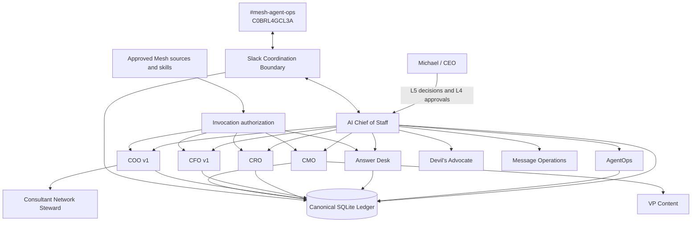
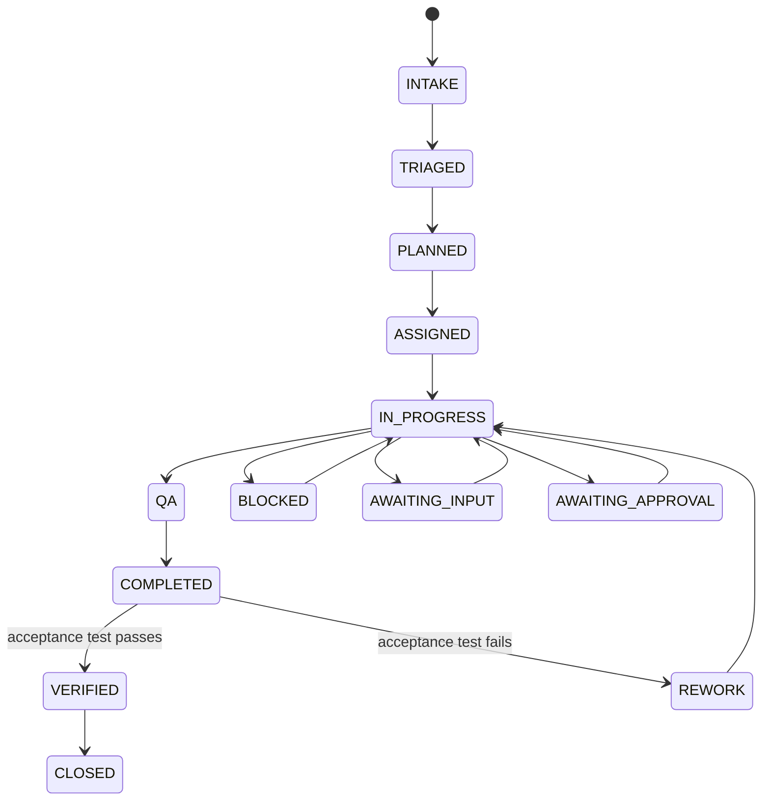

# Mesh AI Chief of Staff Agent Universe

Phase 1 operating core for Mesh Digital LLC's AI Chief of Staff. The repository implements a governed executive operating control plane for a bounded agent workforce. It is not a general chatbot and Slack is not the system of record.

## Operating objective

**Maximize the return on Michael's judgment, relationships, attention, and authority by independently resolving everything that does not require the CEO, and materially improving everything that does.**

## Current status

Phase 1 code-level remediation is complete on `main`. The runtime now includes canonical registry loading, durable control-plane records, Chief of Staff orchestration through explicit acceptance verification, governed delegation, conflict and decision records, Answer Desk disposition persistence, Slack coordination controls, invocation-time authorization, AgentOps evaluation, bounded retries, operating metrics, and thin functional adapter boundaries.

Production activation still requires environment-specific configuration that must not be committed: Slack credentials, the separate Answer Desk channel ID, authoritative source credentials and permissions, and production approval-owner configuration.

## System architecture



### Canonical boundaries

- `agents/registry.json` is the runtime source of truth for agent identity, authority, source/tool policy, delegation permissions, health, and prohibited actions.
- `TaskLedger` is canonical for task state and consequential operating records.
- Versioned JSON schemas define machine-readable contracts.
- Slack is an observable collaboration layer. Task/thread mappings and event idempotency are persisted in the ledger.
- Functional adapters compose approved Mesh capabilities without duplicating the underlying skill logic.

## Agent hierarchy

- **CoS**: outcome intake, planning, assignment, lifecycle control, arbitration, escalation, verification, and executive compression.
- **AgentOps**: performance evaluation, health recommendations, stalled-work detection, coordination-loop detection, and workforce observability.
- **Answer Desk**: permission-aware question handling with durable disposition records.
- **CRO**: commercial executive and pursuit ownership within delegated scope.
- **CFO v1**: Engagement Finance / FP&A only.
- **COO v1**: delivery feasibility, capacity, and resource readiness.
  - **Consultant Network Steward**: consultant fit, freshness, rate, availability confidence, and contracting readiness.
- **CMO**: marketing strategy and delegated execution.
  - **VP Content**: editorial production workflow.
- **Devil's Advocate**: independent challenge, never final decision owner.
- **Message Operations**: controlled execution boundary for approved communications.

## Decision rights

- **L0 Information**: authorized retrieval and factual synthesis.
- **L1 Established policy / precedent**: execution of approved rules with logging.
- **L2 Reversible operating judgment**: bounded internal decisions within explicit guardrails.
- **L3 Material internal judgment**: agents recommend; CoS resolves only when explicitly delegated, otherwise Michael decides.
- **L4 Human approval required**: consequential commercial, external, public, legal, regulatory, security, privacy, personnel, destructive, sensitive-system, and irreversible actions fail closed.
- **L5 Michael exclusive**: firm strategy, major pivots and capital decisions, material client or partner exceptions, senior personnel decisions, CoS authority, decision-rights policy, and material agent-authority expansion.

No monetary thresholds are inferred. Threshold-sensitive actions remain approval-required until explicitly configured.

## Outcome lifecycle



A produced artifact is not completion. `VERIFIED` requires explicit acceptance-test execution with evidence. Failed verification routes to rework.

## Slack coordination

Current agent-operations channel:

- Name: `#mesh-agent-ops`
- Channel ID: `C0BRL4GCL3A`
- Environment variable: `MESH_COS_SLACK_AGENT_OPS_CHANNEL_ID`

Implemented controls include request-signature verification, durable event deduplication, one-task/one-thread mapping, structured message rendering, and a live-capable Web API client boundary. Live operation still requires a bot token and signing secret. The separate team-facing Answer Desk channel is not yet configured.

## Development and verification

```bash
python3 -m venv .venv
source .venv/bin/activate
pip install -e '.[dev]'
python scripts/validate-contracts.py
pytest
python -m compileall -q src
```

The remediation increment was developed with red-green-refactor loops. CI exposed registry normalization defects during the loop, which were corrected before merge. The final remediation PR passed contract validation, the complete pytest suite, and compileall.

## Documentation

Start at [`docs/README.md`](docs/README.md). Key documents include the canonical operating contract, architecture, decision rights, delegation, lifecycle, Agent Registry, AgentOps, Slack protocol, Answer Desk, security/governance, observability, testing, runbook, and remediation closure record.

## Production dependencies

The remaining gaps are configuration and external integration dependencies, not missing Phase 1 control-plane code:

- Slack bot token and signing secret
- team-facing Answer Desk Slack channel ID
- approved Mesh source and skill credentials/permissions
- production approval owners
- explicitly approved future monetary thresholds, if any
- deployment/runtime infrastructure for the chosen production environment

SQLite remains the Phase 1 persistence choice. Revisit persistence before multi-instance or high-availability deployment.
