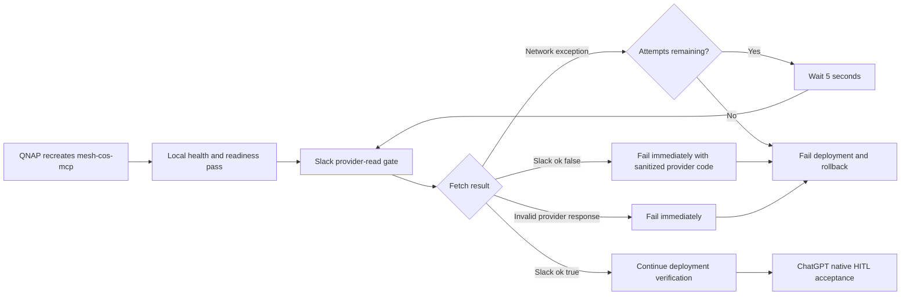

# v4.2.3 QNAP qnet Egress Readiness

`v4.2.3` is a causal deployment-hardening patch for the v4.2.x ChatGPT-native Slack event-triggered HITL architecture.

The canonical Phase 1 authority/runtime contract remains **`4.0.0`** with exactly 10 registered agents and the unchanged governed CoS tool surface. Human-only operations remain human-only. OpenAI Secure MCP Tunnel remains the production remote MCP transport. TaskLedger remains canonical approval state.

## Incident fixed

v4.2.2 correctly repaired Slack provider reads to use authenticated GET/query transport and corrected the Slack App ID to `A0B49RNE4K0`. During QNAP deployment, however, two consecutive v4.2.2 candidates reached local health and readiness, then failed the first live `conversations.history` check with a network exception before Slack returned any provider response. Transactional rollback correctly restored v4.2.1 each time.

The exact v4.2.2 image and protected bot token then succeeded immediately when the image shared the already-stable v4.2.1 `mesh-cos-mcp` network namespace. This isolates the failure to fresh QNAP/qnet external-egress readiness timing rather than image content, Slack OAuth, scopes, channel membership, or the Slack API contract.

v4.2.3 permits bounded retry only for pre-provider network exceptions in the deployment provider-read gate. A Slack `ok:false` response, malformed response, or internal verifier failure remains an immediate hard failure.

## Architecture



The Mermaid source is validated in the versioned release documentation.

## Invariants

- Dispatcher remains locator-only and non-authoritative.
- The dispatcher stays version-family labeled `Mesh CoS MCP v4.x`; no patch-specific edit is required.
- v4.2.2 GET/query provider transport remains unchanged.
- No new public MCP tool or agent is added.
- `approval.record_decision` remains human-only and unavailable to agents.
- Slack bot scopes remain `chat:write` and `groups:history`.
- The protected bot token remains `xoxb-` and is never placed in query strings or logs.
- No Slack Socket Mode listener or `xapp-` credential is used.
- Only a network exception before any Slack provider response is eligible for retry.
- Retry is bounded to six total attempts with five-second inter-attempt delay.
- Slack `ok:false`, invalid/malformed response, provider authorization failure, and exhausted network readiness all fail closed.
- v4.2.1 one-layer Slack bold-wrapper decision compatibility remains intact.
- Duplicate delivery remains idempotent and CHANGE remains a two-step governed revision loop.

## Slack deployment prerequisite

The dedicated bot must be installed with Bot Token Scopes `chat:write` and `groups:history`, must be a member of `#mesh-agent-ops`, and must use provider-verified App ID `A0B49RNE4K0`. If scope configuration changes, reauthorize/reinstall the Slack app and reprovision the resulting Bot User OAuth Token to QNAP.

v4.2.3 deployment verification performs a live private-channel read from the freshly recreated `mesh-cos-mcp` container. It tolerates only bounded pre-provider network readiness; it does not tolerate Slack authorization or policy failure.

## Security boundary

Security applicability is **TARGETED** because this patch changes external API/network egress readiness and deployment/runtime behavior at the human approval boundary. See `docs/security-review-v4.2.3.md` and `specs/native-slack-event-hitl-v4.2.3.feature`.

## Release assets

- `mesh-cos-mcp-qnap-v4.2.3.zip`
- `mesh-cos-mcp-qnap-v4.2.3.zip.sha256`

## Version identity

- Repository/QNAP deployment release: `4.2.3`
- Semantic tag: `v4.2.3`
- Container image label: `4.2.3-qnap`
- Canonical Phase 1 authority/runtime contract: `4.0.0` unchanged
- Workforce: exactly 10 agents
- Production transport: OpenAI Secure MCP Tunnel
- Slack App ID: `A0B49RNE4K0`

Successful live readiness after deployment must report the equivalent of:

```text
mcp_version: 4.0.0
deployment_release: 4.2.3
agent_id: cos
transport: SECURE_MCP_TUNNEL
slack_hitl_mode: CHATGPT_NATIVE_EVENT_TRIGGER
slack_hitl_ready: true
```

## QNAP deployment

Place the immutable release ZIP and checksum directly in `/share/Docker/cos-mcp/releases` and deploy the versioned unit:

```sh
cd /share/Docker/cos-mcp/releases
sha256sum -c mesh-cos-mcp-qnap-v4.2.3.zip.sha256
unzip -oq mesh-cos-mcp-qnap-v4.2.3.zip
sudo sh ./v4.2.3/mesh-cos-mcp-deploy.sh
```

The corrected protected Slack bot credential and tunnel credential are preserved. No dispatcher edit, Slack scope change, or OAuth reprovisioning is required solely for the v4.2.3 code deployment.

## Production acceptance

After QNAP deployment, keep the existing dispatcher prompt labeled `Mesh CoS MCP v4.x` and execute `docs/chatgpt-published-app-production-acceptance-v4.2.3.md`. The first live case must use a fresh synthetic approval, provider text `*APPROVE*`, and prove the complete Work -> published MCP -> QNAP GET provider reread -> canonical APPROVED / READY_FOR_ACTION transition plus replay idempotency before the rest of the matrix runs.

**COMPLETED != VERIFIED.** v4.2.3 is not production-accepted until repository verification, live QNAP provider-read/qnet readiness, and the live event-trigger/provider reconciliation matrix all pass.
