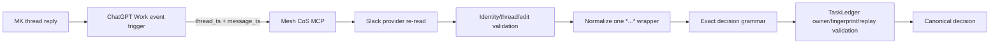

# v4.2.1 Native Slack HITL Decision Compatibility

`v4.2.1` is a patch release for the v4.2.0 ChatGPT-native Slack event-triggered HITL architecture.

The canonical Phase 1 authority/runtime contract remains **`4.0.0`** with exactly 10 registered agents and exactly 27 governed CoS tools. Human-only operations remain human-only. OpenAI Secure MCP Tunnel remains the production remote MCP transport. TaskLedger remains canonical approval state.

## Incident fixed

The first live v4.2.0 production acceptance proved that the ChatGPT Work dispatcher fired and reached Mesh CoS MCP, but reconciliation failed closed with `INVALID_ARGUMENT / execution_failed`. Slack provider evidence showed the human reply as `*APPROVE*`; the v4.2.0 parser accepted only the bare exact token `APPROVE`.

v4.2.1 accepts exactly one whole-message Slack `*...*` wrapper and then applies the unchanged exact decision grammar. This means `*APPROVE*`, `*DENY*`, and `*CHANGE*` are compatible while `**APPROVE**`, `*APPROVE* extra`, `*looks good*`, and fuzzy natural-language approvals remain rejected.

## Architecture



## Invariants

- Dispatcher remains locator-only and non-authoritative.
- No new public MCP tool is added.
- `approval.record_decision` remains human-only and unavailable to agents.
- Slack bot scopes remain `chat:write` and `groups:history`.
- No Slack Socket Mode listener or `xapp-` credential is used.
- Edited, deleted/unavailable, bot-authored, wrong-user, wrong-thread, root-message, stale-fingerprint, nested/partial-formatting, and conflicting-replay cases fail closed.
- Duplicate delivery remains idempotent.
- CHANGE remains a two-step governed revision loop requiring a new fingerprint before consequential action.

## Dispatcher

The existing **Mesh Slack HITL Dispatcher** trigger configuration does not change. After deployment, edit only the prompt's release label from `v4.2.0` to `v4.2.1`. Do not create a second dispatcher.

See `docs/chatgpt-native-slack-dispatcher-v4.2.1.md`.

## Security boundary

Security applicability is **FULL REVIEW** because this patch changes parsing at the human approval authority boundary. See `docs/security-review-v4.2.1.md` and `specs/native-slack-event-hitl-v4.2.1.feature`.

## Release assets

- `mesh-cos-mcp-qnap-v4.2.1.zip`
- `mesh-cos-mcp-qnap-v4.2.1.zip.sha256`

## Version identity

- Repository/QNAP deployment release: `4.2.1`
- Semantic tag: `v4.2.1`
- Container image label: `4.2.1-qnap`
- Canonical Phase 1 authority/runtime contract: `4.0.0` unchanged
- Workforce: exactly 10 agents
- CoS catalog: exactly 27 governed tools
- Production transport: OpenAI Secure MCP Tunnel

Successful live readiness after deployment must report the equivalent of:

```text
mcp_version: 4.0.0
deployment_release: 4.2.1
agent_id: cos
transport: SECURE_MCP_TUNNEL
slack_hitl_mode: CHATGPT_NATIVE_EVENT_TRIGGER
slack_hitl_ready: true
```

## QNAP deployment

Place the immutable release ZIP and checksum directly in `/share/Docker/cos-mcp/releases` and deploy the versioned unit:

```sh
cd /share/Docker/cos-mcp/releases
sha256sum -c mesh-cos-mcp-qnap-v4.2.1.zip.sha256
unzip -oq mesh-cos-mcp-qnap-v4.2.1.zip
sudo sh ./v4.2.1/mesh-cos-mcp-deploy.sh
```

Existing protected Slack and tunnel credentials are preserved. No Slack reauthorization or new OAuth scope is required by this patch.

## Production acceptance

After QNAP deployment, update the existing dispatcher prompt release label to `v4.2.1`, then execute `docs/chatgpt-published-app-production-acceptance-v4.2.1.md`. The first live case must reproduce Slack provider text `*APPROVE*` and prove a single canonical APPROVED / READY_FOR_ACTION transition before the rest of the positive/negative matrix runs.

**COMPLETED != VERIFIED.** v4.2.1 is not production-accepted until that live event-trigger/provider reconciliation path and the complete acceptance matrix pass.
