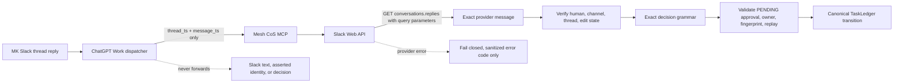

# v4.2.2 Native Slack HITL Provider Transport Repair

`v4.2.2` is a causal patch release for the v4.2.x ChatGPT-native Slack event-triggered HITL architecture.

The canonical Phase 1 authority/runtime contract remains **`4.0.0`** with exactly 10 registered agents and the unchanged governed CoS tool surface. Human-only operations remain human-only. OpenAI Secure MCP Tunnel remains the production remote MCP transport. TaskLedger remains canonical approval state.

## Incidents fixed

v4.2.1 preserved the correct parser compatibility for provider text such as `*APPROVE*`, but production acceptance exposed a second defect before that parser was reached. The dedicated bot and exact locators succeed when Slack `conversations.replies` is invoked with GET/query parameters. The v4.2.1 generic Slack transport instead POSTed a JSON body, and Slack returned `invalid_arguments` with required `channel` and `ts` missing.

v4.2.2 moves provider read methods to authenticated GET/query transport while keeping Slack writes on POST/JSON. Provider failures expose only a sanitized Slack error code and remain fail closed.

The provider-verified Slack App ID is also corrected from the prior typo to `A0B49RNE4K0`, and QNAP deployment verification now proves the actual mounted bot token can read the governed private channel before ChatGPT acceptance begins.

## Architecture



The Mermaid source is validated in the versioned release documentation.

## Invariants

- Dispatcher remains locator-only and non-authoritative.
- The dispatcher stays version-family labeled `Mesh CoS MCP v4.x`; no patch-specific edit is required.
- No new public MCP tool is added.
- `approval.record_decision` remains human-only and unavailable to agents.
- Slack bot scopes remain `chat:write` and `groups:history`.
- The protected bot token remains `xoxb-` and is never placed in query strings or logs.
- No Slack Socket Mode listener or `xapp-` credential is used.
- v4.2.1's one-layer Slack bold-wrapper decision compatibility remains intact.
- Edited, deleted/unavailable, bot-authored, wrong-user, wrong-thread, root-message, stale-fingerprint, nested/partial-formatting, provider-error, and conflicting-replay cases fail closed.
- Duplicate delivery remains idempotent.
- CHANGE remains a two-step governed revision loop requiring a new fingerprint before consequential action.

## Slack deployment prerequisite

The dedicated bot must be installed with Bot Token Scopes:

- `chat:write`
- `groups:history`

If `groups:history` is added to an existing installation, reauthorize/reinstall the Slack app and reprovision the resulting Bot User OAuth Token to QNAP. v4.2.2 deployment verification performs a live private-channel read from the running `mesh-cos-mcp` container and fails if the actual credential lacks scope or channel access.

## Security boundary

Security applicability is **TARGETED** because this patch changes Slack OAuth-backed provider transport and deployment verification at the human approval boundary. See `docs/security-review-v4.2.2.md` and `specs/native-slack-event-hitl-v4.2.2.feature`.

## Release assets

- `mesh-cos-mcp-qnap-v4.2.2.zip`
- `mesh-cos-mcp-qnap-v4.2.2.zip.sha256`

## Version identity

- Repository/QNAP deployment release: `4.2.2`
- Semantic tag: `v4.2.2`
- Container image label: `4.2.2-qnap`
- Canonical Phase 1 authority/runtime contract: `4.0.0` unchanged
- Workforce: exactly 10 agents
- Production transport: OpenAI Secure MCP Tunnel
- Slack App ID: `A0B49RNE4K0`

Successful live readiness after deployment must report the equivalent of:

```text
mcp_version: 4.0.0
deployment_release: 4.2.2
agent_id: cos
transport: SECURE_MCP_TUNNEL
slack_hitl_mode: CHATGPT_NATIVE_EVENT_TRIGGER
slack_hitl_ready: true
```

## QNAP deployment

Place the immutable release ZIP and checksum directly in `/share/Docker/cos-mcp/releases` and deploy the versioned unit:

```sh
cd /share/Docker/cos-mcp/releases
sha256sum -c mesh-cos-mcp-qnap-v4.2.2.zip.sha256
unzip -oq mesh-cos-mcp-qnap-v4.2.2.zip
sudo sh ./v4.2.2/mesh-cos-mcp-deploy.sh
```

The currently corrected protected Slack bot credential and tunnel credential are preserved. If the installed bot already has `groups:history`, no additional Slack reauthorization is required for the v4.2.2 code deployment itself.

## Production acceptance

After QNAP deployment, keep the existing dispatcher prompt labeled `Mesh CoS MCP v4.x` and execute `docs/chatgpt-published-app-production-acceptance-v4.2.2.md`. The first live case must use a fresh synthetic approval, provider text `*APPROVE*`, and prove the complete Work -> published MCP -> QNAP GET provider reread -> canonical APPROVED / READY_FOR_ACTION transition plus replay idempotency before the rest of the matrix runs.

**COMPLETED != VERIFIED.** v4.2.2 is not production-accepted until repository verification and the live event-trigger/provider reconciliation matrix both pass.
