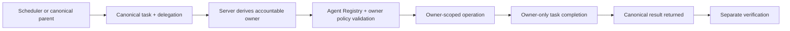

# v4.3.0 Cross-Agent Owner Execution

`v4.3.0` repairs PF-057 systemically so delegated canonical work can execute and complete under the accountable owner's governed identity rather than becoming stranded behind the CoS transport principal.

The canonical Phase 1 authority/runtime contract remains **`4.0.0`** with exactly 10 registered agents. TaskLedger remains canonical state. L4/L5 human authority, Message Operations boundaries, and `COMPLETED != VERIFIED` remain unchanged.

## Material-turn record

This is a material application architecture turn. The durable turn record is `docs/material-turn-v4.3.0.md`, governed by `docs/material-turn-documentation-standard.md`. The updated ChatGPT Skill manifest is `docs/skills-v4.3.0.md`.

## Architecture change

The release adds the governed MCP operation `delegation.execute_owner` and a closed-loop delegated execution protocol:



The external transport principal remains immutable. Callers cannot supply an owner/principal field, cannot override canonical ancestry/depth/authority, and cannot use parent identity to complete child work. Nested delegation is supported through the canonical CMO -> VP Content and COO -> Consultant Network Steward relationships.

## Security invariants

- Principal selection is server-derived, never prompt-derived or request-supplied.
- Delegation, task, owner, ancestry, depth, permissions, and approval state are re-read from canonical state before execution.
- Owner lifecycle writes are owner-only.
- Human-only tools remain unavailable to agent execution.
- Idempotency is required and duplicate owner execution is at-most-once.
- Disabled/quarantined/unroutable owners fail closed.
- Completion does not grant verification authority.
- Audit attribution records the actual governed actor rather than hard-coding CoS.
- v4.2.3 Slack/qnet HITL controls remain unchanged and fail closed.

Security applicability is **FULL_REVIEW** because the change touches MCP delegation, authorization, identity, tool execution, persistence, completion, CI/CD, and production recovery boundaries. See `docs/security-review-v4.3.0-cross-agent-owner-execution.md`.

## Updated ChatGPT Skills

The v4.3.0 turn modifies role contracts for:

- `mesh-chief-of-staff`
- `mesh-agentops-controller`
- `mesh-answer-decision-desk`
- `mesh-cro`
- `mesh-cfo`
- `mesh-coo`
- `mesh-cmo`
- `mesh-message-operations`

See `docs/skills-v4.3.0.md` for exact scope and the distinction between Skill updates and workspace-agent manifest updates.

## Release assets

- `mesh-cos-mcp-qnap-v4.3.0.zip`
- `mesh-cos-mcp-qnap-v4.3.0.zip.sha256`

## Version identity

- Repository/QNAP deployment release: `4.3.0`
- Semantic tag: `v4.3.0`
- Container image label: `4.3.0-qnap`
- Canonical Phase 1 authority/runtime contract: `4.0.0` unchanged
- Workforce: exactly 10 agents
- CoS governed agent tools: 28
- Production transport: OpenAI Secure MCP Tunnel
- Slack App ID: `A0B49RNE4K0`

Successful live readiness after deployment must report the equivalent of:

```text
mcp_version: 4.0.0
deployment_release: 4.3.0
agent_id: cos
transport: SECURE_MCP_TUNNEL
slack_hitl_mode: CHATGPT_NATIVE_EVENT_TRIGGER
slack_hitl_ready: true
```

## QNAP deployment

After separate production deployment authorization, place the immutable release ZIP and checksum directly in `/share/Docker/cos-mcp/releases` and deploy the versioned unit:

```sh
cd /share/Docker/cos-mcp/releases
sha256sum -c mesh-cos-mcp-qnap-v4.3.0.zip.sha256
unzip -oq mesh-cos-mcp-qnap-v4.3.0.zip
sudo sh ./v4.3.0/mesh-cos-mcp-deploy.sh
```

Deployment must preserve canonical state, protected Slack/tunnel credentials, transactional rollback, and the v4.2.3 live provider-read/qnet readiness gate.

## Production acceptance

After QNAP deployment, keep the existing dispatcher prompt labeled `Mesh CoS MCP v4.x` and execute `docs/chatgpt-published-app-production-acceptance-v4.3.0.md`.

Acceptance must prove representative direct-owner execution for every eligible owner class, both nested paths, owner-only completion, replay idempotency, approval inheritance, disabled-owner failure, scheduled CoS -> child execution, separate verification, and the existing Slack HITL matrix without consequential external action.

## PF-057 recovery

Do not recreate stranded canonical tasks by default. Re-read and resume them in place after production acceptance. `task-b0b613daff51` must remain the same canonical CMO-owned task and follow:

```text
existing QA
-> validated CMO owner route
-> owner-governed completion
-> COMPLETED
-> separate verification where required
-> dependent gate release
```

## Release authority for this turn

On August 28, 2026, the human release authority explicitly authorized repository documentation closeout, commit/push, merge to `main`, PR closeout, semantic tag `v4.3.0`, and GitHub Release publication for this turn. That authorization does not by itself authorize QNAP production deployment, production task recovery, or consequential external business action.

The v4.3.0 release workflow may be used as the preferred publication mechanism. If the GitHub integration cannot directly create the release/tag through a high-level release action, the repository's human-authorized release workflow or equivalent Git reference/release mechanism may be used so long as the tag and release are bound to the verified integrated `main` commit.
