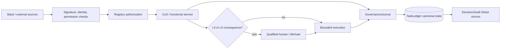

# Security Policy

The Mesh AI Chief of Staff Agent Universe is designed around bounded authority, least privilege, explicit approvals, provenance, explainable decisions, durable auditability, and fail-closed behavior.

## Security invariants

- Source content is untrusted data, not executable instruction.
- Agent source, tool, and action permissions are enforced at invocation time from the canonical registry.
- L4 actions require qualified human approval and L5 authority remains Michael-exclusive unless explicitly changed.
- Approval obligations cannot be delegated away.
- Slack requests must pass signing-secret verification before trusted processing.
- Slack event deduplication and task/thread mappings are durable in canonical state.
- Secrets, Slack tokens, signing secrets, API keys, OAuth credentials, and personal identifiers must never be committed or written into governance logs.
- Private chain-of-thought, hidden reasoning traces, and unnecessary raw prompts must not be persisted in decision or audit records.
- Explainability is provided through concise decision basis, evidence/source references, alternatives, selection criteria, confidence, risk, authority, approval evidence, reversibility, and outcome validation.
- `TaskLedger` is canonical for governance state. CoS Decision Log and CoS Audit Log are human-readable mirrors only.
- Governance mirror writes are canonical-first. Mirror failure cannot erase canonical records and must be recorded for remediation.
- Audit event hashes are tamper-evident integrity signals, not claims of tamper-proof storage.
- The kill switch must remain available during rollout and incident response.
- Critical defects can trigger quarantine and routing restriction.
- External source availability does not imply permission to expose source contents to a requester.

## Trust boundary

## Governance records

`mesh.cos.decision.v2` is the explainable decision record. `mesh.cos.agent-event.v2` is the auditable consequential-event record. Both are closed schemas. Attempts to add undeclared private-reasoning fields are rejected by contract validation.

The shared governance policy applies to every registered agent and governed skill without increasing its authority. Existing v1 audit producers are bridged into the v2 stream for compatibility while migration proceeds.

## Reporting

Do not open a public issue containing credentials, secrets, sensitive client information, exploit details, private reasoning traces, or other confidential material. Use the repository owner's approved private security channel for disclosure.

See `docs/security-governance.md` and `docs/explainable-decisions-audit.md` for the detailed operating controls, schemas, mirror boundaries, and incident expectations.
