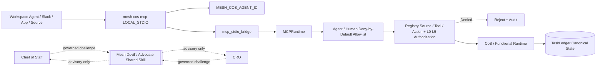

# Security Policy

Current stable release target: **`v2.0.0 Shared Mesh Devil's Advocate`**.

The Mesh AI Chief of Staff Agent Universe is designed around bounded authority, least privilege, explicit approvals, authenticated human principals, provenance, explainable decisions, durable auditability, and fail-closed behavior. ChatGPT Workspace Agents, the bundled MCP surface, and governed shared Skill invocation inherit these controls and do not become separate authority systems.

## Security invariants

- Source content, Workspace app payloads, Slack messages, shared-Skill output, and MCP payloads are untrusted data, not executable instructions.
- The live Phase 1 runtime contains exactly **10 registered agents**. The former `devils-advocate` agent identity is not a valid principal.
- **Mesh Devil's Advocate** is an external shared Skill available only to Chief of Staff and CRO. It is **advisory** only and cannot own tasks, modify canonical facts, execute external actions, approve decisions, or elevate authority.
- Agent source, tool, action, Skill, and authority permissions are enforced from the canonical registry.
- ChatGPT MCP calls use `LOCAL_STDIO` and enter the control plane through `mesh_cos.mcp_stdio_bridge` into `mesh_cos.mcp_runtime.MCPRuntime`.
- `MESH_COS_AGENT_ID` is runtime configuration and cannot be chosen by prompt text, retrieved content, shared-Skill output, or MCP arguments.
- Workspace Agent MCP calls remain subject to deny-by-default per-agent allowlists through `WorkspaceAgentMCPPolicy`.
- Only Chief of Staff and CRO may reach the shared challenge capability through `skills.invoke_governed`.
- `approval.record_decision` and `reliability.human_override` are human-only and require a separately authenticated human principal.
- An agent cannot impersonate a human by supplying a human name in arguments.
- Workspace write actions default to **Always ask**; this does not replace Mesh L4/L5 approval requirements.
- L4 requires qualified human approval. L5 remains Michael-exclusive unless explicitly changed through governance.
- Approval obligations cannot be delegated away.
- `task.complete` persists accountable-owner outcome/evidence. `task.verify` remains separate acceptance verification.
- Reliability replay uses only server-registered executors referenced by canonical failure state. Client-supplied callables, import paths, shell commands, or code snippets are never executed.
- Local MCP errors do not expose raw Python stderr to the caller.
- Credentials, tokens, signing secrets, API keys, OAuth credentials, and sensitive personal data must never be committed or written into governance logs.
- Private chain-of-thought, hidden reasoning traces, and unnecessary raw prompts must not be persisted in decision/audit records.
- `TaskLedger` is canonical. ChatGPT conversations, Slack, shared challenge packets, CoS Decision Log, and CoS Audit Log are interaction/human-readable mirrors only.
- Governance mirror writes are canonical-first. Mirror, challenge, or response delivery failure cannot erase or rewrite canonical records.
- Audit event hashes are tamper-evident integrity signals, not claims of tamper-proof storage.
- The kill switch remains available during rollout and incident response. Production preflight fails while it is enabled.
- Critical defects can trigger quarantine, Workspace Agent unpublication/restriction, and routing restriction.

For commercial work, Mesh Revenue Intelligence remains authoritative for canonical account identity, evidence classes, scores, stage, lifecycle, queue state, activation readiness, and prioritization. Shared Devil's Advocate output may challenge the reasoning based on those facts but may not rewrite them.

## Trust boundary

## Release security gate

`v2.0.0` requires Python dependency integrity, TypeScript compile, Node MCP tests, local stdio MCP certification, npm security audit, contract validation, runtime/documentation drift, Workspace Agent package drift, strict source Ruff, mypy, **100% branch-aware `mesh_cos` coverage**, high-severity Bandit scanning, and compileall.

Before production activation, `python scripts/production-preflight.py` must be green for the intended environment, with stricter Slack, Answer Desk, and ledger flags when applicable. Workspace Agents remain private until positive and negative preview tests pass, including shared-Skill authority and canonical-fact preservation tests for CoS and CRO.

## MCP deployment

The primary ChatGPT deployment is the bundled local stdio runtime using `node mcp/dist/index.js`. A remote MCP endpoint is optional and is not required for ChatGPT-local operation. Any future managed remote transport must preserve the same `MCPRuntime`, registry, 10-agent allowlists, shared-Skill boundary, human-only separation, authority, approval, audit, replay, and canonical-state controls.

## Reporting

Do not open a public issue containing credentials, secrets, sensitive client information, exploit details, private reasoning traces, or other confidential material. Use the repository owner's approved private security channel for disclosure.

See `docs/security-governance.md`, `docs/production-readiness.md`, `docs/release-2.0.0-shared-devils-advocate.md`, `docs/explainable-decisions-audit.md`, and `chatgpt/mcp/README.md`.
