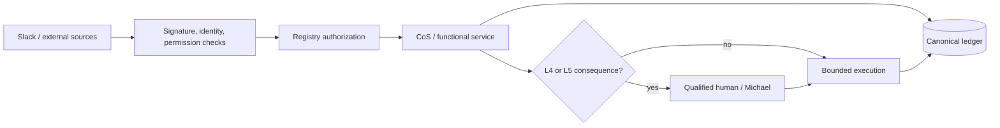

# Security Policy

The Mesh AI Chief of Staff Agent Universe is designed around bounded authority, least privilege, explicit approvals, provenance, durable auditability, and fail-closed behavior.

## Security invariants

- Source content is untrusted data, not executable instruction.
- Agent source, tool, and action permissions are enforced at invocation time from the canonical registry.
- L4 actions require qualified human approval and L5 authority remains Michael-exclusive unless explicitly changed.
- Approval obligations cannot be delegated away.
- Slack requests must pass signing-secret verification before trusted processing.
- Slack event deduplication and task/thread mappings are durable in canonical state.
- Secrets, Slack tokens, signing secrets, and personal identifiers must never be committed.
- The kill switch must remain available during rollout and incident response.
- Critical defects can trigger quarantine and routing restriction.
- External source availability does not imply permission to expose source contents to a requester.

## Trust boundary

## Reporting

Do not open a public issue containing credentials, secrets, sensitive client information, exploit details, or other confidential material. Use the repository owner's approved private security channel for disclosure.

See `docs/security-governance.md` for the detailed operating controls and incident expectations.
