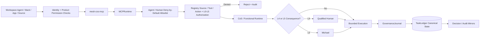

# Security Policy

Current stable repository release: **`v1.0.0 Production Readiness`**.

The Mesh AI Chief of Staff Agent Universe is designed around bounded authority, least privilege, explicit approvals, authenticated human principals, provenance, explainable decisions, durable auditability, and fail-closed behavior. ChatGPT Workspace Agents and the custom MCP surface inherit these controls and do not become a separate authority system.

## Security invariants

- Source content, Workspace app payloads, Slack messages, and MCP payloads are untrusted data, not executable instructions.
- Agent source, tool, action, and authority permissions are enforced at invocation time from the canonical registry.
- Remote calls enter through serialized `mesh_cos.mcp_runtime.MCPRuntime`; no generic client-controlled code execution path is permitted.
- Workspace Agent MCP calls are subject to server-side per-agent deny-by-default allowlists through `WorkspaceAgentMCPPolicy`.
- `approval.record_decision` and `reliability.human_override` are human-only and require an authenticated human principal.
- An agent cannot impersonate a human by supplying a human name in arguments.
- Builder-side tool toggles and Connector Action Constraints are defense in depth and may not widen canonical authority.
- Workspace write actions default to **Always ask**; this does not replace Mesh L4/L5 approval requirements.
- L4 actions require qualified human approval and L5 remains Michael-exclusive unless explicitly changed through governance.
- Approval obligations cannot be delegated away.
- Message Operations may inspect recorded approval state but cannot decide its own approval. Consequential sends require matching canonical approval and Workspace write approval.
- Answer Desk Slack remains disabled until a dedicated team-facing channel ID is configured.
- Slack requests must pass signing-secret and freshness verification before trusted runtime processing.
- Slack event deduplication and canonical event persistence are atomic.
- `task.complete` persists accountable-owner outcome/evidence. `task.verify` remains separate acceptance verification.
- A passing verification with missing required evidence fails closed.
- Remote replay uses only a server-registered executor referenced by canonical failure state. Client-supplied callables, import paths, shell commands, or code snippets are never executed as replay behavior.
- Secrets, MCP credentials, Slack tokens, signing secrets, API keys, OAuth credentials, and sensitive personal data must never be committed or written into governance logs.
- Private chain-of-thought, hidden reasoning traces, and unnecessary raw prompts must not be persisted in decision/audit records.
- `TaskLedger` is canonical. ChatGPT conversations, Slack, CoS Decision Log, and CoS Audit Log are interaction/human-readable mirrors only.
- Governance mirror writes are canonical-first. Mirror or response delivery failure cannot erase canonical records.
- Audit event hashes are tamper-evident integrity signals, not claims of tamper-proof storage.
- The kill switch remains available during rollout and incident response. Production preflight fails while it is enabled.
- Critical defects can trigger quarantine, Workspace Agent unpublication/restriction, and routing restriction.
- External source/app availability does not imply authority over its facts or permission to expose source contents to a requester.

## Trust boundary

## Release security gate

`v1.0.0` requires contract validation, runtime/documentation drift, Workspace Agent package drift, strict source Ruff, mypy, 100% branch-aware `mesh_cos` coverage, high-severity Bandit scanning, dependency integrity, and compileall.

Before production activation, `python scripts/production-preflight.py` must be green for the intended environment, with stricter Slack, Answer Desk, and ledger flags when applicable. Workspace Agents remain private until positive and negative preview tests pass.

## MCP deployment

The repository defines the production-ready MCP contract and runtime but does not fabricate a remote endpoint. Production deployment must set `MESH_COS_MCP_SERVER_URL`, use approved authentication outside source control, expose only the checked-in tool contract, preserve human-only operations, preserve the runtime kill switch and approval engines, and reject any client-supplied executable replay mechanism.

## Reporting

Do not open a public issue containing credentials, secrets, sensitive client information, exploit details, private reasoning traces, sensitive MCP endpoints, or other confidential material. Use the repository owner's approved private security channel for disclosure.

See `docs/security-governance.md`, `docs/production-readiness.md`, `docs/release-1.0.0-production-readiness.md`, `docs/explainable-decisions-audit.md`, and `chatgpt/mcp/README.md`.
