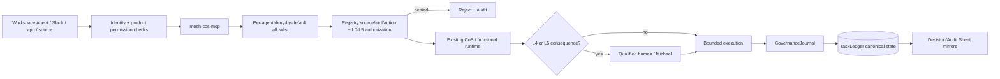

# Security Policy

The Mesh AI Chief of Staff Agent Universe is designed around bounded authority, least privilege, explicit approvals, provenance, explainable decisions, durable auditability, and fail-closed behavior. ChatGPT Workspace Agents and the custom MCP surface inherit these controls and do not become a separate authority system.

## Security invariants

- Source content, Workspace app payloads, Slack messages, and MCP payloads are untrusted data, not executable instruction.
- Agent source, tool, action, and authority permissions are enforced at invocation time from the canonical registry.
- Workspace Agent MCP calls are also subject to a server-side per-agent deny-by-default allowlist through `WorkspaceAgentMCPPolicy`.
- Builder-side tool toggles and Connector Action Constraints are defense in depth and may not widen canonical authority.
- Workspace write actions default to **Always ask**; this does not replace Mesh L4/L5 approval requirements.
- L4 actions require qualified human approval and L5 authority remains Michael-exclusive unless explicitly changed.
- Approval obligations cannot be delegated away.
- Message Operations may inspect recorded approval state but cannot decide its own approval. Consequential sends require a matching canonical approval and Workspace write approval.
- Answer Desk Slack remains disabled until a dedicated team-facing channel ID is configured.
- Slack requests must pass signing-secret verification before trusted runtime processing.
- Slack event deduplication and task/thread mappings are durable in canonical state.
- Remote Workspace Agent verification requires named verifier identity and explicit evidence; a passing result with no evidence fails closed.
- Secrets, MCP credentials, Slack tokens, signing secrets, API keys, OAuth credentials, and personal identifiers must never be committed or written into governance logs.
- Private chain-of-thought, hidden reasoning traces, and unnecessary raw prompts must not be persisted in decision or audit records.
- Explainability is provided through concise decision basis, evidence/source references, alternatives, selection criteria, confidence, risk, authority, approval evidence, reversibility, and outcome validation.
- `TaskLedger` is canonical for governance and operating state. ChatGPT conversations, CoS Decision Log, and CoS Audit Log are interaction/human-readable mirrors only.
- Governance mirror writes are canonical-first. Mirror or response delivery failure cannot erase canonical records and must be recorded for remediation when consequential.
- Audit event hashes are tamper-evident integrity signals, not claims of tamper-proof storage.
- The kill switch must remain available during rollout and incident response.
- Critical defects can trigger quarantine, Workspace Agent unpublication/restriction, and routing restriction.
- External source/app availability does not imply authority over its facts or permission to expose source contents to a requester.

## Trust boundary

## Workspace Agent app constraints

The checked-in manifests deliberately constrain risky app surfaces. CRO uses Apollo for research/enrichment only and has no autonomous Gmail/LinkedIn outbound. CMO and VP Content cannot publish through LinkedIn or AuthoredUp autonomously. CFO, COO, and Consultant Network Steward evidence access is read-only. CoS and AgentOps Slack writes are limited to internal `#mesh-agent-ops` coordination. Message Operations is the controlled outbound execution role and must preserve exact approved scope.

## Governance records

`mesh.cos.decision.v2` is the explainable decision record. `mesh.cos.agent-event.v2` is the auditable consequential-event record. Both are closed schemas. Attempts to add undeclared private-reasoning fields are rejected by contract validation.

Workspace Agent activity should preserve stable canonical `agent_id` / role identity while recording model, Skill/agent implementation, MCP capability/tool, approval, and run/correlation provenance separately. Role names must not encode implementation versions.

The shared governance policy applies to every registered agent and governed Skill without increasing its authority. Existing v1 audit producers are bridged into the v2 stream for compatibility while migration proceeds.

## MCP deployment

The repository defines the MCP contract but does not fabricate or publish a remote endpoint. Production deployment must set `MESH_COS_MCP_SERVER_URL`, use approved authentication outside source control, expose only the checked-in tool contract, enforce `WorkspaceAgentMCPPolicy`, and preserve the existing runtime kill switch and approval engines.

## Reporting

Do not open a public issue containing credentials, secrets, sensitive client information, exploit details, private reasoning traces, MCP endpoints if sensitive, or other confidential material. Use the repository owner's approved private security channel for disclosure.

See `docs/security-governance.md`, `docs/explainable-decisions-audit.md`, and `chatgpt/mcp/README.md` for the detailed operating controls, schemas, trust boundaries, and incident expectations.
