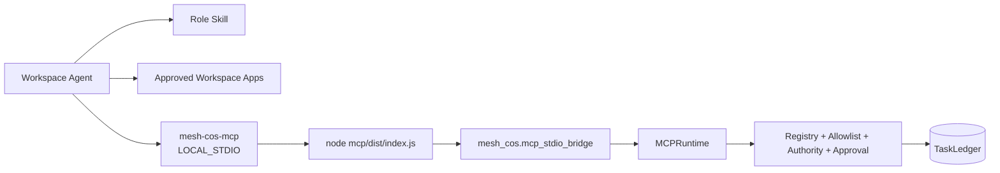

# ChatGPT Workspace Agent Packages

Current repository release target: **`1.1.0`**.

This directory projects the canonical Mesh CoS organization into ChatGPT Workspace Agent deployment packages. It does not replace the Python control plane and does not move canonical state into ChatGPT.

## Contents

- `skills/`: 11 validated OpenAI role Skills.
- `workspace-agents/`: exact Workspace Agent manifests aligned to repository release `1.1.0`.
- `mcp/mesh-cos-mcp.v1.json`: MCP contract, per-agent allowlists, local runtime metadata, and human-only operations.
- `mcp/README.md`: bundled MCP implementation and security boundary.
- `workspace-agent-builder-prompt.md`: deployment and private-preview handoff.

## ChatGPT-local architecture



The bundled TypeScript MCP handles transport only. `MCPRuntime` remains the sole business/governance execution core.

## Required local binding

Each Workspace Agent launches the same package with:

```text
MESH_COS_AGENT_ID=<registered agent id>
MESH_COS_LEDGER_PATH=.mesh-cos/task-ledger.sqlite3
MESH_COS_PYTHON_BIN=python
```

All 11 agents in one operating universe share the approved ledger path. The bound agent identity cannot be changed by prompt text, retrieved content, or tool arguments.

## Production invariants

- `TaskLedger` remains canonical.
- MCP transport for ChatGPT is `LOCAL_STDIO`.
- L4 fails closed until qualified human approval exists.
- L5 remains Michael-exclusive.
- `approval.record_decision` and `reliability.human_override` are human-only and never appear in agent tool catalogs.
- Per-agent tool projection is deny-by-default.
- Workspace write actions default to **Always ask**.
- Reliability replay accepts only server-registered executors referenced by canonical failure state.
- Accountable owners use `task.complete`; verification remains a separate `task.verify` action.
- Workspace Agent package drift is a CI blocker.
- Production preflight and private-preview positive/negative tests are required before activation.

## Deployment boundary

A separately deployed HTTPS MCP endpoint and `MESH_COS_MCP_SERVER_URL` are not required for ChatGPT-local operation. A managed remote transport may be added separately, but it must preserve the same `MCPRuntime`, authority, approval, audit, allowlist, and canonical-state controls.

External activation dependencies still include Workspace app authentication, applicable Slack credentials, a dedicated Answer Desk Slack channel, production approval-owner mappings, approved source/Skill credentials, secrets management, and target-workspace RBAC/publication settings.

See `../docs/release-1.1.0-local-chatgpt-mcp.md`, `../docs/production-readiness.md`, and `../RELEASE.md`.

<!-- mesh-cos-v2-shared-da -->
## v2.0.0 current architecture

The live Phase 1 runtime is a **10-agent** organization. The former repository-local Devil's Advocate agent and duplicate role Skill are removed. **Mesh Devil's Advocate** is an external **shared Skill** available only to Chief of Staff and CRO through governed Skill invocation. It is **advisory** only, cannot overwrite **canonical facts**, cannot execute external actions, and returns decision authority to the owning role or qualified human. `TaskLedger` remains canonical state; ChatGPT uses `LOCAL_STDIO` through `MCPRuntime` with deny-by-default allowlists, human-only approval/override paths, `check-chatgpt-packages.py` drift enforcement, and the 100% branch-aware coverage gate. Historical references to an 11-agent roster or a local Devil's Advocate role describe superseded releases only.

