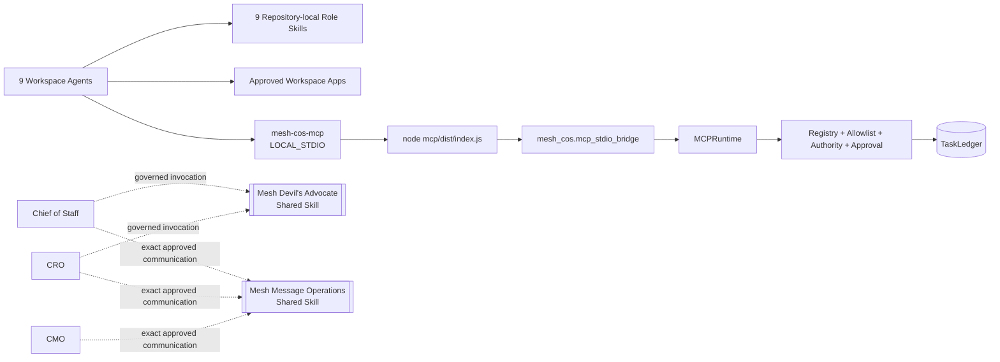

# ChatGPT Workspace Agent Packages

Current repository release target: **`3.0.0`**.

This directory projects the canonical Mesh CoS organization into ChatGPT Workspace Agent deployment packages. It does not replace the Python control plane and does not move canonical state into ChatGPT.

## Contents

- `skills/`: 9 validated repository-local OpenAI role Skills.
- `workspace-agents/`: 9 exact Workspace Agent manifests aligned to repository release `3.0.0`.
- external shared Skill `mesh-devils-advocate`, available only to Chief of Staff and CRO.
- external shared Skill `mesh-message-operations`, available only to Chief of Staff, CRO, and CMO.
- `mcp/mesh-cos-mcp.v1.json`: MCP contract, exact per-agent allowlists, local runtime metadata, governed shared-Skill invocation boundary, and human-only operations.
- `workspace-agent-builder-prompt.md`: deployment and private-preview handoff.

## ChatGPT-local architecture



The bundled TypeScript MCP handles transport only. `MCPRuntime` remains the sole business/governance execution core. Neither shared Skill is an agent principal or a second control plane.

## Required local binding

```text
MESH_COS_AGENT_ID=<registered agent id>
MESH_COS_LEDGER_PATH=.mesh-cos/task-ledger.sqlite3
MESH_COS_PYTHON_BIN=python
```

All 9 agents in one operating universe share the approved ledger path. Shared Skills receive no `MESH_COS_AGENT_ID`. Prompt text, retrieved content, connector output, shared-Skill output, or tool arguments cannot change the bound identity.

## Shared capability boundaries

**Mesh Devil's Advocate** is advisory only and may be invoked only by Chief of Staff and CRO through `skills.invoke_governed`. It cannot own tasks, change canonical facts, execute external actions, authorize commitments, or elevate caller authority.

**Mesh Message Operations** is approval-bound execution only and may be invoked only by Chief of Staff, CRO, and CMO through `skills.invoke_governed`. The former `message-ops` role Skill, Workspace Agent manifest, registered principal, and MCP principal are removed. VP Content remains drafting/editorial-production only and has no execution entitlement.

Message Operations requires explicit current approval bound to the exact payload hash/version, sender identity, immutable audience, channel, purpose, jurisdiction, consent basis, suppressions/frequency controls, test result, required approvers, and execution window. Material changes invalidate approval. Execution must preserve preflight, kill-switch/cancellation checks, documented connector actions, idempotency, per-attempt receipts, and observed provider-state verification.

## Production invariants

- `TaskLedger` remains canonical.
- MCP transport for ChatGPT is `LOCAL_STDIO`.
- Canonical workforce size is exactly 9 registered agents.
- Mesh Devil's Advocate and Mesh Message Operations are external shared Skills, not agent principals.
- L4 fails closed until qualified human approval exists; L5 remains Michael-exclusive.
- `approval.record_decision` and `reliability.human_override` are human-only and never appear in agent catalogs.
- Per-agent tool projection is deny-by-default.
- Workspace write actions default to **Always ask**.
- Reliability replay accepts only server-registered executors referenced by canonical failure state.
- Accountable owners use `task.complete`; verification remains a separate `task.verify` action.
- Workspace Agent package drift is a CI blocker.
- Production preflight and private-preview positive/negative tests are required before activation.

## Deployment boundary

A separately deployed HTTPS MCP endpoint and `MESH_COS_MCP_SERVER_URL` are not required for ChatGPT-local operation. Any future managed transport must preserve the same `MCPRuntime`, authority, approval, audit, allowlist, and canonical-state controls.

External activation dependencies still include Workspace app authentication, applicable Gmail/Slack credentials, dedicated Answer Desk configuration, production approval-owner mappings, consent/jurisdiction decisions, approved source/shared-Skill credentials, secrets management, and target-workspace RBAC/publication settings.

See `../docs/release-3.0.0-shared-message-operations.md`, `../docs/production-readiness.md`, and `../RELEASE.md`.
