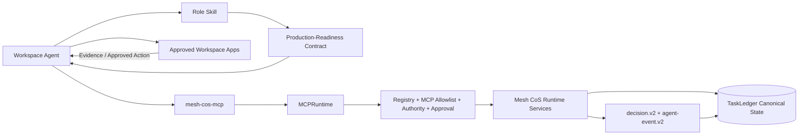
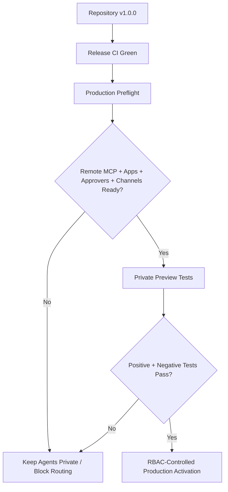

# ChatGPT Workspace Agent Packages

Current repository release: **`1.0.0`**.

This directory projects the canonical Mesh Phase 1 agent organization into production-ready ChatGPT Workspace Agent deployment packages. It does not replace the Python control plane or move canonical state into ChatGPT.

## Contents

- `skills/`: 11 validated OpenAI Skill packages, one for each canonical role. Every Skill includes `references/role-contract.md` and `references/production-readiness.md`.
- `workspace-agents/`: exact Builder manifests derived from `agents/registry.json`, aligned to repository release `1.0.0` and the MCP contract.
- `mcp/mesh-cos-mcp.v1.json`: custom MCP tool contract mapping agents to the serialized governed runtime, including human-only tool definitions.
- `mcp/README.md`: MCP implementation, security, and deployment boundary.
- `workspace-agent-builder-prompt.md`: production deployment and private-preview handoff prompt.
- `workspace-agent-gap-assessment-2026-08-17.md`: historical TDD/loop-engineering closure record for the initial package increment.

## Architecture

The Workspace Agent is the conversational/workflow surface. The Skill carries repeatable role behavior. `MCPRuntime` and `WorkspaceAgentMCPPolicy` are the controlled bridge to canonical execution. Workspace apps provide role-scoped evidence or explicitly approved actions. Retrieved content is data, not operating instructions.

## v1.0.0 production invariants

- `TaskLedger` remains canonical.
- L4 fails closed until qualified human approval exists.
- L5 remains Michael-exclusive.
- `approval.record_decision` and `reliability.human_override` are human-only MCP operations.
- Agent identity, role, implementation version, and authority are derived server-side from the canonical registry.
- Workspace write actions default to **Always ask**.
- Remote replay accepts only a server-registered executor referenced by canonical failure state.
- Accountable owners use `task.complete`; verification remains a separate authorized `task.verify` action.
- Workspace Agent package drift is a CI blocker.
- Production preflight and private-preview negative tests are required before publication/activation.

## Deployment boundary

The repository does not fabricate the remote MCP endpoint or credentials. Production activation still requires an approved HTTPS MCP deployment, `MESH_COS_MCP_SERVER_URL`, Workspace app authentication, applicable Slack credentials, the dedicated Answer Desk channel, production approval-owner mappings, approved source/Skill credentials, secrets management, and deployment ownership.

See `../docs/release-1.0.0-production-readiness.md`, `../docs/production-readiness.md`, and `../RELEASE.md`.
