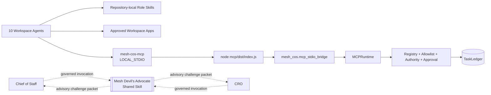

# ChatGPT Workspace Agent Packages

Current repository release target: **`2.0.0`**.

This directory projects the canonical Mesh CoS organization into ChatGPT Workspace Agent deployment packages. It does not replace the Python control plane and does not move canonical state into ChatGPT.

## Contents

- `skills/`: 10 validated repository-local OpenAI role Skills.
- `workspace-agents/`: 10 exact Workspace Agent manifests aligned to repository release `2.0.0`.
- external shared Skill entitlement: `mesh-devils-advocate`, available only to Chief of Staff and CRO.
- `mcp/mesh-cos-mcp.v1.json`: MCP contract, per-agent allowlists, local runtime metadata, shared-Skill invocation boundary, and human-only operations.
- `mcp/README.md`: bundled MCP implementation and security boundary.
- `workspace-agent-builder-prompt.md`: deployment and private-preview handoff.

## ChatGPT-local architecture



The bundled TypeScript MCP handles transport only. `MCPRuntime` remains the sole business/governance execution core. Mesh Devil's Advocate is a shared challenge capability, not an agent principal and not a second control plane.

## Required local binding

Each Workspace Agent launches the same package with:

```text
MESH_COS_AGENT_ID=<registered agent id>
MESH_COS_LEDGER_PATH=.mesh-cos/task-ledger.sqlite3
MESH_COS_PYTHON_BIN=python
```

All 10 agents in one operating universe share the approved ledger path. The bound agent identity cannot be changed by prompt text, retrieved content, shared-Skill output, or tool arguments.

## Shared Mesh Devil's Advocate boundary

The former repository-local Devil's Advocate role Skill, Workspace Agent manifest, runtime agent principal, and MCP principal are removed.

`mesh-devils-advocate` is an external **shared Skill** and may be invoked only by Chief of Staff and CRO through the governed Skill path. Its output is advisory. It cannot own tasks, change canonical facts, execute external actions, authorize commitments, or elevate the invoking agent's authority.

For Revenue Intelligence work, account identity, evidence classes, scores, stage, lifecycle, queue state, activation readiness, and prioritization remain canonical to Revenue Intelligence. Challenge output may test interpretation, assumptions, route, evidence sufficiency, capacity, and decision conditions without modifying those facts.

## Production invariants

- `TaskLedger` remains canonical.
- MCP transport for ChatGPT is `LOCAL_STDIO`.
- Canonical workforce size is 10 registered agents.
- Mesh Devil's Advocate is a shared Skill, not an agent principal.
- L4 fails closed until qualified human approval exists.
- L5 remains Michael-exclusive.
- `approval.record_decision` and `reliability.human_override` are human-only and never appear in agent tool catalogs.
- Per-agent tool projection is deny-by-default.
- Workspace write actions default to **Always ask**.
- Reliability replay accepts only server-registered executors referenced by canonical failure state.
- Accountable owners use `task.complete`; verification remains a separate `task.verify` action.
- Workspace Agent package drift is a CI blocker.
- Production preflight and private-preview positive/negative tests are required before activation.

## Deployment boundary

A separately deployed HTTPS MCP endpoint and `MESH_COS_MCP_SERVER_URL` are not required for ChatGPT-local operation. A managed remote transport may be added separately, but it must preserve the same `MCPRuntime`, authority, approval, audit, allowlist, and canonical-state controls.

External activation dependencies still include Workspace app authentication, applicable Slack credentials, a dedicated Answer Desk Slack channel, production approval-owner mappings, approved source/Skill credentials, secrets management, and target-workspace RBAC/publication settings.

See `../docs/release-2.0.0-shared-devils-advocate.md`, `../docs/production-readiness.md`, and `../RELEASE.md`.
