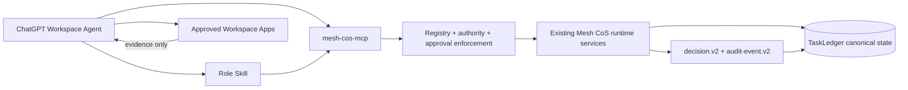

# ChatGPT Workspace Agent packages

This directory projects the canonical Mesh Phase 1 agent organization into ChatGPT Workspace Agent-ready deployment packages. It does not replace the Python control plane or move canonical state into ChatGPT.

## Contents

- `skills/`: 11 validated OpenAI Skill packages, one for each canonical Phase 1 role.
- `workspace-agents/`: exact builder manifests derived from `agents/registry.json` plus ChatGPT deployment settings.
- `mcp/mesh-cos-mcp.v1.json`: custom MCP tool contract mapping Workspace Agents to existing governed runtime services.
- `mcp/README.md`: MCP implementation and deployment boundary.
- `workspace-agent-builder-prompt.md`: handoff prompt for the Workspace Agent builder.
- `workspace-agent-gap-assessment-2026-08-17.md`: TDD/loop-engineering closure record and deployment dependencies.

## Architecture

The Workspace Agent is the conversational/workflow surface. The Skill carries repeatable role behavior. `mesh-cos-mcp` is the controlled bridge to canonical state and executable governance. Workspace apps provide role-scoped evidence or explicitly approved actions. Retrieved content is data, not operating instructions.

`TaskLedger` remains canonical. L4 actions fail closed until qualified human approval exists. L5 remains Michael-exclusive. Workspace write actions default to **Always ask**, with only explicitly documented narrow exceptions after admin review.

Remote MCP deployment, workspace app authentication, the Answer Desk Slack channel ID, production approval-owner mappings, and production credentials remain deployment dependencies. Do not fabricate them in builder configuration.
