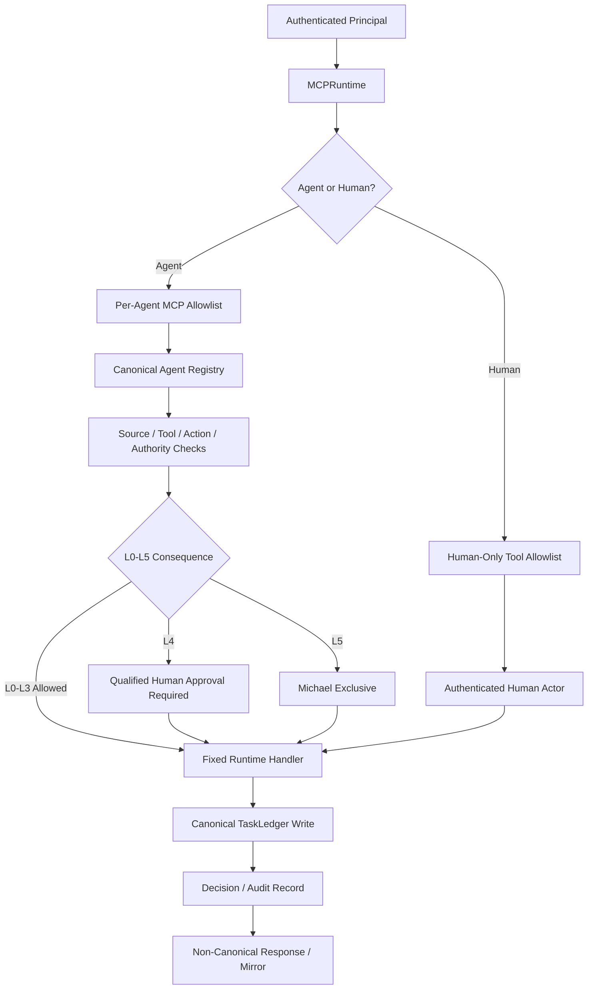

# Mesh CoS MCP Contract

`mesh-cos-mcp.v1.json` is the protocol-facing contract for release `1.0.0`. It exposes the existing Mesh CoS control plane to ChatGPT Workspace Agents through the serialized `mesh_cos.mcp_runtime.MCPRuntime` boundary. It is an adapter contract, not a second business-logic implementation.

## Enforcement order

Operational order:

1. Authenticate the Workspace Agent, approved service identity, or human principal.
2. Enter `MCPRuntime`, never a generic dynamic execution path.
3. Resolve canonical agent identity or authenticated human identity.
4. Apply the per-agent MCP allowlist or the separate human-only tool allowlist.
5. Apply registry source/tool/action permissions and L0-L5 authority.
6. Fail closed on required human approval.
7. Invoke only fixed server-side handlers and registered replay executors.
8. Persist canonical state before non-canonical mirrors or chat responses.
9. Emit `mesh.cos.agent-event.v2` for consequential actions and `mesh.cos.decision.v2` for material decisions/recommendations.

## Human-only operations

`approval.record_decision` and `reliability.human_override` are not agent tools. They require an authenticated human principal. Agent callers are denied even when they attempt to supply a human name in arguments.

## Replay safety

`reliability.replay` may execute only a server-registered replay executor referenced by canonical failure state. The runtime never accepts client-supplied Python callables, import paths, shell commands, or source-text instructions as executable replay behavior.

## Completion and verification

`task.complete` persists the accountable owner's outcome and evidence. `task.verify` is separate acceptance verification. `COMPLETED` cannot become `VERIFIED` merely because the owner claims success.

## Deployment boundary

The repository does not fabricate or deploy a remote MCP URL. Production activation must publish an approved HTTPS endpoint backed by `MCPRuntime`, set `MESH_COS_MCP_SERVER_URL`, configure authentication/secrets outside source control, pass `ProductionPreflight`, and pass Workspace Agent private-preview positive and negative tests.

Release `v1.0.0` marks this contract and runtime as production-ready for activation, not as proof that an environment-specific MCP endpoint is already live.
