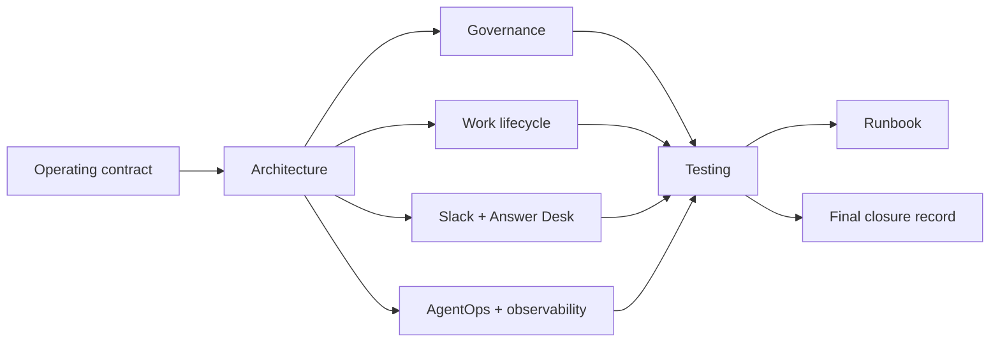

# Documentation Index

Phase 1 documentation for the Mesh AI Chief of Staff operating core.

## Canonical

- `phase-1-operating-contract.md`: operating constitution.
- `../agents/registry.json`: source agent definitions, normalized by the runtime registry.
- `../contracts/`: nine versioned machine contracts.
- `../config/performance-policy.v1.json`: AgentOps policy.
- `../src/mesh_cos/ledger.py`: canonical runtime persistence boundary.

## Architecture and governance

- `architecture.md`: control plane, work graph, canonical boundaries, and Mermaid diagrams.
- `decision-rights.md`: L0-L5 authority.
- `delegation-model.md`: bounded work contracts and one-owner policy.
- `task-lifecycle.md`: outcome lifecycle and verification.
- `agent-registry.md`: governed workforce definitions.
- `agent-performance.md`: AgentOps performance management.
- `conflict-resolution.md`: functional fact authority and CoS arbitration.
- `escalation-policy.md`: impact, authority, confidence, and reversibility routing.
- `security-governance.md`: least privilege, provenance, injection defense, and approvals.
- `observability.md`: audit and metrics model.

## Collaboration

- `slack-agent-protocol.md`: `#mesh-agent-ops`, structured messages, request verification, dedupe, task/thread mapping, and approval notifications.
- `answer-desk.md`: separate team-facing Answer Desk interface and dispositions.

## Verification and operations

- `testing-evaluation.md`: TDD, contract/runtime validation, stateful evaluations, and CI quality gates.
- `runbook.md`: startup, management loop, incidents, replay/override, quarantine, and shutdown.
- `pressure-test.md`: independent challenge criteria.
- `phase-1-gap-assessment-2026-08-17.md`: historical gap record.
- `phase-1-remediation-completion-2026-08-17.md`: prior remediation record.
- `phase-1-final-closure-2026-08-17.md`: final requirement-to-runtime closure record.
- `adr/`: architecture decisions.

## Current production dependencies

Slack credentials, a separate Answer Desk channel ID, approved source/skill credentials and permissions, production approval-owner mapping, deployment infrastructure, and any future monetary thresholds explicitly approved by Michael.

Documentation must describe current runtime behavior. CI runs `scripts/check-runtime-doc-drift.py` so canonical contracts, runtime records, Slack configuration, and core documentation cannot silently diverge.
