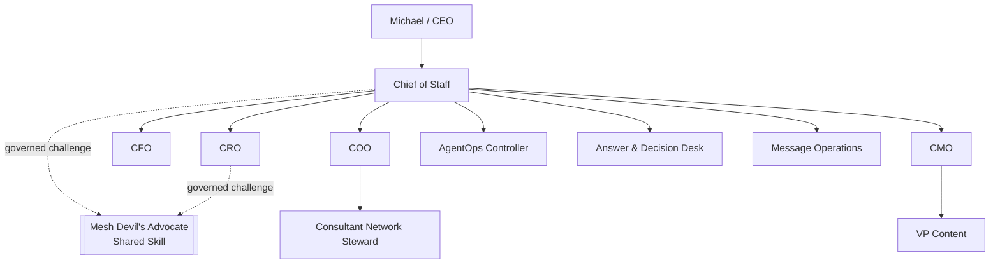

# Documentation Index

Current release target: **`v4.0.0 Chief of Staff Delegation Contract Remediation`**.

The current documentation describes the canonical **10-agent** Phase 1 ChatGPT Workspace Agent projection, Mesh Devil's Advocate as the sole external governed shared Skill, bundled local MCP, human-principal authority boundary, completion/verification lifecycle, bounded delegation, security controls, production preflight, and release verification.

## Current release documentation

- `release-4.0.0-cos-delegation-remediation.md`: v4 remediation trace, engineering evidence, and release record.
- `phase-1-operating-contract.md`: canonical operating constitution.
- `architecture.md`: 10-agent runtime, MCP, authority, and lifecycle diagrams.
- `agent-registry.md`: canonical roster and shared-Skill boundary.
- `decision-rights.md`: L0-L5 authority and human-principal-only operations.
- `delegation-model.md`: direct-child delegation, authority inheritance, and depth ceilings.
- `task-lifecycle.md`: `task.complete` versus `task.verify` semantics.
- `security-governance.md`: immutable identity, deny-by-default MCP exposure, and human-only separation.
- `testing-evaluation.md`: BDD, TDD, negative tests, end-to-end certification, and release gates.
- `production-readiness.md`: fail-closed activation contract.
- `runbook.md`: build, certification, preflight, activation, and incident operations.
- `../RELEASE.md`: canonical GitHub Release notes.
- `../CHANGELOG.md`: semantic release history.

## Canonical runtime sources

- `../agents/registry.json`: exactly 10 registered agents and external Mesh Devil's Advocate entitlement.
- `../chatgpt/workspace-agents/`: exactly 10 Workspace Agent manifests.
- `../chatgpt/skills/`: exactly 10 repository-local role Skills.
- `../chatgpt/mcp/mesh-cos-mcp.v1.json`: per-agent allowlists plus the separate human-only allowlist.
- `../src/mesh_cos/mcp_runtime.py`: serialized authorization and dispatch boundary.
- `../src/mesh_cos/lifecycle.py`: lifecycle transition enforcement.
- `../src/mesh_cos/orchestration.py`: task intake, completion, and verification services.
- `../src/mesh_cos/delegation.py`: delegation invariants.
- `TaskLedger`: canonical runtime state.

## Current topology

Historical release records remain historical snapshots. v3.0.0's 9-agent architecture is explicitly superseded by v4.0.0 and is not current runtime truth.