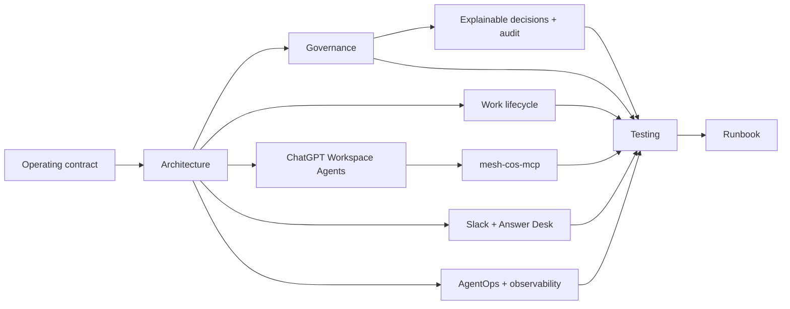

# Documentation Index

Phase 1 documentation for the Mesh AI Chief of Staff operating core and its ChatGPT Workspace Agent deployment projection.

## Canonical runtime

- `phase-1-operating-contract.md`: operating constitution.
- `../agents/registry.json`: canonical agent definitions and authority.
- `../contracts/`: versioned machine contracts, including `decision.v2` and `agent-event.v2`.
- `../config/performance-policy.v1.json`: AgentOps policy.
- `../config/governance-policy.v1.json`: shared explainability and audit policy.
- `../config/governance-logs.v1.json`: non-secret Decision/Audit Sheet mirror configuration.
- `../src/mesh_cos/ledger.py`: canonical runtime persistence boundary.

## ChatGPT Workspace Agent deployment

- `../chatgpt/README.md`: deployment-package overview and architecture.
- `../chatgpt/skills/`: 11 OpenAI Skill source packages, one per canonical agent.
- `../chatgpt/workspace-agents/`: exact Workspace Agent manifests and Builder configurations.
- `../chatgpt/mcp/mesh-cos-mcp.v1.json`: per-agent custom MCP contract and runtime bindings.
- `../chatgpt/mcp/README.md`: MCP authorization/enforcement sequence.
- `../chatgpt/workspace-agent-builder-prompt.md`: final prompt for the Workspace Agent builder.
- `../chatgpt/workspace-agent-gap-assessment-2026-08-17.md`: TDD and loop-engineering gap closure record.

These artifacts project the canonical organization into ChatGPT. They do not replace `agents/registry.json` or `TaskLedger`.

## Architecture and governance

- `architecture.md`: runtime and Workspace Agent/MCP control-plane architecture.
- `decision-rights.md`: L0-L5 authority, Mesh approvals, and Workspace **Always ask** interaction.
- `explainable-decisions-audit.md`: decision/audit schemas, Workspace Agent provenance, Google Sheets mirrors, privacy, integrity, and reconciliation.
- `delegation-model.md`: bounded work contracts and one-owner policy.
- `task-lifecycle.md`: outcome lifecycle and verification.
- `agent-registry.md`: governed workforce definitions and ChatGPT projection rules.
- `agent-performance.md`: AgentOps performance management.
- `conflict-resolution.md`: functional fact authority and CoS arbitration.
- `escalation-policy.md`: impact, authority, confidence, and reversibility routing.
- `security-governance.md`: least privilege, MCP deny-by-default controls, injection defense, app constraints, approvals, and audit privacy/integrity.
- `observability.md`: audit, explainability, mirror, and metrics model.

## Collaboration

- `slack-agent-protocol.md`: `#mesh-agent-ops`, structured messages, request verification, dedupe, task/thread mapping, and approval notifications.
- `answer-desk.md`: separate team-facing Answer Desk interface and dispositions.

## Verification and operations

- `testing-evaluation.md`: TDD, contracts, runtime drift, Workspace Agent package drift, Skill validation, and CI quality gates.
- `runbook.md`: startup, MCP deployment, Workspace Agent private preview, governance reconciliation, incidents, replay/override, quarantine, and shutdown.
- `pressure-test.md`: independent challenge criteria.
- `phase-1-gap-assessment-2026-08-17.md`: historical gap record.
- `phase-1-remediation-completion-2026-08-17.md`: prior remediation record.
- `phase-1-final-closure-2026-08-17.md`: final Phase 1 runtime requirement closure record.
- `adr/`: architecture decisions.

## Governance registers

- **CoS Decision Log**: Google Sheet ID `1IJcwPuulqsNAa1lCW2MsmNgH6Vm5INPqTlcH4NR0xpw`.
- **CoS Audit Log**: Google Sheet ID `1T8vKx4gaUJdeG8kSc18MsBbXpY4EbDF3exZ0RGpvND0`.

They are operational mirrors. `TaskLedger` remains canonical.

## Current production dependencies

Production ChatGPT operation still requires an approved remote `mesh-cos-mcp` endpoint and `MESH_COS_MCP_SERVER_URL`, Workspace app authentication, the separate Answer Desk Slack channel ID, approved source/Skill credentials and permissions, production approval-owner mapping, deployment infrastructure, and any future thresholds explicitly approved by Michael.

Documentation must describe current runtime behavior. CI runs both `scripts/check-runtime-doc-drift.py` and `scripts/check-chatgpt-packages.py` so runtime, registry, Skills, Workspace Agent manifests, MCP permissions, release metadata, and core documentation cannot silently diverge.
