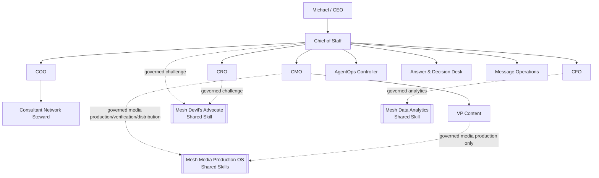

# Current documentation: v4.14.0 CxO Executive Risk Management

Current release evidence:

- `release-v4.14.0-cxo-risk.md`
- `architecture-v4.14.0-cxo-risk.md`
- `security-review-v4.14.0-cxo-risk.md`

Canonical MCP authority/runtime contract remains 4.0.0. QNAP deployment release remains 4.4.2.

## v4.12.1 CoS Delegation and Agent Reporting

The current patch corrects the delegation request contract, stable failure classification, agent-principal versus Skill-capability routing, and explicit child-result reconciliation to the CoS parent. The Commercial Growth OS is unchanged. See `release-v4.12.1-cos-delegation-reporting.md`, `security-review-v4.12.1-cos-delegation-reporting.md`, `verification-v4.12.1-cos-delegation-reporting.md`, and `skills-v4.12.1.md`.

## Historical v4.10.0 Outcome-Driven Orchestration

That historical repository capability release adds Outcome-Driven Development to the Chief of Staff, CMO, and AgentOps role Skills. Business checkpoints now separate outcome movement, evidence-pending intervention, justified no-action, business blockage, and business failure from technical health. Progressive T0-T3 evidence loading reduces unnecessary AI/provider work without weakening evidence, verification, security, or human approval.

Canonical Phase 1 authority/runtime contract remains `4.0.0`. Production QNAP remains `4.4.0`. The organization remains exactly 10 registered agents.

## Historical v4.9.1 release documentation

- `release-v4.9.1-media-os-capability-registration.md`: Media OS capability-registration scope, authority preservation, runtime identity, and rollback boundary.
- `security-review-v4.9.1-media-os-capability-registration.md`: TARGETED registry, MCP, release-control, and QNAP provenance review.
- `verification-v4.9.1-media-os-capability-registration.md`: requirement-to-evidence matrix and live post-deploy acceptance contract.
- `gap-audit-v4.9.1-media-os-capability-registration.md`: stale-regression root cause, remediation, and preserved boundaries.
- `../CHANGELOG-v4.9.1.md`: semantic PATCH change record.
- `../RELEASE.md`: current and historical repository release record.

v4.9.1 registers `mesh-media-production`, `mesh-media-verification`, and `mesh-media-distribution` for CMO, and `mesh-media-production` for VP Content only. VP Content remains L2 with zero delegation authority. No Skill becomes an agent principal or gains approval/publication authority.

## v4.9.0 historical capability evidence

- `release-v4.9.0-mesh-opex-bot-integration.md`: historical Mesh OpEx Bot shared-capability release.
- `security-review-v4.9.0-mesh-opex-bot-integration.md`: v4.9.0 security record.
- `verification-v4.9.0-mesh-opex-bot-integration.md`: v4.9.0 verification record.
- `gap-audit-v4.9.0-mesh-opex-bot-integration.md`: v4.9.0 gap audit.

The published v4.9.0 workflow is manual-only and read-only. v4.9.1 is the sole active exact-SHA SemVer publisher after verification.

## v4.8.4 closeout documentation

- `release-v4.8.4-release-record-correction.md`: documentation/release-control PATCH scope and corrected v4.8.3 retirement inventory.
- `security-review-v4.8.4-release-record-correction.md`: TARGETED release-control security review and least-privilege evidence.
- `verification-v4.8.4-release-record-correction.md`: exact-candidate, historical-workflow, and exact-SHA publication proof model.
- `gap-audit-v4.8.4-release-record-correction.md`: documentation-to-implementation defect and remediation.
- `../CHANGELOG-v4.8.4.md`: semantic PATCH change record.

## v4.8.3 historical publisher evidence

- `release-v4.8.3-historical-publisher-retirement.md`: corrected current-source record of the workflows retired by v4.8.3, including v4.6.0.
- `security-review-v4.8.3-historical-publisher-retirement.md`: TARGETED release-control security evidence.
- `verification-v4.8.3-historical-publisher-retirement.md`: systemic historical-workflow proof model.
- `gap-audit-v4.8.3-historical-publisher-retirement.md`: corrected inventory and v4.8.4 record-correction lineage.

## v4.8.2 functional remediation evidence

- `release-v4.8.2-functional-method-audit-remediation.md`: functional PATCH scope, compatibility, release boundary, and known blocker.
- `architecture-v4.8.2-functional-method-remediation.md`: donor, behavior-verification, and release architecture.
- `security-review-v4.8.2-functional-method-audit-remediation.md`: FULL_REVIEW security evidence and residual advisory.
- `verification-v4.8.2-functional-method-audit-remediation.md`: durable behavior verification evidence.
- `requirements-trace-v4.8.2.md`: requirement -> BDD -> implementation -> test -> security -> verification traceability.
- `source-governance-v4.8.2.md`: pinned donor source governance and fourth-source blocker.
- `donor-disposition-ledger-v4.8.2.md`: explicit disposition for all 49 candidates in the three evidenced donor collections.
- `testing-evaluation.md`: BDD/TDD, behavior-level evaluation, structural regressions, and release gates.

## Canonical architecture and governance

- `phase-1-operating-contract.md`: canonical operating constitution.
- `architecture.md`: 10-agent runtime, MCP, authority, lifecycle, and production deployment integrity diagrams.
- `agent-registry.md`: canonical roster and shared-Skill boundary.
- `decision-rights.md`: L0-L5 authority and human-principal-only operations.
- `delegation-model.md`: direct-child delegation, authority inheritance, and depth ceilings.
- `task-lifecycle.md`: `task.complete` versus `task.verify` semantics.
- `security-governance.md`: immutable identity, deny-by-default MCP exposure, human-only separation, and QNAP integrity controls.
- `production-readiness.md`: fail-closed activation contract.
- `runbook.md`: build, certification, preflight, activation, and incident operations.

## Canonical runtime sources

- `../agents/registry.json`: exactly 10 registered agents.
- `../chatgpt/workspace-agents/`: exactly 10 Workspace Agent manifests.
- `../chatgpt/skills/`: exactly 10 repository-local role Skills.
- `../chatgpt/mcp/mesh-cos-mcp.v1.json`: canonical 4.0.0 per-agent allowlists plus human-only allowlist.
- `../mcp/src/server.ts`: MCP projection and governed response envelope.
- `../src/mesh_cos/mcp_runtime.py`: serialized authorization and dispatch boundary.
- `../src/mesh_cos/lifecycle.py`: lifecycle transition enforcement.
- `../src/mesh_cos/orchestration.py`: task intake, completion, and verification services.
- `../src/mesh_cos/delegation.py`: delegation invariants.
- `TaskLedger`: canonical operating state.

## Production identity

```text
mcp_version: 4.0.0
deployment_release: 4.4.0
agent_id: cos
transport: SECURE_MCP_TUNNEL
```

The repository release, canonical authority/runtime contract, and QNAP deployment release are deliberately separate version domains. v4.9.1 produces a verified current-source QNAP 4.4.0 candidate, but production activation is not established until that candidate is promoted through the governed QNAP deployment process and read back through Secure MCP.

## Current topology



Historical release records remain snapshots. They do not override the current v4.9.1 repository release, canonical 4.0.0 authority/runtime contract, or the production QNAP 4.4.0 deployment state established by live readback.
