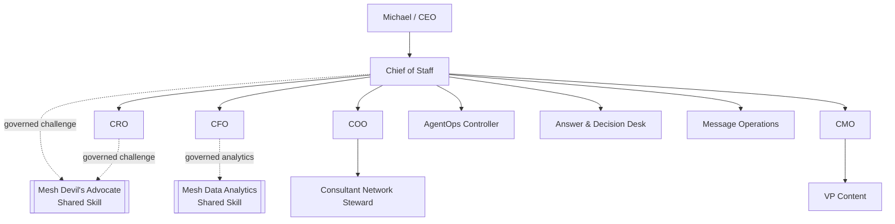

# Documentation Index

Current repository release: **`v4.8.3 Historical Publisher Retirement`**.  
Current production QNAP deployment: **`4.4.0`**.  
Canonical Phase 1 agent authority/runtime contract: **`4.0.0`**.

The current documentation describes the canonical **10-agent** Phase 1 workforce, governed external shared Skills, Mesh CoS MCP, TaskLedger authority, completion/verification separation, bounded delegation, QNAP deployment controls, security, behavior-level evaluation, donor governance, historical-release immutability, and release verification.

## Current v4.8.3 closeout documentation

- `release-v4.8.3-historical-publisher-retirement.md`: release-control-only PATCH scope and historical publisher retirement.
- `security-review-v4.8.3-historical-publisher-retirement.md`: TARGETED release-control security review and least-privilege evidence.
- `verification-v4.8.3-historical-publisher-retirement.md`: systemic historical-workflow and exact-SHA publication proof model.
- `gap-audit-v4.8.3-historical-publisher-retirement.md`: verification-discovered defect and closure state.
- `../CHANGELOG-v4.8.3.md`: semantic PATCH change record.
- `../RELEASE.md`: current and historical repository release record.

## v4.8.2 functional remediation evidence

- `release-v4.8.2-functional-method-audit-remediation.md`: functional PATCH scope, compatibility, release boundary, and known blocker.
- `architecture-v4.8.2-functional-method-remediation.md`: donor, behavior-verification, and release architecture.
- `security-review-v4.8.2-functional-method-audit-remediation.md`: FULL_REVIEW security evidence and residual advisory.
- `verification-v4.8.2-functional-method-audit-remediation.md`: durable behavior verification evidence.
- `requirements-trace-v4.8.2.md`: requirement -> BDD -> implementation -> test -> security -> verification traceability.
- `source-governance-v4.8.2.md`: pinned donor source governance and fourth-source blocker.
- `donor-disposition-ledger-v4.8.2.md`: explicit disposition for all 49 candidates in the three evidenced donor collections.
- `gap-audit-v4.8.2-functional-method-remediation.md`: original audit remediation state.
- `testing-evaluation.md`: BDD/TDD, behavior-level evaluation, structural regressions, and release gates.

## Canonical architecture and governance

- `phase-1-operating-contract.md`: canonical operating constitution.
- `architecture.md`: 10-agent runtime, MCP, authority, lifecycle, and production deployment integrity diagrams.
- `agent-registry.md`: canonical roster and shared-Skill boundary.
- `decision-rights.md`: L0-L5 authority and human-principal-only operations.
- `delegation-model.md`: direct-child delegation, authority inheritance, and depth ceilings.
- `task-lifecycle.md`: `task.complete` versus `task.verify` semantics.
- `security-governance.md`: immutable identity, deny-by-default MCP exposure, human-only separation, and QNAP integrity controls.
- `production-readiness.md`: fail-closed activation contract.
- `runbook.md`: build, certification, preflight, activation, and incident operations.

## Canonical runtime sources

- `../agents/registry.json`: exactly 10 registered agents.
- `../chatgpt/workspace-agents/`: exactly 10 Workspace Agent manifests.
- `../chatgpt/skills/`: exactly 10 repository-local role Skills.
- `../chatgpt/mcp/mesh-cos-mcp.v1.json`: canonical 4.0.0 per-agent allowlists plus human-only allowlist.
- `../mcp/src/server.ts`: MCP projection and governed response envelope.
- `../src/mesh_cos/mcp_runtime.py`: serialized authorization and dispatch boundary.
- `../src/mesh_cos/lifecycle.py`: lifecycle transition enforcement.
- `../src/mesh_cos/orchestration.py`: task intake, completion, and verification services.
- `../src/mesh_cos/delegation.py`: delegation invariants.
- `TaskLedger`: canonical operating state.

## Production identity

```text
mcp_version: 4.0.0
deployment_release: 4.4.0
agent_id: cos
transport: SECURE_MCP_TUNNEL
```

The repository release, canonical authority/runtime contract, and QNAP deployment release are deliberately separate version domains. v4.8.3 does not deploy QNAP or change the runtime contract.

## Current topology



Historical release records remain snapshots. They do not override the current v4.8.3 repository release, canonical 4.0.0 authority/runtime contract, or production QNAP 4.4.0 deployment.
