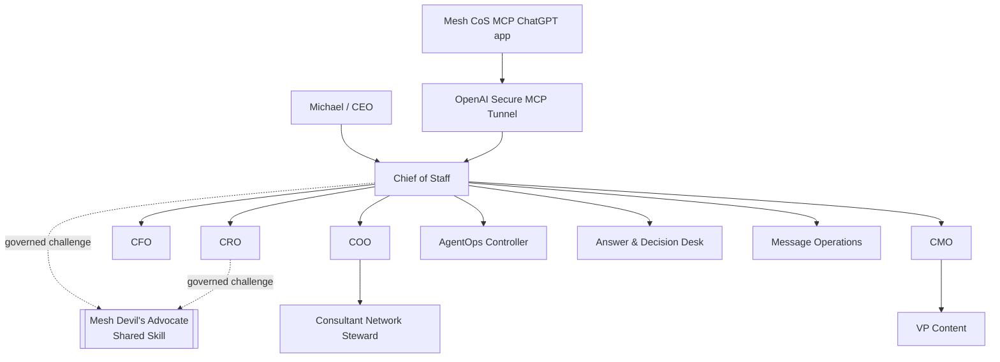

# Documentation Index

Current repository/QNAP deployment release: **`v4.1.6 Secure MCP Published App Production Identity`**.  
Canonical Phase 1 agent authority/runtime contract: **`4.0.0`**.

The current documentation describes the canonical **10-agent** Phase 1 workforce, Mesh Devil's Advocate as the sole external governed shared Skill, the published **Mesh CoS MCP** ChatGPT app, OpenAI Secure MCP Tunnel production transport, human-principal authority boundary, completion/verification lifecycle, bounded delegation, QNAP deployment controls, production identity observability, security controls, acceptance, and release verification.

## Current release and production documentation

- `release-4.1.6-secure-mcp-published-app-identity.md`: v4.1.6 requirements trace, TDD evidence, dual identity contract, and release record.
- `chatgpt-published-app-production-acceptance-v4.1.6.md`: live published-app baseline and post-deploy acceptance requirements.
- `qnap-security-review-v4.1.6.md`: targeted security review for deployment identity observability and remote fail-closed startup.
- `qnap-production-preflight.md`: current QNAP production preflight and dual release identity boundary.
- `../deployment/qnap/README-QNAP.md`: QNAP production topology and operator controls.
- `../deployment/qnap/DEPLOYMENT-STEPS.md`: SSH-safe v4.1.6 deployment procedure.
- `../deployment/qnap/CHATGPT-ACCEPTANCE.md`: published app tool/catalog/transport/identity acceptance procedure.
- `release-4.0.0-cos-delegation-remediation.md`: canonical Phase 1 authority remediation record retained as the 4.0.0 runtime-contract baseline.
- `phase-1-operating-contract.md`: canonical operating constitution.
- `architecture.md`: 10-agent runtime, MCP, authority, and lifecycle diagrams.
- `agent-registry.md`: canonical roster and shared-Skill boundary.
- `decision-rights.md`: L0-L5 authority and human-principal-only operations.
- `delegation-model.md`: direct-child delegation, authority inheritance, and depth ceilings.
- `task-lifecycle.md`: `task.complete` versus `task.verify` semantics.
- `security-governance.md`: immutable identity, deny-by-default MCP exposure, and human-only separation.
- `testing-evaluation.md`: BDD, TDD, negative tests, end-to-end certification, and release gates.
- `production-readiness.md`: fail-closed activation contract.
- `runbook.md`: build, certification, preflight, activation, and incident operations.
- `../RELEASE.md`: current GitHub Release notes.
- `../CHANGELOG.md`: semantic release history.

## Canonical runtime sources

- `../agents/registry.json`: exactly 10 registered agents and external Mesh Devil's Advocate entitlement.
- `../chatgpt/workspace-agents/`: exactly 10 Workspace Agent manifests.
- `../chatgpt/skills/`: exactly 10 repository-local role Skills.
- `../chatgpt/mcp/mesh-cos-mcp.v1.json`: canonical 4.0.0 per-agent allowlists plus the separate human-only allowlist.
- `../mcp/src/server.ts`: transport-neutral MCP projection and governed response envelope.
- `../mcp/src/remote.ts`: Secure MCP Tunnel production HTTP adapter, readiness, source-IP gate, and deployment identity requirement.
- `../src/mesh_cos/mcp_runtime.py`: serialized authorization and dispatch boundary.
- `../src/mesh_cos/lifecycle.py`: lifecycle transition enforcement.
- `../src/mesh_cos/orchestration.py`: task intake, completion, and verification services.
- `../src/mesh_cos/delegation.py`: delegation invariants.
- `TaskLedger`: canonical runtime state.

## Production identity

```text
mcp_version: 4.0.0
deployment_release: 4.1.6
agent_id: cos
transport: SECURE_MCP_TUNNEL
```

The canonical authority/runtime contract and the QNAP deployment release are deliberately separate version domains.

## Current topology



Historical release records remain historical snapshots. v3.0.0's 9-agent architecture is superseded by the canonical v4.0.0 10-agent authority model. The v4.1.x train changes deployment/transport/reliability surfaces without changing that authority contract.
