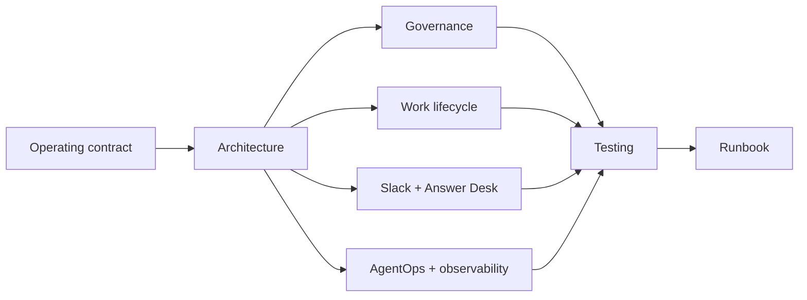

# Documentation Index

Post-remediation Phase 1 documentation for the Mesh AI Chief of Staff operating core.

## Canonical

- `phase-1-operating-contract.md`: operating constitution.
- `../agents/registry.json`: runtime agent source of truth.
- `../contracts/`: versioned machine contracts.
- `../config/performance-policy.v1.json`: AgentOps policy.

## Architecture and governance

- `architecture.md`
- `decision-rights.md`
- `delegation-model.md`
- `task-lifecycle.md`
- `agent-registry.md`
- `agent-performance.md`
- `conflict-resolution.md`
- `escalation-policy.md`
- `security-governance.md`
- `observability.md`

## Collaboration

- `slack-agent-protocol.md`
- `answer-desk.md`

## Verification and operations

- `testing-evaluation.md`
- `runbook.md`
- `pressure-test.md`
- `phase-1-gap-assessment-2026-08-17.md` (historical, with closure mapping)
- `phase-1-remediation-completion-2026-08-17.md`
- `adr/` architecture decisions

## Current production dependencies

Slack credentials, a separate Answer Desk channel ID, approved source/skill credentials and permissions, production approval-owner mapping, deployment infrastructure, and any future thresholds explicitly approved by Michael.

Documentation must describe current runtime behavior. Update affected Mermaid diagrams, tests, registry/policy, and docs in the same PR when operating semantics change.
