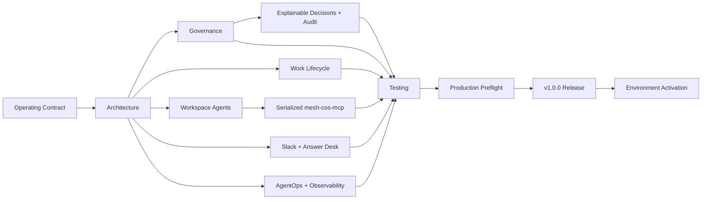
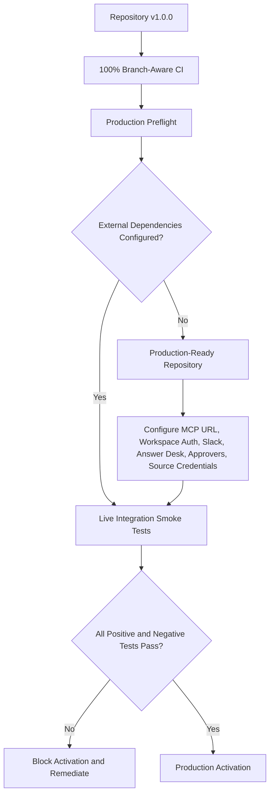

# Documentation Index

Current release: **`v1.0.0 Production Readiness`**.

The Mesh AI Chief of Staff documentation set covers the canonical operating constitution, governed runtime, 11-agent Workspace Agent deployment projection, security and decision rights, production preflight, release verification, and environment-specific activation. Historical Phase 1 closure/remediation records remain preserved as historical snapshots.

## v1.0.0 release documentation

- `release-1.0.0-production-readiness.md`: semantic release record, production-readiness invariants, Mermaid release/execution/activation diagrams, and activation boundary.
- `production-readiness.md`: fail-closed repository and environment readiness model.
- `production-hardening-2026-08-17.md`: TDD and loop-engineering hardening record that produced the 100% branch-aware release gate and production runtime controls.
- `../RELEASE.md`: canonical GitHub release notes for `v1.0.0 Production Readiness`.
- `../CHANGELOG.md`: full semantic release history.

## Canonical runtime

- `phase-1-operating-contract.md`: operating constitution.
- `../agents/registry.json`: canonical agent definitions and authority.
- `../contracts/`: versioned machine contracts, including `decision.v2` and `agent-event.v2`.
- `../config/performance-policy.v1.json`: AgentOps policy.
- `../config/governance-policy.v1.json`: shared explainability and audit policy.
- `../config/governance-logs.v1.json`: non-secret Decision/Audit Sheet mirror configuration.
- `../src/mesh_cos/ledger.py`: canonical runtime persistence boundary.
- `../src/mesh_cos/mcp_runtime.py`: serialized remote MCP execution boundary.
- `../src/mesh_cos/preflight.py`: production preflight implementation.

## ChatGPT Workspace Agent deployment

- `../chatgpt/README.md`: Workspace Agent deployment-package overview and architecture.
- `../chatgpt/skills/`: 11 validated OpenAI Skill source packages, one per canonical agent.
- `../chatgpt/workspace-agents/`: exact Workspace Agent manifests and Builder configurations, aligned to repository release `1.0.0`.
- `../chatgpt/mcp/mesh-cos-mcp.v1.json`: per-agent custom MCP contract, allowlists, human-only tools, and serialized runtime binding.
- `../chatgpt/mcp/README.md`: MCP authorization and enforcement sequence.
- `../chatgpt/workspace-agent-builder-prompt.md`: production deployment and private-preview handoff for the Workspace Agent builder.
- `../chatgpt/workspace-agent-gap-assessment-2026-08-17.md`: historical TDD gap-closure record for the initial Workspace Agent package layer.

These artifacts project the canonical organization into ChatGPT. They do not replace `agents/registry.json` or `TaskLedger`.

## Architecture and governance

- `architecture.md`: runtime, Workspace Agent, MCP, human authority, and production-activation topology.
- `decision-rights.md`: L0-L5 authority, qualified-human L4 approvals, and Michael-exclusive L5 authority.
- `explainable-decisions-audit.md`: decision/audit schemas, provenance, mirrors, privacy, integrity, and reconciliation.
- `delegation-model.md`: bounded work contracts and one-owner policy.
- `task-lifecycle.md`: outcome lifecycle, accountable-owner completion, independent verification, and rework.
- `agent-registry.md`: governed workforce definitions and Workspace Agent projection rules.
- `agent-performance.md`: AgentOps performance management.
- `conflict-resolution.md`: functional fact authority and CoS arbitration.
- `escalation-policy.md`: impact, authority, confidence, and reversibility routing.
- `security-governance.md`: least privilege, serialized MCP deny-by-default controls, injection defense, app constraints, approvals, replay safety, and audit integrity.
- `observability.md`: audit, explainability, mirror, and metrics model.

## Collaboration

- `slack-agent-protocol.md`: `#mesh-agent-ops`, signature/freshness validation, dedupe, task/thread mapping, and approval notifications.
- `answer-desk.md`: separate team-facing Answer Desk interface and dispositions.

## Verification and operations

- `testing-evaluation.md`: TDD, contract tests, 100% branch-aware release coverage, static checks, negative control tests, drift gates, and Skill/package validation.
- `runbook.md`: production preflight, MCP deployment, Workspace Agent private preview, governance reconciliation, incidents, replay/override, quarantine, and shutdown.
- `pressure-test.md`: independent challenge criteria.
- `adr/`: architecture decisions.

## Historical Phase 1 records

The following remain intentionally historical and should not be mechanically rewritten to claim they were authored against `v1.0.0`:

- `phase-1-gap-assessment-2026-08-17.md`;
- `phase-1-remediation-completion-2026-08-17.md`;
- `phase-1-final-closure-2026-08-17.md`.

## Governance registers

- **CoS Decision Log**: Google Sheet ID `1IJcwPuulqsNAa1lCW2MsmNgH6Vm5INPqTlcH4NR0xpw`.
- **CoS Audit Log**: Google Sheet ID `1T8vKx4gaUJdeG8kSc18MsBbXpY4EbDF3exZ0RGpvND0`.

They are operational mirrors. `TaskLedger` remains canonical.

## Production readiness versus production activation

Production activation still requires an approved remote `mesh-cos-mcp` endpoint and `MESH_COS_MCP_SERVER_URL`, Workspace app authentication, applicable Slack credentials, the separate Answer Desk Slack channel, approved source/Skill credentials and permissions, production approval-owner mapping, deployment infrastructure, secrets management, and any future thresholds explicitly approved by Michael.

Documentation must describe current runtime behavior. CI runs contract validation, runtime/documentation drift, Workspace Agent package drift, strict source Ruff, mypy, 100% branch-aware coverage, Bandit high-severity scanning, and compileall before release.
