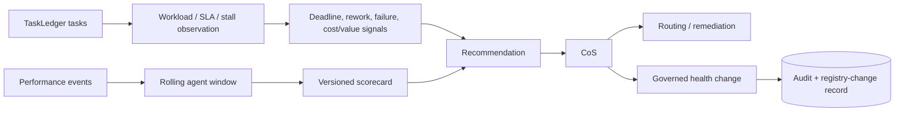

# Agent Performance and AgentOps

AgentOps converts execution evidence into bounded routing, remediation, and health recommendations. The performance policy is versioned in `config/performance-policy.v1.json`; weights and thresholds must not be changed silently in code.

## Performance policy

| Category | Weight |
|---|---:|
| Outcome achievement | 0.30 |
| First-pass quality | 0.20 |
| Escalation judgment | 0.15 |
| Evidence governance | 0.10 |
| Execution reliability | 0.10 |
| CEO leverage | 0.10 |
| Efficiency | 0.05 |

The initial thresholds remain configurable. A critical defect normally recommends `QUARANTINE` regardless of weighted score.

## AgentOps loop

## Required signals implemented

AgentOps supports:

- task success/failure evidence,
- rolling performance windows,
- rework monitoring,
- stalled-task and missed-deadline detection,
- escalation-quality evidence,
- output rejection reasons,
- execution error taxonomy,
- workload and concurrency observations,
- high-cost/low-value signals where cost telemetry exists,
- repeated tool failures,
- repeated evidence/governance defects,
- durable scorecards and health-change records.

The supported recommendation vocabulary is:

`CONTINUE`, `INCREASE_ROUTING`, `DECREASE_ROUTING`, `WATCH`, `RESTRICT`, `RETRAIN_OR_REVISE`, `QUARANTINE`, `RETIRE`, `BUILD_NEW_SPECIALIST`.

Recommendations are advisory to the CoS. Material authority changes and autonomous agent creation remain outside AgentOps authority.

## Health states

`SHADOW`, `ACTIVE`, `WATCH`, `RESTRICTED`, `QUARANTINED`, and `RETIRED` are supported operating states. Health-state changes are recorded and audited. A health change cannot expand the agent's decision rights beyond the canonical Agent Registry.

## Evidence discipline

Performance is based on durable task, verification, error, source, approval, and telemetry records rather than conversational impressions. No baseline or target is fabricated. Cost and CEO-time metrics are reported only when the supporting telemetry or explicit methodology exists.

## Change control

Changes to weights, thresholds, recommendation semantics, critical-defect behavior, or health policy require a versioned policy change, tests, documentation, and green CI.
