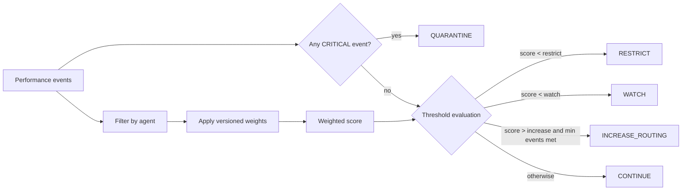

# Agent Performance and AgentOps

AgentOps converts execution evidence into bounded routing and health recommendations. Performance policy is versioned in `config/performance-policy.v1.json`; weights and thresholds must not be changed silently in code.

## Current performance policy

| Category | Weight |
|---|---:|
| Outcome achievement | 0.30 |
| First-pass quality | 0.20 |
| Escalation judgment | 0.15 |
| Evidence governance | 0.10 |
| Execution reliability | 0.10 |
| CEO leverage | 0.10 |
| Efficiency | 0.05 |

Current thresholds:

- below `0.30`: `RESTRICT`
- below `0.65`: `WATCH`
- above `0.90` with at least five qualifying events: `INCREASE_ROUTING`
- any critical-severity defect: `QUARANTINE`
- otherwise: `CONTINUE`

## Evaluation flow

## What AgentOps observes

Phase 1 AgentOps includes:

- versioned scorecard evaluation,
- stalled-task detection based on `next_check_at`,
- coordination-loop detection when repeated cross-agent messages produce no state change or evidence,
- critical defect handling,
- recommendation output for routing/health governance.

The performance layer must use evidence from actual work rather than subjective conversational impressions.

## Health states

`SHADOW`, `ACTIVE`, `WATCH`, `RESTRICTED`, `QUARANTINED`, and `RETIRED` are supported operating states. Health recommendations do not automatically grant new authority. Authority remains governed by the Agent Registry and decision-rights policy.

## Metrics and CEO leverage

The runtime includes deterministic metrics for verified outcomes, CEO deflection, and CEO-time-avoided estimates when the methodology is explicitly supported. Estimates without a defined methodology must not be presented as measured fact.

## Change control

Changing weights, thresholds, recommendation semantics, or critical-defect behavior requires:

1. a versioned policy change,
2. test updates,
3. documentation updates,
4. review of downstream health/routing implications,
5. CI success before merge.
