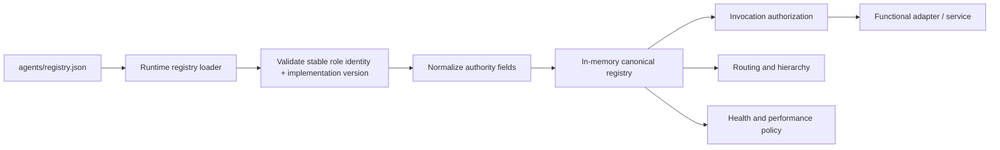

# Agent Registry

`agents/registry.json` is the canonical runtime source of truth for Phase 1 agent identity and governance. The remediation removed the duplicate hardcoded registry as an independent authority source.

## Control path

## Role identity policy

Role identity and software version are deliberately separate:

- `agent_id` is the durable machine identity.
- `display_name` is the stable organizational role name.
- `version` is the runtime implementation version and uses `MAJOR.MINOR.PATCH`.
- repository release versions describe the control-plane release.
- accountable domain, sources, permitted/prohibited actions, approvals, and delegation express scope and maturity boundaries.

The registry loader rejects display names that embed version labels. The top-level `role_identity_policy` documents the same rule so runtime behavior, tests, and human-readable governance stay aligned.

## Registry content

Each agent record defines, as applicable:

- stable agent ID and display name,
- implementation version,
- parent and accountable functional domain,
- source authority and approved sources,
- existing Mesh skills and native tools,
- permitted and prohibited actions,
- decision authority,
- approval obligations,
- delegation permissions,
- performance policy,
- confidentiality class,
- runtime health.

The human-readable files in `agents/*.md` are role cards. They summarize the canonical registry but do not override it.

## Phase 1 agents

| Agent | Parent | Primary Phase 1 purpose |
|---|---|---|
| CoS | Michael | Executive outcome orchestration and arbitration. |
| AgentOps | CoS | Workforce observability, performance, and health recommendations. |
| Answer Desk | CoS | Permission-aware team question handling. |
| CRO | CoS | Commercial strategy, opportunity quality, pursuits, buyer dynamics, expansion, and commercial-risk framing. |
| CFO | CoS | Engagement Finance / FP&A, economics, margin, scenario, forecast, and financial-risk recommendations. |
| COO | CoS | Delivery feasibility, configuration, capacity, POD/resource readiness, dependency risk, and staffing recommendations. |
| Consultant Network Steward | COO | Consultant identification/matching, fit, freshness, rate, availability, readiness gaps, refresh, and contracting evidence. |
| CMO | CoS | Marketing strategy, audience/ICP, category positioning, demand/campaign architecture, distribution, brand governance, and optimization. |
| VP Content | CMO | Editorial planning, evidence assembly, production, adaptation, reuse, QA, inventory, and performance feedback. |
| Devil's Advocate | CoS | Independent challenge, never final decision owner. |
| Message Operations | CoS | Controlled execution of approved communications. |

## Functional capability model

The registry's `permitted_actions` is the executable Phase 1 capability surface. Descriptions and role cards must not claim capabilities that are absent from this list. Likewise, a listed permitted action does not create a new external integration. Existing Mesh skills remain separately listed in `skills`, while native typed runtime controls remain listed in `tools`.

This separation prevents capability theater and preserves the rule that source/tool access never expands decision authority.

## Runtime normalization

Some registry authority descriptions are human-readable strings rather than bare integers. The loader normalizes known `L0` through `L5` forms and advisory-only authority safely for runtime comparison. Unknown authority representations fail rather than silently granting access.

## Health states

Supported states are:

- `SHADOW`
- `ACTIVE`
- `WATCH`
- `RESTRICTED`
- `QUARANTINED`
- `RETIRED`

Health is not equivalent to authority. An `ACTIVE` agent is still limited by its registry permissions and decision-rights ceiling.

## Invocation authorization

Before a source, tool, or consequential action is used, runtime authorization checks the registry record. Denied sources or tools raise a permission failure rather than relying on prompt instructions alone.

## Change control

Any registry change that alters identity, accountable domain, authority, source/tool access, skills, permitted/prohibited actions, delegation, confidentiality, or health policy must update tests and relevant documentation in the same pull request. Material authority expansion must follow the L4/L5 governance model.
