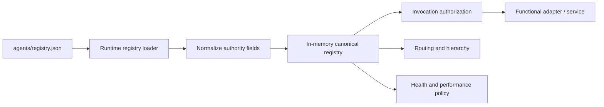

# Agent Registry

`agents/registry.json` is the canonical runtime source of truth for Phase 1 agent identity and governance. The remediation removed the duplicate hardcoded registry as an independent authority source.

## Control path

## Registry content

Each agent record defines, as applicable:

- stable agent ID and role,
- parent and functional domain,
- source authority and approved sources,
- skills and tools,
- permitted and prohibited actions,
- decision authority,
- approval obligations,
- delegation permissions,
- performance policy,
- confidentiality class,
- runtime health.

The human-readable files in `agents/*.md` are role cards. They summarize the canonical registry but do not override it.

## Phase 1 agents

| Agent | Parent | Primary purpose |
|---|---|---|
| CoS | Michael | Executive outcome orchestration and arbitration. |
| AgentOps | CoS | Workforce observability, performance, and health recommendations. |
| Answer Desk | CoS | Permission-aware team question handling. |
| CRO | CoS | Commercial and pursuit leadership within delegated scope. |
| CFO v1 | CoS | Engagement Finance / FP&A. |
| COO v1 | CoS | Delivery feasibility, capacity, and resource readiness. |
| Consultant Network Steward | COO | Consultant readiness, fit, freshness, rate, and availability evidence. |
| CMO | CoS | Marketing strategy and delegated execution. |
| VP Content | CMO | Editorial production. |
| Devil's Advocate | CoS | Independent challenge, never final decision owner. |
| Message Operations | CoS | Controlled execution of approved communications. |

## Runtime normalization

Some registry authority descriptions are human-readable strings rather than bare integers. The loader normalizes known `L0` through `L5` forms and advisory-only authority safely for runtime comparison. Unknown authority representations fail rather than silently granting access.

## Health states

Supported states are:

- `SHADOW`
- `ACTIVE`
- `WATCH`
- `RESTRICTED`
- `QUARANTINED`
- `RETIRED`

Health is not equivalent to authority. An `ACTIVE` agent is still limited by its registry permissions and decision-rights ceiling.

## Invocation authorization

Before a source, tool, or consequential action is used, runtime authorization checks the registry record. Denied sources or tools raise a permission failure rather than relying on prompt instructions alone.

## Change control

Any registry change that alters authority, source/tool access, delegation, prohibited actions, confidentiality, or health policy must update tests and relevant documentation in the same pull request. Material authority expansion must follow the L4/L5 governance model.
