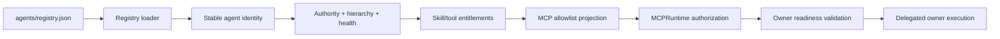

# Agent Registry

`agents/registry.json` is the canonical runtime source of truth for Phase 1 agent identity, hierarchy, authority, capabilities, delegation depth, runtime health, required approvals, and shared-Skill entitlement.

## Canonical roster

Phase 1 contains exactly **10 registered agents**:

| Agent ID | Display name | Parent | Max delegation depth |
|---|---|---|---:|
| `cos` | Chief of Staff | Michael / CEO | 2 |
| `agentops` | AgentOps Controller | `cos` | 0 |
| `answer-desk` | Answer & Decision Desk | `cos` | 0 |
| `cro` | CRO | `cos` | 1 |
| `cfo` | CFO | `cos` | 1 |
| `coo` | COO | `cos` | 1 |
| `consultant-network-steward` | Consultant Network Steward | `coo` | 0 |
| `cmo` | CMO | `cos` | 1 |
| `vp-content` | VP Content | `cmo` | 0 |
| `message-ops` | Message Operations | `cos` | 0 |

Mesh Devil's Advocate is intentionally absent from the agent roster. It is the external `mesh-devils-advocate` shared Skill, available only to `cos` and `cro`, with `ADVISORY_ONLY` authority, `canonical_facts_modified: false`, and `external_action_included: false`.

## Control path



The registry does not itself grant human-principal-only MCP operations. `approval.record_decision` and `reliability.human_override` are governed separately by the MCP human allowlist and authenticated human dispatch.

## Identity policy

`agent_id` is the durable machine identity. `display_name` is the stable organizational name. `version` is implementation metadata.

Prompt text, task content, retrieved content, delegated instructions, app payloads, connector output, model output, or shared-Skill output cannot change the external runtime identity bound through `MESH_COS_AGENT_ID` or select an arbitrary delegated execution principal.

Delegated owner execution derives the acting owner from canonical task/delegation relationships and then resolves the owner's registry record and MCP allowlist.

## Delegation policy

A delegation target must be a registered direct child of the authenticated delegator and remain within the parent's authority and approval obligations. Parentage and depth are derived from this registry at runtime, not from a hard-coded owner router.

Current second-level paths are:

```text
CoS -> CMO -> VP Content
CoS -> COO -> Consultant Network Steward
```

Both specialists are terminal in the current registry. Agents with `max_delegation_depth=0` cannot delegate further.

Delegation creation also requires the target owner to be ACTIVE/routable and to have a validated owner lifecycle surface. A registry relationship alone is insufficient.

## Owner execution readiness

A production-readiness invariant applies to every ACTIVE downstream agent eligible to become an accountable task owner:

> The agent must have a validated mechanism to read, transition, check in, and complete its authorized canonical work under its own authority, and its delegating parent must have the governed owner-execution transport.

`scripts/check-owner-execution-readiness.py` generates this matrix from the current registry and MCP policy. A future agent addition that is owner-eligible but not executable fails CI rather than creating stranded production work.

## Authority projection

Registry `permitted_actions`, `prohibited_actions`, `required_approvals`, `decision_authority`, parentage, max delegation depth, status, and runtime health are authoritative inputs to delegation and owner execution.

Delegation cannot:

- grant actions outside the target registry authority;
- remove target prohibited actions;
- drop inherited or target required approvals;
- exceed registry-derived delegation depth;
- execute a disabled, quarantined, or otherwise unroutable owner;
- cause a child to inherit parent-only MCP capabilities.

## Completion policy

Registry membership does not imply verification authority. Appropriate accountable owners receive `task.complete`; only explicitly authorized verifiers receive `task.verify`. In the Phase 1 agent projection, Chief of Staff is the only agent with `task.verify`.

Authoritative owner lifecycle writes require the canonical accountable owner. Parent orchestration does not confer direct child completion authority.

## Drift protection

CI requires agreement among the registry roster, Workspace Agent manifests, repository-local role Skills, MCP principal allowlists, owner-execution readiness, and current architecture documentation.

Historical release documents may preserve prior roster/tool counts only when clearly scoped as historical. Current production readiness fails if any ACTIVE owner-eligible registry entry lacks a compatible execution path.
