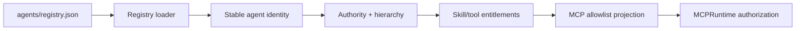

# Agent Registry

`agents/registry.json` is the canonical runtime source of truth for Phase 1 agent identity, hierarchy, authority, capabilities, and shared-Skill entitlement.

## Canonical roster

Phase 1 contains exactly **10 registered agents**:

| Agent ID | Display name | Parent | Max delegation depth |
|---|---|---|---:|
| `cos` | Chief of Staff | Michael / CEO | 2 |
| `agentops` | AgentOps Controller | `cos` | 0 |
| `answer-desk` | Answer & Decision Desk | `cos` | 0 |
| `cro` | CRO | `cos` | 1 |
| `cfo` | CFO | `cos` | 1 |
| `coo` | COO | `cos` | 1 |
| `consultant-network-steward` | Consultant Network Steward | `coo` | 0 |
| `cmo` | CMO | `cos` | 1 |
| `vp-content` | VP Content | `cmo` | 0 |
| `message-ops` | Message Operations | `cos` | 0 |

Mesh Devil's Advocate is intentionally absent from the agent roster. It is the external `mesh-devils-advocate` shared Skill, available only to `cos` and `cro`, with `ADVISORY_ONLY` authority, `canonical_facts_modified: false`, and `external_action_included: false`.

## Control path



The registry does not itself grant human-principal-only MCP operations. `approval.record_decision` and `reliability.human_override` are governed separately by the MCP human allowlist and authenticated human dispatch.

## Identity policy

`agent_id` is the durable machine identity. `display_name` is the stable organizational name. `version` is implementation metadata. Prompt text, task content, retrieved content, delegated instructions, app payloads, or shared-Skill output cannot change the runtime identity bound through `MESH_COS_AGENT_ID`.

## Delegation policy

A delegation target must be a registered direct child of the caller and remain within the parent's authority and approval obligations. The legal specialist path is:

```text
CoS -> COO -> Consultant Network Steward
```

Consultant Network Steward is terminal. Depth beyond the Phase 1 ceiling is denied.

## Completion policy

Registry membership does not imply verification authority. Appropriate accountable owners receive `task.complete`; only explicitly authorized verifiers receive `task.verify`. In the Phase 1 agent projection, Chief of Staff is the only agent with `task.verify`.

## Drift protection

CI requires exact equality among the registry roster, Workspace Agent manifests, repository-local role Skills, MCP principal allowlists, and current architecture documentation. Historical release documents may preserve prior roster counts only when clearly scoped as historical.