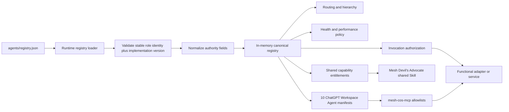

# Agent Registry

`agents/registry.json` is the canonical runtime source of truth for Phase 1 agent identity, governance, and shared capability entitlement.

## Control path



## Role identity policy

Role identity and software version are separate:

- `agent_id` is the durable machine identity.
- `display_name` is the stable organizational role name.
- `version` is the runtime implementation version and uses `MAJOR.MINOR.PATCH`.
- repository release versions describe the control-plane release.
- accountable domain, sources, permitted/prohibited actions, approvals, and delegation express scope and maturity boundaries.

The registry loader rejects display names that embed version labels. The top-level `role_identity_policy` documents the same rule so runtime behavior, tests, governance, and Workspace Agent configuration stay aligned.

## Registry content

Each agent record defines, as applicable:

- stable agent ID and display name,
- implementation version,
- parent and accountable functional domain,
- source authority and approved sources,
- existing Mesh Skills and native tools,
- permitted and prohibited actions,
- decision authority,
- approval obligations,
- delegation permissions,
- performance policy,
- confidentiality class,
- runtime health.

The human-readable files in `agents/*.md` are role cards. They summarize the canonical registry but do not override it.

## Phase 1 agents

Release `v2.0.0` has exactly **10 agent principals**:

| Agent | Parent | Primary Phase 1 purpose |
|---|---|---|
| CoS | Michael | Executive outcome orchestration and arbitration. |
| AgentOps | CoS | Workforce observability, performance, and health recommendations. |
| Answer Desk | CoS | Permission-aware team question handling. |
| CRO | CoS | Commercial strategy, opportunity quality, pursuits, buyer dynamics, expansion, and commercial-risk framing. |
| CFO | CoS | Engagement Finance / FP&A, economics, margin, scenario, forecast, and financial-risk recommendations. |
| COO | CoS | Delivery feasibility, configuration, capacity, POD/resource readiness, dependency risk, and staffing recommendations. |
| Consultant Network Steward | COO | Consultant identification/matching, fit, freshness, rate, availability, readiness gaps, refresh, and contracting evidence. |
| CMO | CoS | Marketing strategy, audience/ICP, category positioning, demand/campaign architecture, distribution, brand governance, and optimization. |
| VP Content | CMO | Editorial planning, evidence assembly, production, adaptation, reuse, QA, inventory, and performance feedback. |
| Message Operations | CoS | Controlled execution of approved communications. |

## Shared capability model

`shared_capabilities` is separate from `agents` by design. The first governed shared capability is **Mesh Devil's Advocate** (`mesh-devils-advocate`). It is an `EXTERNAL_SHARED_SKILL`, not a Workspace Agent principal, not a delegated task owner, and not a repository-local duplicate Skill.

Its contract is:

- consumers: `cos` and `cro` only;
- authority: `ADVISORY_ONLY`;
- request: `mesh.devils-advocate.challenge-request.v1`;
- response: `mesh.devils-advocate.challenge-packet.v1`;
- canonical facts modified: `false`;
- external action included: `false`.

The shared Skill may challenge assumptions, interpretations, evidence sufficiency, routes, premortems, and decision conditions. It returns authority to the owning agent or qualified human. For Revenue Intelligence, canonical account IDs, evidence classes, scores, stage, lifecycle, queue state, and activation readiness remain owned by Revenue Intelligence.

## Functional capability model

The registry's `permitted_actions` is the executable Phase 1 capability surface. Descriptions and role cards must not claim capabilities that are absent from this list. Likewise, a listed permitted action does not create a new external integration. Existing Mesh Skills remain separately listed in `skills`, while native typed runtime controls remain listed in `tools`.

This separation prevents capability theater and preserves the rule that source/tool access never expands decision authority.

## ChatGPT Workspace Agent projection

Release `2.0.0` maps each of the 10 canonical agent roles into exactly one Workspace Agent manifest and one repository-local role Skill:

```text
agents/registry.json
  -> chatgpt/workspace-agents/<agent_id>.json
  -> chatgpt/skills/<role-skill>/SKILL.md
  -> mesh-cos-mcp per-agent tool allowlist
```

Chief of Staff and CRO additionally receive the shared `mesh-devils-advocate` entitlement. They invoke it through `skills.invoke_governed`; there is no `devils-advocate` MCP principal or Workspace Agent manifest.

The projection must preserve raw registry values for stable display name, parent, implementation version, accountable domain, decision authority, required approvals, prohibited actions, and maximum delegation depth. Builder-only fields such as preferred model, Workspace apps, channel enablement, starter prompts, shared Skill attachments, and connector action constraints may add deployment controls but may not widen registry authority.

`mesh_cos.mcp_policy.WorkspaceAgentMCPPolicy` enforces checked-in per-agent MCP allowlists server-side with deny-by-default behavior. `scripts/check-chatgpt-packages.py` prevents registry, Skill, manifest, MCP, release, shared-capability, or permission drift in CI.

## Runtime normalization

Some registry authority descriptions are human-readable strings rather than bare integers. The loader normalizes known `L0` through `L5` forms and advisory-only authority safely for runtime comparison. Unknown authority representations fail rather than silently granting access. Workspace Agent manifests preserve original human-readable authority wording for governance review.

## Health states

Supported states are `SHADOW`, `ACTIVE`, `WATCH`, `RESTRICTED`, `QUARANTINED`, and `RETIRED`. Health is not equivalent to authority. An `ACTIVE` agent is still limited by registry permissions and its decision-rights ceiling.

## Invocation authorization

Before a source, tool, or consequential action is used, runtime authorization checks the registry record. Workspace Agent traffic first passes the agent-specific MCP allowlist, then existing source/tool/action and authority controls. Shared Mesh Devil's Advocate invocation is also constrained by registry Skill entitlement, so only CoS and CRO can invoke it. Denied sources, tools, or capabilities fail closed.

## Change control

Any registry change that alters identity, accountable domain, authority, source/tool access, Skills, shared capability entitlement, permitted/prohibited actions, delegation, confidentiality, or health policy must update tests, role cards, relevant documentation, matching Workspace Agent manifests/Skills, and MCP allowlists in the same pull request. Material authority expansion must follow the L4/L5 governance model.

<!-- mesh-cos-v2-shared-da -->
## v2.0.0 current architecture

The live Phase 1 runtime is a **10-agent** organization. The former repository-local Devil's Advocate agent and duplicate role Skill are removed. **Mesh Devil's Advocate** is an external **shared Skill** available only to Chief of Staff and CRO through governed Skill invocation. It is **advisory** only, cannot overwrite **canonical facts**, cannot execute external actions, and returns decision authority to the owning role or qualified human. `TaskLedger` remains canonical state; ChatGPT uses `LOCAL_STDIO` through `MCPRuntime` with deny-by-default allowlists, human-only approval/override paths, `check-chatgpt-packages.py` drift enforcement, and the 100% branch-aware coverage gate. Historical references to an 11-agent roster or a local Devil's Advocate role describe superseded releases only.

