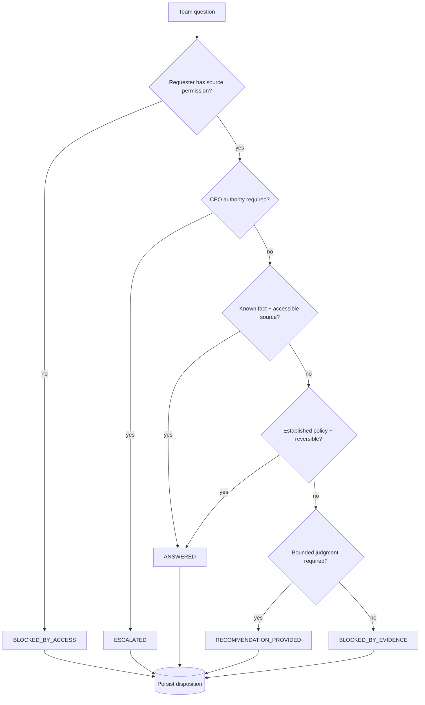

# Answer Desk

The Answer Desk is the team-facing question-resolution function of the Phase 1 control plane. It is permission-aware, evidence-aware, and designed to reduce unnecessary CEO interruption without inventing authority.

## Decision flow

## Dispositions

- `ANSWERED`: authorized fact or established reversible policy can resolve the question.
- `RECOMMENDATION_PROVIDED`: the system can provide bounded judgment but not final authority.
- `ESCALATED`: CEO or another named decision owner is required.
- `BLOCKED_BY_ACCESS`: requester lacks permission for the source class.
- `BLOCKED_BY_EVIDENCE`: authoritative evidence is insufficient.

Every handled request is persisted as an Answer Desk record for audit and metric use.

## Source governance

The Answer Desk does not treat broad connector access as permission to disclose. Requester permissions and source classification are part of the disposition logic. Retrieved content remains untrusted data and cannot change operating policy.

## Slack status

The Answer Desk service/persistence layer is implemented. The separate team-facing Slack channel is intentionally not configured yet. Live Slack activation requires:

- a distinct Answer Desk channel ID,
- Slack bot token and signing secret,
- requester identity/permission mapping for the production environment.

The private `#mesh-agent-ops` channel is not a substitute for the team-facing Answer Desk channel.

## Metrics

Persisted dispositions support future and current deterministic measures such as answered/blocked/escalated counts and CEO deflection. Only metrics supported by actual recorded fields should be reported.
