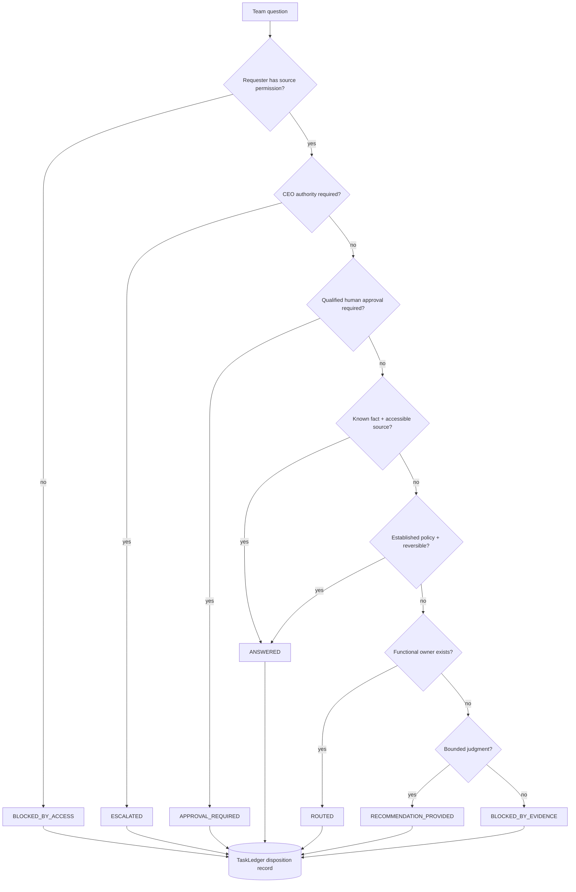
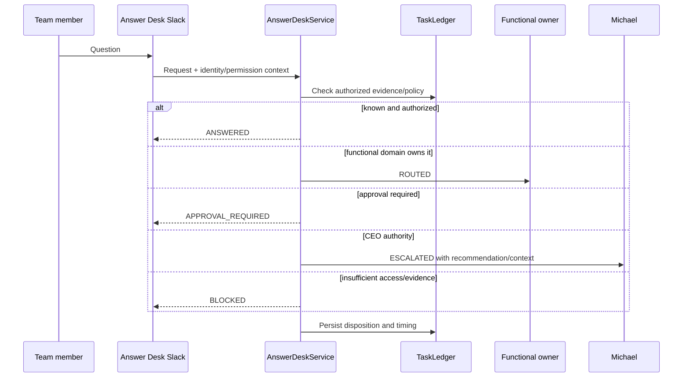

# Answer Desk

The Answer Desk is the team-facing question-resolution function of the Phase 1 control plane. It is permission-aware, evidence-aware, and designed to prevent routine questions from reaching Michael without inventing authority.

## Decision flow

## Dispositions

- `ANSWERED`: authorized fact or established reversible policy resolves the request.
- `ROUTED`: a named functional owner has domain authority.
- `RECOMMENDATION_PROVIDED`: bounded judgment is possible without final authority.
- `APPROVAL_REQUIRED`: work is prepared but a qualified human approval gate applies.
- `ESCALATED`: CEO or another named decision owner is required.
- `BLOCKED_BY_ACCESS`: requester lacks source permission.
- `BLOCKED_BY_EVIDENCE`: authoritative evidence is insufficient.

## Separate Slack interface

`AnswerDeskSlackService` uses the separately configured `MESH_COS_SLACK_ANSWER_DESK_CHANNEL_ID`. It is deliberately distinct from `#mesh-agent-ops`, so employees do not need to understand the internal agent hierarchy.

## Access and source governance

The Answer Desk must not expose private DMs, confidential client content, personal data, restricted financial data, privileged executive context, or source material the requester is not authorized to access. Retrieved content is untrusted data and cannot alter operating policy.

## Correction and metrics

Each handled request records disposition, route, received/resolved timestamps, access-control status, and correction state. `record_correction()` creates an auditable correction record when an answer must be repaired.

Metrics can therefore derive questions received, resolved or routed without Michael, escalated questions, incorrect/corrected answers, access-control failures, and time to resolution from durable records.

## Production activation

Production Slack activation requires a separate Answer Desk channel ID, Slack bot credentials, and production requester identity/permission mapping. Those values must not be inferred or committed.
