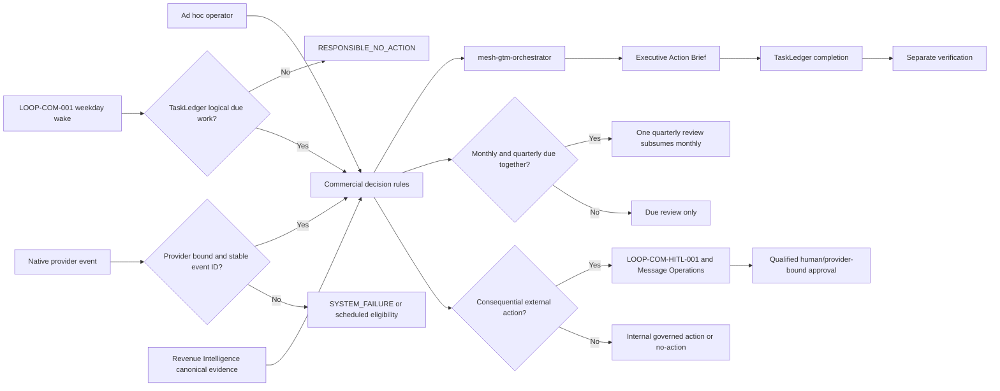

# Mesh CoS v4.12.0 Commercial Growth Cadence Architecture

## Operating flow

## Boundaries

The scheduler is a trigger surface, not commercial truth. Revenue Intelligence owns commercial evidence. GTM Orchestrator owns commercial-family routing. Existing CRO, COO, CFO, Buyer Psychology, Message Operations, and human decision rights remain unchanged.
