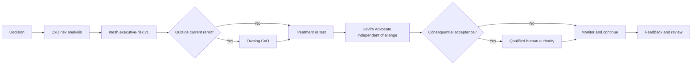

# v4.14.0 CxO Executive Risk Management Architecture

The four CxO Skills use one additive shared risk contract, `mesh.executive-risk.v1`. Each CxO owns risk recommendation only within its existing functional remit. Cross-functional risk is routed to the correct owner. Consequential acceptance remains with the qualified human authority.

The shared contract does not create enterprise risk truth. It standardizes decision-support handoff fields, treatment ownership, monitoring, escalation, reversibility, residual risk, and acceptance ownership.
