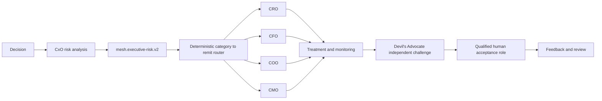

# v4.15.0 CxO Executive Risk Routing Architecture

The four CxO Skills use `mesh.executive-risk.v2` for new risk handoffs. Historical v1 records remain readable. The deterministic router assigns risk categories to CRO, CFO, COO, or CMO while preserving a qualified-human acceptance principal.

A Skill may recommend treatment but never becomes the risk-acceptance principal. Unknown delivery capacity does not block early pursuit. Capacity becomes decision relevant only when concrete delivery need and a staffing or timeline commitment coexist.
