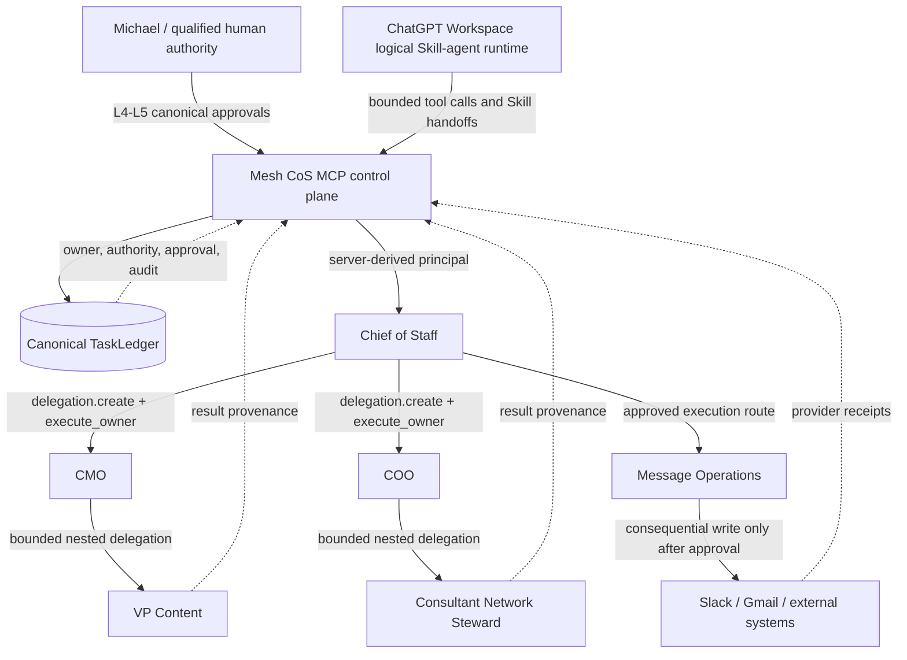

# Mesh CoS v4.4.0 Authority and Execution Architecture

## Purpose

v4.4.0 separates orchestration, reasoning, authority, state, and consequential execution so the system no longer conflates a delegated role with an unconstrained runtime principal.

## Canonical architecture

The diagram was validated with the Mermaid Chart integration on 2026-08-28.

## Authority model

1. MCP is the authority and persistence boundary. Task ownership, delegation, approvals, audit, and completion state are canonical in TaskLedger.
2. ChatGPT reasoning roles are logical Skill-agents unless a separately observable runtime is explicitly configured. A Skill handoff is authorization to execute reasoning in that bounded role context; it is not evidence that a distinct Workspace Agent process ran.
3. `delegation.execute_owner` derives the execution principal from the canonical delegation and task. Request payloads cannot choose or impersonate the child owner.
4. Delegated capability authority is the intersection of the owner registry and the delegation's `permitted_capabilities`.
5. Nested delegation is allowed only on registered parent-child routes and remains bound to the current delegated task.
6. L4/L5 authority requires a canonical approved TaskLedger record. L5 requires Michael as the canonical approval actor.
7. `COMPLETED` remains distinct from `VERIFIED`; delegated owners cannot invoke verifier or human-only tools through the owner executor.

## Capability execution modes

`config/capability-execution.v1.json` classifies every declared tool/capability for all 10 active agents as one of:

- `MCP_CONTROL_PLANE`
- `SERVER_OWNED_ADAPTER`
- `MODEL_NATIVE_ROLE_CAPABILITY`
- `CHATGPT_APP_BOUNDARY`
- `DECLARED_NON_EXECUTABLE`

CI fails if an agent declares a capability that cannot be resolved to one of these governed execution modes.

## Publication contract

The source contract has 30 total MCP operations: 28 CoS machine actions and two human-only operations. Workspace publication acceptance requires exact equality of both action names and input schemas. Source validation alone reports `PUBLISHED_ACTION_SURFACE=SOURCE_CONTRACT_ONLY`; it cannot establish that a ChatGPT workspace has refreshed or published the matching snapshot.

## Provenance

MCP response envelopes expose four independent identities:

- runtime contract version (`mcp_version`)
- deployment release (`deployment_release`)
- immutable source revision (`source_commit`)
- principal-specific action/input-schema digest (`publication_schema_digest`)

This prevents operators from using one version number as a proxy for code, deployment, or Workspace publication state.
