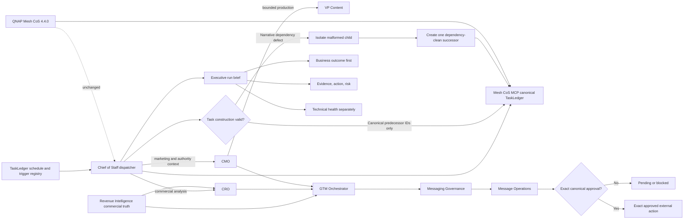

# Mesh CoS v4.4.1 Commercial Operations Architecture

## Purpose

v4.4.1 corrects the Commercial Operations orchestration layer while keeping the healthy Mesh CoS MCP 4.4.0 QNAP runtime unchanged. The release tightens caller-side work-graph construction, central scheduling, bounded recovery, business-first reporting, and governed marketing-authority composition.

## System boundary

The canonical runtime boundary remains Mesh CoS MCP and its canonical TaskLedger. Google TaskLedger is the recoverable scheduling and operating mirror. Gmail, Slack, AuthoredUp, LinkedIn, Apollo, and other connectors remain provider/evidence surfaces with their existing authority limits.

The QNAP deployment is not modified by v4.4.1. Production remains Mesh CoS MCP 4.4.0 at source commit `f63a2be696bb56d03d327bc4bb4e50ecd898fc8f` unless a separately justified operator-proxied QNAP release is approved later.

## Ownership and flow

The diagram was also validated through the Mermaid Chart integration during implementation.

## Canonical dependency rule

`TaskRecord.dependencies` and `task.decompose.work_packages[].dependencies` represent hard canonical predecessor edges. Every value must resolve to the intended canonical task that is supposed to gate lifecycle progression.

Do not place narrative text in canonical dependencies. Source requirements, provider state, evidence labels, Revenue Intelligence prerequisites, interface assumptions, response-source registry references, and other descriptive prerequisites belong in job contracts, acceptance tests, constraints, trigger conditions, evidence supplied, or operating mirrors.

If a job has no hard canonical predecessor, omit the dependency list.

## Legacy recovery

When a pre-v4.4.1 child is blocked only because narrative text was stored as a dependency:

1. Reconcile the parent, child, delegation, execution key, and provider state.
2. Prove that no external provider side effect requires replay.
3. Preserve the malformed child and its audit history.
4. Isolate/cancel it only through valid canonical lifecycle controls.
5. Create exactly one deterministic dependency-clean successor under the same CoS parent.
6. Preserve owner, authority, acceptance test, prohibited actions, and inherited approval gates.
7. Execute the successor through registry-valid owner execution.
8. Complete through the accountable owner and verify separately through CoS.
9. Reconcile the provider, MCP, and Google mirror before final writeback.

This is metadata/work-graph recovery, not runtime failure recovery. Repeated or systemic runtime failures remain a separate platform incident.

## Business and technical outcome separation

A scheduled execution can be technically correct while the business result is `BUSINESS_BLOCKED`, `NOT_TRIGGERED`, `HOLD`, or `RESEARCH`. The executive brief reports the business disposition first, then evidence and action, followed by technical health.

A single blocked job does not make the entire Commercial Operations platform degraded. Platform health is downgraded only when a shared material capability is impaired.

## Authority boundaries

- Revenue Intelligence alone owns account fit, lifecycle, priority, buying groups, activation readiness, commercial evidence, and buyer-response interpretation.
- CRO performs commercial analysis and seller-support work assigned through the ledger.
- CMO owns marketing and authority strategy. LinkedIn Authority OS may inform authority, relationship, content, and performance context only.
- VP Content performs bounded production under CMO and has no autonomous public-publishing authority.
- GTM Orchestrator owns governed activation.
- Messaging Governance and Message Operations retain exact approval and execution controls.
- External action defaults to `NOT_AUTHORIZED` unless an existing exact canonical approval path authorizes a specific action.

## Scheduling

The Commercial Operations Orchestrator wakes weekdays at 08:00, 10:00, 12:00, and 16:00 America/New_York. The wake is only a dispatcher tick. TaskLedger logical due time, trigger, predecessor state, approval, kill switch, provider state, and retry/backoff determine eligibility.

`COM-EMAIL-SEND-DLY-001` remains isolated under the event-driven `LOOP-COM-HITL-001`; scheduled polling is prohibited.
