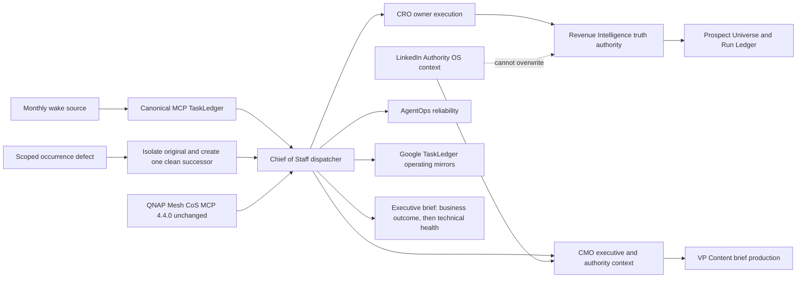

# Architecture v4.4.2: Data Intelligence Orchestration

## Release boundary
v4.4.2 is an orchestration and operating-control release. It does not alter the QNAP container, network, persistence format, authentication, published MCP action surface, Slack trust boundary, or canonical 4.0.0 authority contract. The production Mesh CoS MCP deployment remains 4.4.0.

## Logical architecture

The diagram source was validated through Mermaid Chart during release engineering on September 3, 2026.

## State and authority
Mesh CoS MCP TaskLedger is canonical for ownership, task state, delegation, completion, verification, approval, and audit. Google TaskLedger, the Prospect Universe workbook, Run History, and connector state are operating mirrors or evidence surfaces.

The exact 10-agent organization is preserved. Direct routes used here are CoS to CRO, CMO, and AgentOps. The only content-production nested route is CMO to VP Content. Revenue Intelligence is the commercial-data authority. CMO and LinkedIn Authority OS may add labeled executive and authority context but cannot create prospect fit, lifecycle, priority, buying group, intent, budget, sponsor, urgency, stage, or activation readiness.

## Recovery architecture
The runtime treats each dependency as a canonical task edge. This is correct. Narrative prerequisites in dependency arrays are a caller defect. v4.4.2 prevents the defect at the orchestration boundary and retains runtime fail-closed behavior.

Recovery requires immutable key reuse, original audit preservation, provider and mirror reconciliation, exactly one dependency-clean successor, same parent/owner/authority/acceptance boundary, no provider replay, owner completion followed by CoS verification, and explicit retention of the original business failure.

## Scheduling architecture
TaskLedger remains the central logical schedule and trigger authority. `RI-ICP-DECAY-MTH-001` is due monthly on day one at 00:01 ET and is the documented overnight/weekend exception. The external wake source is operational transport, not logical execution identity. A repository release or Sheet value does not prove the wake is active; activation requires live provider readback.

A disabled or drifting wake blocks the scheduler stage only. It does not invalidate the repository release, canonical runtime, source contract, verified owner routes, or unrelated eligible work.

## Data write architecture
Prospect writes are not batched. Each approved prospect-cell mutation is a single transaction:
1. Read the exact target cell.
2. Confirm the expected pre-write value.
3. Write exactly one cell.
4. Immediately read the same cell.
5. Verify expected value and validation/formula behavior.
6. Reconcile the full governed row after approved changes.
7. Commit Last Reviewed Date and Next Review Date last.

On the first blocked write or reconciliation failure, stop further writes, preserve prior committed rows, record the exact exception, and release the lock.

## Failure domains
- Caller metadata defect: isolate the occurrence and correct caller contract.
- Runtime identity, registry, audit, or owner-transport defect: block affected canonical mutation.
- Source or connector defect: block only jobs requiring that source/connector.
- Prospect write defect: stop the current transaction without rolling back reconciled rows.
- Scheduler defect: block autonomous wake activation while preserving ready canonical state.
- External-action gate defect: prohibit the external stage; internal analysis can remain eligible.

The QNAP runtime is not changed to accept arbitrary dependencies or invented delegation actions because that would weaken authorization and work-graph integrity.
