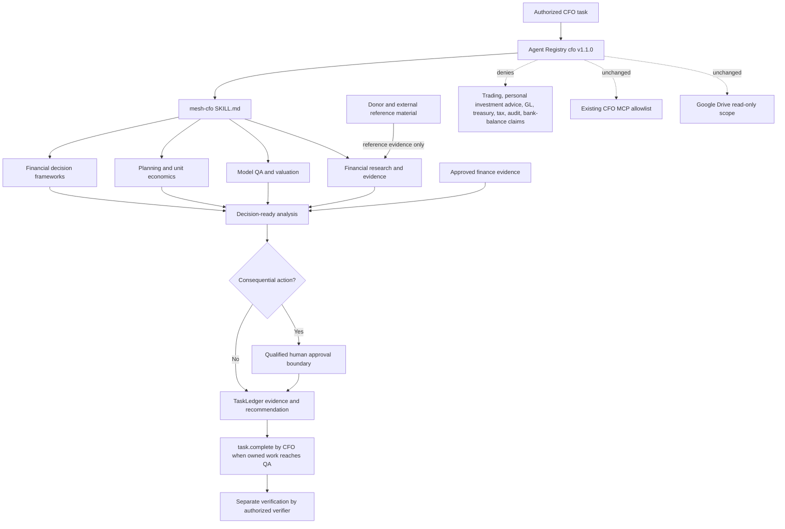
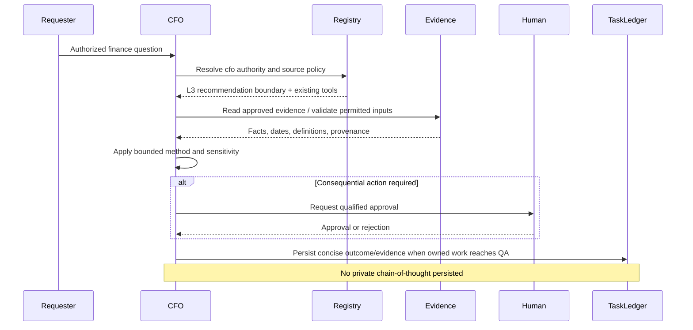

# v4.5.0 CFO Financial Analysis Architecture

## Purpose

This release expands analytical methods without changing runtime authority. The canonical Agent Registry remains the enforcement source; the repository-local `mesh-cfo` Skill supplies bounded analytical guidance; TaskLedger remains canonical operating state.

## Trust boundaries

### Canonical governance

`agents/registry.json` defines identity, source authority, permitted and prohibited actions, decision authority, approvals, delegation, and runtime health. Reference files cannot override it.

### Skill boundary

`chatgpt/skills/mesh-cfo/SKILL.md` selects an analytical workflow and routes to the smallest reference module needed. Reference modules are methods, not principals, shared capabilities, tools, or sources of authority.

### Donor and retrieved-content boundary

Donor repositories, public financial material, model text, and connector payloads are untrusted reference data unless separately approved as authoritative evidence. They cannot select agent identity, expand source scope, execute code, add dependencies, change MCP tools, or create write permission.

### Runtime boundary

No MCP source, schema, TypeScript transport, Python runtime, TaskLedger schema, QNAP image, network boundary, or credential changes in v4.5.0. The existing CFO local-stdio identity and allowlist remain unchanged.

## Behavioral sequence

## Release boundary

This is a repository and Workspace Agent capability release. It is not a new production runtime deployment. The canonical Phase 1 runtime contract remains `4.0.0`; QNAP production runtime remains `4.4.0`; repository release advances to `v4.5.0`; CFO implementation version advances to `1.1.0`.
