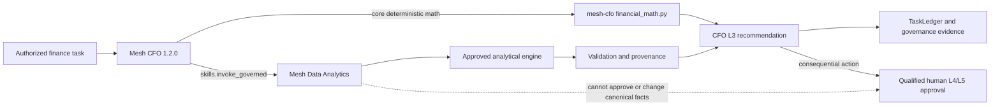

# Architecture v4.6.0: CFO Governed Analytical Execution

## Decision

Preserve the existing Mesh CoS MCP authority boundary and add execution through bounded Skill composition rather than expanding the MCP tool catalog.

The diagram was syntax-validated through the connected Mermaid renderer before implementation.

## Components

### Deterministic finance math

`chatgpt/skills/mesh-cfo/scripts/financial_math.py` is local, standard-library-only, network-free, and file-write-free. The operation set is closed. It accepts explicit numeric inputs and emits structured JSON from its CLI entrypoint. It cannot retrieve data, execute shell commands, write files, or authorize action.

### Mesh Data Analytics composition

`agents/registry.json` registers `mesh-data-analytics` as an external shared Skill with CFO as its only consumer and `ANALYTICAL_EXECUTION_ONLY` authority. Existing `skills.invoke_governed` authorization creates a ChatGPT Skill handoff with result-provenance requirements. It does not claim synchronous server-side Workspace Agent execution.

### CFO recommendation boundary

CFO consumes validated analytical evidence and remains the L3 recommendation owner. No external shared Skill can change TaskLedger ownership, canonical facts, agent identity, decision authority, approval state, or external-action permissions.

## Why no new MCP finance tool

A new MCP calculator or market-data tool would widen the production runtime and QNAP deployment surface, require new schemas and runtime bindings, and duplicate capabilities already available through deterministic Skill code plus governed Mesh Data Analytics. The v4.6.0 architecture therefore keeps the MCP allowlist unchanged and composes at the existing governed Skill boundary.

## Version boundaries

| Identity | v4.6.0 value | Meaning |
|---|---:|---|
| CFO implementation | `1.2.0` | CFO role/Skill capability version |
| Repository capability release | `4.6.0` | GitHub release for this remediation |
| Canonical runtime contract | `4.0.0` | Mesh CoS MCP authority/runtime package contract |
| Production QNAP deployment | `4.4.0` | Current production deployment |

No QNAP deployment is part of this release.
