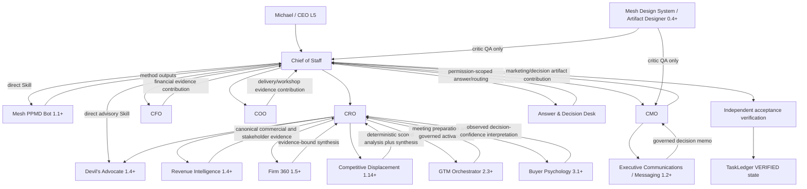

# v4.7.0 Enterprise Consulting Skill Architecture

## Architecture intent

The ten-agent organization remains unchanged. Consulting-method capability is strengthened at existing Skill boundaries, while canonical facts, agent authority, approval, execution, and verification remain separate.

## Control-plane rules

1. **Method is not truth.** PPMD owns consulting method, not functional source authority.
2. **Commercial truth remains canonical.** Revenue Intelligence owns designated account, buying-group, lifecycle, and stakeholder truth.
3. **Financial truth remains scoped.** CFO owns supported engagement-finance and management-FP&A analysis within approved sources.
4. **Delivery truth remains scoped.** COO owns delivery feasibility, capacity, resource-readiness, and operational constraints.
5. **Design authority remains separate.** Critic QA cannot replace Mesh Design System or Artifact Designer authority.
6. **Communication execution remains separate.** Decision memos and drafts cannot bypass Message Operations and human approval.
7. **Completion and verification remain separate.** Artifact completion cannot self-establish `VERIFIED`.
8. **No capability-to-authority transitivity.** A Skill's richer reasoning cannot expand the invoking agent's L0-L5 decision rights, tool allowlist, delegation depth, or source permissions.

## Runtime impact

No Phase 1 runtime-contract change is required. No new MCP tool, database migration, credential, connector, QNAP restart, or network authority is introduced. Production QNAP remains `4.4.0`; canonical Phase 1 authority/runtime contract remains `4.0.0`.
