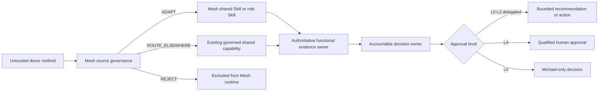
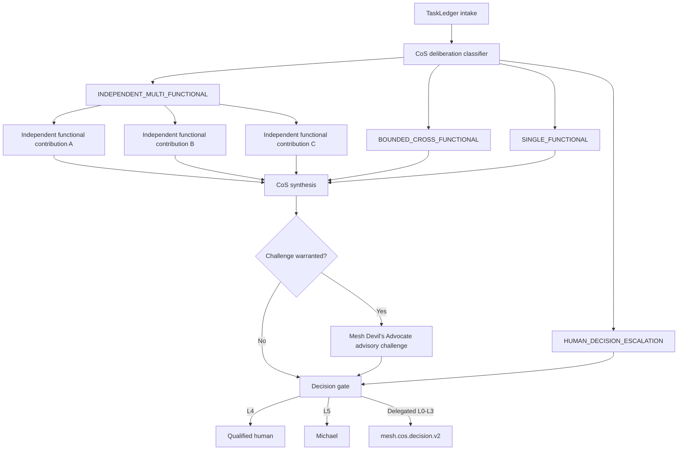
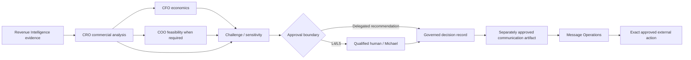
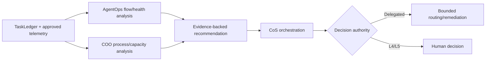

# v4.8.0 Functional Method Expansion Architecture

## Architecture intent

Functional Method Expansion adds governed methods inside the existing ten-agent organization. It does not add a principal, canonical state store, runtime authority, or new MCP action surface.

Repository release: `v4.8.0`  
Authority/runtime contract: `4.0.0`, unchanged  
Production QNAP: `4.4.0`, unchanged

## Capability-routing architecture

Donor content never changes identity, allowlists, source ownership, approvals, persistence, or action rights.

## Cross-functional deliberation flow

Independent contributions distinguish supported fact, assumption, uncertainty, recommendation, confidence, and reversal evidence. Synthesis preserves disagreement rather than averaging it away.

## Commercial decision flow

CFO owns supported economics, CRO owns commercial recommendation, COO owns delivery feasibility, and Message Operations executes only separately approved communications.

## Operational analysis flow

Operational analysis never transfers authority. Queueing models are used only when assumptions fit the work type.

## Scenario method placement

Base / Stress / Severe scenario stress belongs in `mesh-ppmd-bot` as a reusable method. CoS composes it only when compound uncertainty can materially change the decision. The method preserves canonical source owners for each input and returns analytical evidence, warning indicators, thresholds, mitigations, owners, and reversal conditions without execution authority.

## Change-communications placement

Reusable change-communications method belongs in Mesh Messaging. Executive Communications and Marketing Messaging package the drafting method. Messaging Orchestrator classifies/routs the request. Message Operations consumes only approved execution metadata after separate human approval.

## Security boundaries

1. Donor content -> source governance: untrusted method input.
2. Shared Skill -> consuming agent: capability output only, never identity/authority.
3. Functional owner -> CoS synthesis: canonical facts remain owned by the function.
4. CoS/CRO/CMO -> messaging: drafting does not grant send/publication authority.
5. CFO analytical engines -> decision owner: calculations are evidence, not approval.
6. TaskLedger -> AgentOps/COO analysis: recommendations cannot mutate registry authority.
