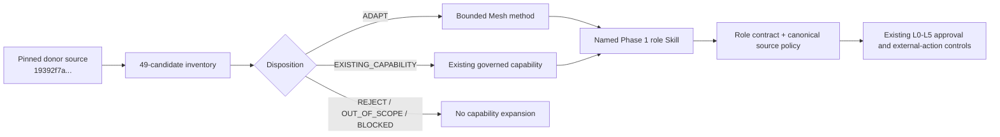
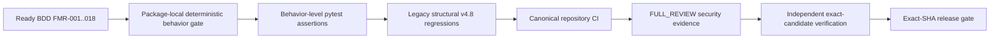
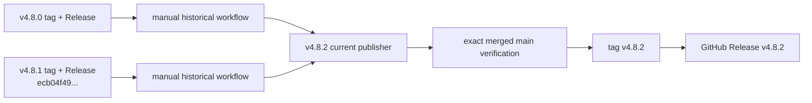

# v4.8.2 Functional Method Remediation Architecture

## Boundary

v4.8.2 changes repository-level Skill behavior evidence and release control only. The canonical Phase 1 authority/runtime contract remains `4.0.0`; production QNAP remains `4.4.0`; the 10-agent registry and MCP action surface remain unchanged.

## Donor-to-authority flow

The disposition ledger is evidence, not authorization. A donor method cannot become a principal, tool grant, canonical source owner, TaskLedger owner, or approval authority.

## Behavioral verification flow

`SKILL.md` phrase/content tests remain compatibility checks. They are not treated as proof of behavior. `scripts/fme_behavior.py` provides deterministic observable evaluation outputs such as mode, state, disposition, block, approval boundary, freshness state, and refusal. These scripts are evaluation/support resources and do not replace live canonical data, role contracts, or professional judgment.

## Release lifecycle

Historical workflows have read-only permissions and cannot republish. The v4.8.2 release job alone receives repository contents write permission, and only after the verify job succeeds.

## Shared capability compatibility

The Chief of Staff continues to compose scenario stress with Mesh PPMD Bot v1.2.0. CMO and Message Operations continue to compose governed change communications with Mesh Messaging v1.3.0. The remediation verifies those released contracts and does not fork or duplicate them.

## Runtime non-change

No change is made to:

- Python `mesh_cos` runtime behavior or version;
- MCP schema/catalog, authentication, or transport;
- QNAP images, secrets, network boundaries, or database state;
- registry agent count/parentage;
- TaskLedger or Revenue Intelligence authority;
- external publication/send/procurement/staffing/pricing/contract authority.
